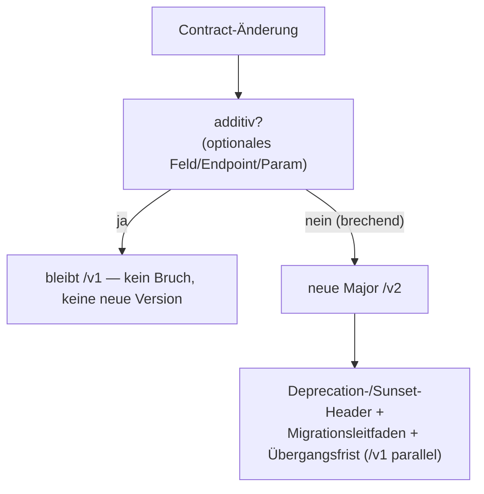

<!--
SPDX-FileCopyrightText: 2026 OpenCivic Contributors
SPDX-License-Identifier: Apache-2.0
-->

# 0013 — API-Versionierung (URI-Pfad-Major + additive Evolution)

- **Status:** Accepted
- **Datum:** 2026-07-10
- **Bezug:** Qualitätsattribute QA1 (Nachvollziehbarkeit/Zitierbarkeit), QA2 (Zugänglichkeit),
  QA3 (Wartbarkeit/Evolvierbarkeit), QA6 (Testbarkeit), QA7 (Interoperabilität);
  Leitprinzipien P1 (boring & bewährt), P7 (Daten sind langlebiger als Code), P8 (Reversibilität);
  baut auf [ADR-0012](0012-api-stil-rest-openapi.md) (REST + OpenAPI); [ADR-0006](0006-provenance-modell-w3c-prov.md)
  (zitierbare Belege); [ADR-0007](0007-bitemporal-append-only-lifecycle.md) (langlebige Daten)

## Kontext und Problemstellung

Die öffentliche REST-API ([ADR-0012](0012-api-stil-rest-openapi.md)) wird über einen
10-Jahres-Horizont von vielen unabhängigen Konsument:innen genutzt — Bürger:innen, die eine URL in
einem Artikel zitieren; Journalist:innen, die einen Beleg dauerhaft verlinken; Dritt-Portale mit
generierten SDKs. „Daten sind langlebiger als Code" (P7): Ein einmal veröffentlichter,
zitierter Contract muss zuverlässig weiter funktionieren, und **Zitate dürfen nicht verrotten**
(QA1). Zugleich wird sich die API über die Jahre unvermeidlich ändern — meist additiv, gelegentlich
brechend.

Zu entscheiden ist ein **Versionierungsschema**, das (a) additive Evolution ohne Bruch erlaubt,
(b) einen sauberen, dokumentierten Pfad für echte Breaking Changes bereitstellt und (c) die Version
auch für **Nicht-Spezialist:innen** sichtbar, verlinkbar und testbar hält (QA2). Die Kernspannung
liegt zwischen der technischen Eleganz header-basierter Verfahren und der Auffindbarkeit einer
sichtbaren Version für Laien.

## Betrachtete Optionen

- **Option A — URI-Pfad-Major** (`/v1/…`) + additive, rückwärtskompatible Evolution innerhalb einer
  Major; Breaking Changes nur mit neuer Major + Deprecation-Policy.
- **Option B — Header-/Media-Type-Versionierung** (z. B. `Accept: application/vnd.opencivic.v1+json`
  oder ein Custom-Header), URLs ohne Versionssegment.
- **Option C — Kein explizites Versionsschema, ausschließlich additive Evolution.**

## Entscheidung

**Option A — URI-Pfad-Major + additive Evolution.**

Die Major-Version steht **sichtbar in der URL** (`/v1/…`, `/v2/…`). Damit ist sie ohne Header-Wissen
erkennbar, in Lesezeichen und Zitaten stabil und trivial testbar — man tippt sie in die Adresszeile.
Für Laien und für die **Zitierbarkeit über Jahre** (QA1, P7) schlägt diese Auffindbarkeit die
theoretische Eleganz von Header-/Content-Negotiation-Verfahren.

Innerhalb einer Major ist die Evolution **additiv und rückwärtskompatibel**: neue optionale Felder,
neue Endpunkte, neue optionale Query-Parameter erscheinen **ohne** Versionswechsel; Konsument:innen
ignorieren unbekannte Felder (Robustheitsprinzip). Ein **Breaking Change** — ein Feld entfernen,
seine Semantik oder seinen Typ ändern, Pflichtparameter einführen — erfordert eine **neue Major**
und wird von einer **Deprecation-Policy** begleitet: `Deprecation`-/`Sunset`-Header, dokumentierter
Mindest-Support-Zeitraum, Migrationsleitfaden und paralleler Betrieb von alt und neu während der
Übergangsfrist.

Das ist „boring & bewährt" (P1), spielt sauber mit dem OpenAPI-Contract und SDK-Codegen aus
[ADR-0012](0012-api-stil-rest-openapi.md) zusammen und ist automatisiert prüfbar: Ein Schema-Diff in
CI erkennt unbeabsichtigte Breaking Changes innerhalb einer Major (QA6).

## Konsequenzen

- **Positiv:** Eine Version ist sichtbar, verlinkbar, zitierbar und testbar (QA1/QA2); additive
  Evolution hält den Alltag ohne Versionssprünge kompatibel (QA3, P7); echte Breaking Changes haben
  einen sauberen, dokumentierten Pfad; Schema-Diffs machen Kompatibilität automatisiert prüfbar (QA6).
- **Negativ / Kosten (ehrlich benannt):** Ein Major-Sprung dupliziert Routing-Präfixe, und
  dieselbe Ressource lebt unter zwei URLs (`/v1/statements/…` und `/v2/statements/…`) — die URL
  identifiziert die Ressource dann nicht mehr rein „puristisch" unabhängig von der Repräsentation.
  Genau das ist der **Punkt, an dem Option B sauberer ist**, und der bewusst akzeptierte Trade-off.
  Zudem erzeugt der parallele Betrieb zweier Majors während der Übergangsfrist temporären
  Wartungs-Overhead.
- **Reversibilität:** Header-basierte Verhandlung ließe sich später **zusätzlich** anbieten, ohne die
  Pfad-Version abzuschaffen (P8); der umgekehrte Weg (von Header zu Pfad) wäre für bereits zitierte
  URLs schmerzhafter. Die Wahl hält also die teurere Option offen und schließt die billigere nicht aus.

## Vor- und Nachteile der Optionen

### Option A — URI-Pfad-Major + additive Evolution *(gewählt)*

- 👍 Version **sichtbar in der URL** — verlinkbar, zitierbar, in Lesezeichen stabil, ohne Header-
  Wissen testbar (QA1/QA2, P7).
- 👍 Additive Evolution deckt den Regelfall bruchfrei ab; klarer, dokumentierter Pfad für den
  Ausnahmefall Breaking Change.
- 👍 „Boring", weit verbreitet, mit OpenAPI/Codegen und Schema-Diff-Tests kompatibel (P1, QA6).
- 👎 Major-Sprünge duplizieren URLs für dieselbe Ressource; paralleler Betrieb kostet Wartung — hier
  ist die Header-Variante konzeptionell reiner.

### Option B — Header-/Media-Type-Versionierung

- 👍 **Saubere, stabile URLs**: dieselbe Ressourcen-URL über alle Versionen; näher an HATEOAS/REST-
  Purismus, weil die URL die Ressource identifiziert und der Header die Repräsentation verhandelt.
  Das ist ein realer konzeptioneller Vorteil, kein Strohmann.
- 👍 Feingranulare Verhandlung (auch Minor-/Media-Type-Varianten) möglich.
- 👎 Version ist **unsichtbar** und für Nicht-Spezialist:innen schwer testbar — man kann sie nicht in
  die Adresszeile tippen oder unverändert verlinken; ein zitierter Link trägt seine Version nicht in
  sich (Spannung zu QA1/QA2).
- 👎 Anfälliger für Fehlkonfiguration (fehlender/falscher Header → stilles Fallback auf eine andere
  Version); schwerer im Browser und in einfachem `curl` zu handhaben.

### Option C — Kein Versionsschema, nur additiv

- 👍 Maximal einfach, solange **jede** Änderung additiv bleibt; keine Duplizierung, keine
  Header-Logik.
- 👎 **Kein sauberer Pfad für unvermeidbare Breaking Changes**: Über 10+ Jahre treten echte
  brechende Änderungen auf (falsch modelliertes Feld, Semantikkorrektur). Ohne Major-Mechanismus
  bleibt nur die Wahl zwischen stillem Bruch bestehender Konsument:innen (verletzt QA1/QA3/P7) oder
  dem dauerhaften Mitschleppen von Altlasten — beides inakzeptabel.
