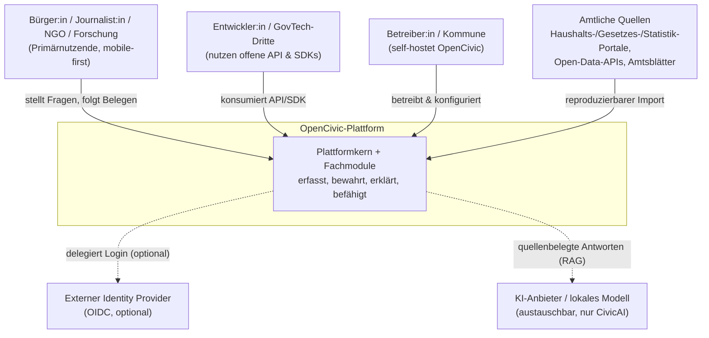
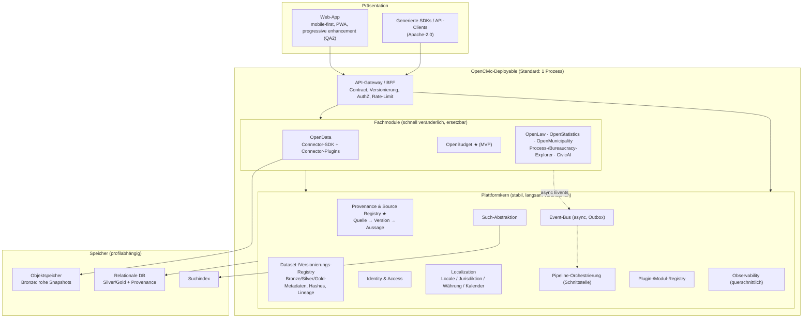
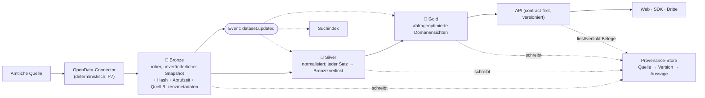
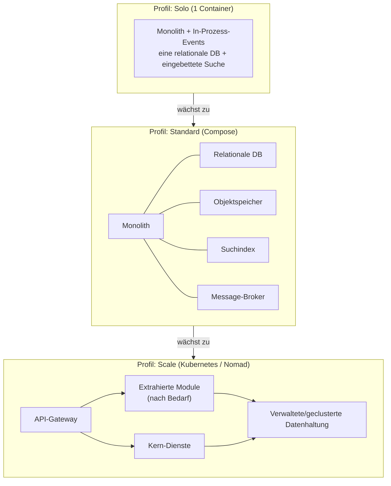

<!--
SPDX-FileCopyrightText: 2026 OpenCivic Contributors
SPDX-License-Identifier: Apache-2.0
-->

# 01 — Makro-Architektur & Modulschnitt

Dieses Dokument beschreibt das Skelett von OpenCivic auf Makro-Ebene: Architekturstil,
die Grenze zwischen **Plattformkern** und **Fachmodulen**, den kanonischen **Datenfluss**,
die **Modul-Kommunikation** und die **Deployment-Profile**. Es zeigt das *Was*; das *Warum*
steht in den verlinkten ADRs.

Jede Aussage ist an ein [Qualitätsattribut](../foundation/06-qualitaetsattribute.md) (QA1–QA10)
oder [Entscheidungsprinzip](../foundation/08-entscheidungsprinzipien.md) (P1–P11) rückgebunden.

---

## 1. Systemkontext (C4 Level 1)

Wer und was interagiert mit OpenCivic?

**Kernaussagen**
- Der **Nordstern** ist die Primärnutzerin; alles ist zuerst für sie gedacht (QA2, mobile-first).
- Amtliche Quellen sind **eingehend**, nie ausgehend — OpenCivic schreibt nie in staatliche Systeme.
- Externer IdP und KI-Anbieter sind **optional und austauschbar** (P3, R12) — die Plattform
  funktioniert ohne sie (nur CivicAI benötigt ein Modell).

---

## 2. Architekturstil: Modularer Monolith mit Extraktions-Nähten

Das Standard-Deployment ist **ein Prozess** (ein „Deployable"), in dem Kern und Fachmodule als
klar getrennte Module leben. Die Grenzen sind **hart** (nur über öffentliche Contracts), sodass
ein Modul bei Bedarf ohne Umbau zu einem eigenständigen Dienst **extrahiert** werden kann.

- **Warum:** erfüllt „Self-Hosting als Grad" (QA5, Architekturziel 6) — Solo-Betreiber starten mit
  einem Container; geringe Contributor-Komplexität (R9); Wartbarkeit (QA3); boring & bewährt (P1).
- **Nicht Microservices-ab-Tag-1:** verfrühter Ops-/Contributor-Overhead, zerstört den einfachen
  Self-Host (R8/R9).
- **Nicht Monolith-ohne-Grenzen:** würde zum „Big Ball of Mud", verletzt Modularität (Leitprinzip 7).

Details & Alternativen: [ADR-0002](../adr/0002-architekturstil-modular-monolith.md).

---

## 3. Container- & Modul-Landkarte (C4 Level 2)

### Plattformkern — Verantwortlichkeiten

| Kern-Baustein | Verantwortung | Bezug |
|---|---|---|
| **Provenance & Source Registry** ★ | Herzstück: registriert Quellen und verkettet *Quelle → Version → Aussage*; jede Aussage ist belegbar | QA1, Leitprinzip 2 |
| **Dataset-/Versionierungs-Registry** | Verwaltet Datensätze & -versionen über Bronze/Silver/Gold inkl. Hashes und Lineage | QA1, Architekturziel 5 |
| **Identity & Access** | AuthN (OIDC, optional extern) + AuthZ; hortet keine PII | QA4, Leitprinzip 6 |
| **Such-Abstraktion** | Einheitliche Suchschnittstelle, Backend austauschbar | QA7, P3 |
| **Localization** | Locale, **Jurisdiktion**, Währung, Kalender — die i18n-Achse ab Tag 1 | QA10, DACH-first-Entscheidung |
| **Pipeline-Orchestrierung** | Schnittstelle für ETL-Jobs (Scheduler-Adapter, austauschbar) | Architekturziel 4, P3 |
| **Event-Bus (Outbox)** | Zuverlässige asynchrone Ereignisse zwischen Ingest, Speicher und Suche | QA3, entkoppelt Schichten |
| **Plugin-/Modul-Registry** | Registriert Module & Connectoren über stabile Extension-Points | Architekturziel 10 |
| **API-Gateway / BFF** | Ein Eintrittspunkt: Contract, Versionierung, AuthZ, Rate-Limit | Architekturziel 2, QA7 |
| **Observability** | Strukturierte Logs, Metriken, Traces (offene Standards) | QA9, P6 |

### Fachmodule — Regeln

- Jedes Fachmodul **besitzt** sein Domänenmodell, seine Connectoren, seine **versionierte**
  API-Fläche und seine UI-Views.
- Jedes Fachmodul **muss** Provenance, Identity, Search und Localization des Kerns nutzen —
  **kein Eigenbau** dieser Querschnittsfunktionen (verhindert Wildwuchs, sichert QA1).
- Module sind **lose gekoppelt** und untereinander nur über öffentliche Contracts/Events
  sichtbar (Leitprinzip 7, Architekturziel 1).

Details & Alternativen: [ADR-0003](../adr/0003-plattformkern-und-modulschnitt.md).

---

## 4. Kanonischer Datenfluss — Medallion + Provenance-First

Jeder Weg von der amtlichen Quelle bis zur Anzeige durchläuft dieselben, reproduzierbaren Stufen.
Rohdaten werden **unverändert** bewahrt; jede abgeleitete Aussage ist bis zur Originalquelle
rückverfolgbar.

**Kernaussagen**
- **Bronze ist unveränderlich** und gehasht → Reproduzierbarkeit (Leitprinzip 4) und Audit-Trail
  bei Quellenänderung/Link-Rot (R3).
- Der **Provenance-Store ist kein Silo**, sondern wird aus jeder Stufe beschrieben und von der API
  gelesen — so trägt jede Antwort einen Beleg (QA1, Leitprinzip 2).
- **Trennung Ingest ↔ Speicher ↔ Präsentation** (Architekturziel 4): Ein Ingest-Lauf blockiert nie
  die Auslieferung; Events triggern Neuberechnung & Reindizierung.
- *Verworfene Alternative:* direkter Quelle→DB-Import ohne Roh-Snapshot — nicht reproduzierbar,
  kein Audit-Trail.

Details & Alternativen: [ADR-0004](../adr/0004-kanonischer-datenfluss-medallion-provenance.md).

---

## 5. Modul-Kommunikation

| Art | Wie | Wofür |
|---|---|---|
| **Synchron** | Nur über die **öffentliche** API/Schnittstelle eines Moduls (nie interne Interna) — gilt auch in-Prozess | Anfrage/Antwort, Lesezugriffe |
| **Asynchron** | **Event-Bus + Outbox-Pattern** | Ingest-/Pipeline-Ereignisse: „Dataset aktualisiert" → Silver/Gold neu berechnen → Suche reindizieren |

Das Outbox-Pattern sichert zuverlässige Zustellung (kein verlorenes Event bei Absturz) und hält
Ingest von Präsentation entkoppelt. Auch im monolithischen Solo-Profil gilt dieselbe Regel — nur
die Bus-Implementierung ist dort in-Prozess statt über einen externen Broker.

---

## 6. Deployment als Grad — dieselbe Codebasis, drei Profile

- **Solo:** ein `docker compose up`, minimale Abhängigkeiten — für Kommunen, Vereine, Einzelpersonen.
- **Standard:** entkoppelte Datenhaltung + externer Broker — für produktive mittlere Instanzen.
- **Scale:** Module werden entlang ihrer bereits harten Grenzen als Dienste extrahiert und
  horizontal skaliert — für große Betreiber.

Alle drei laufen aus **derselben Codebasis**, gesteuert per Konfiguration (QA5, Architekturziel 6,
P3 keine harte Cloud-Bindung). Details: [ADR-0002](../adr/0002-architekturstil-modular-monolith.md).

---

## 7. Was hier bewusst noch offen ist

Dieses Dokument legt den *Schnitt* fest, nicht die *Technologien*. Konkrete Wahl von Sprachen,
Datenbank, Suchmaschine, Broker, KI-Schicht usw. folgt in eigenen Topics/ADRs — jeweils gegen
dieselben Qualitätsattribute begründet. Das **Provenance-Datenmodell** (Struktur von
*Quelle → Version → Aussage* inkl. Jurisdiktions-Achse) ist der nächste, inhaltlich zentrale
Schritt.
