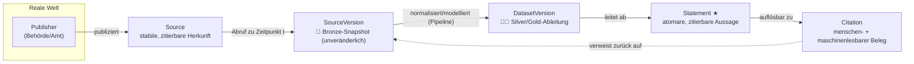
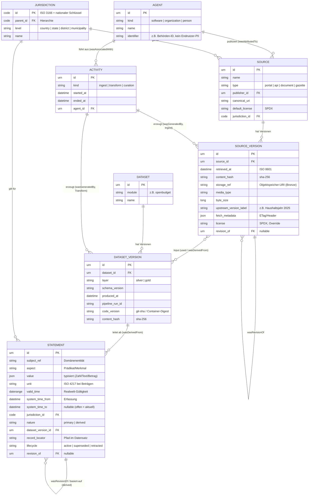
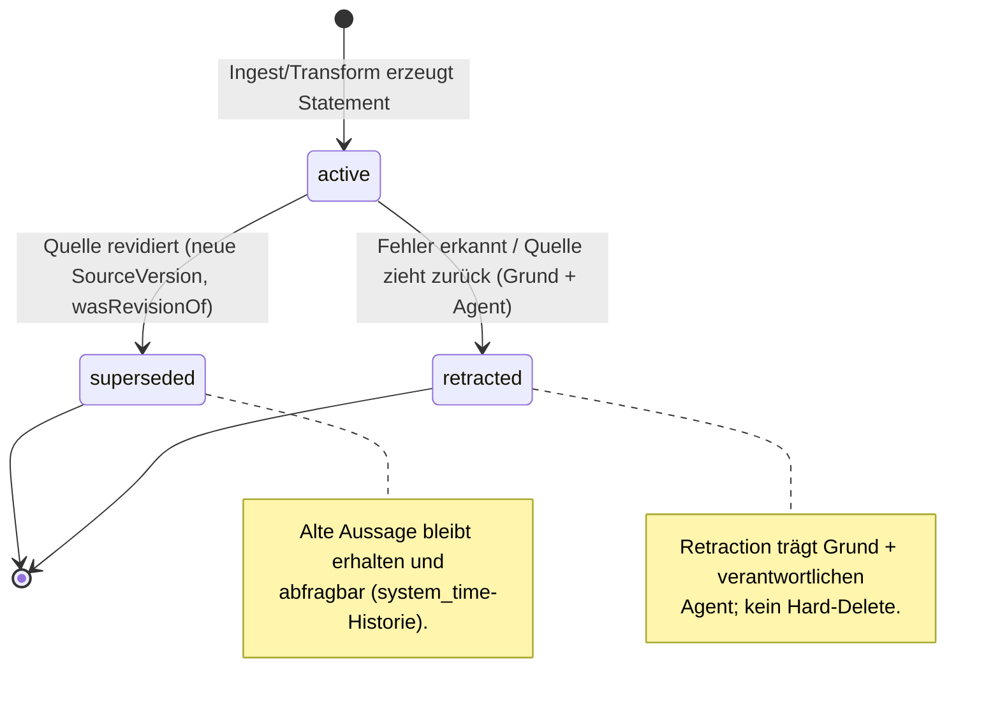

<!--
SPDX-FileCopyrightText: 2026 OpenCivic Contributors
SPDX-License-Identifier: Apache-2.0
-->

# 02 — Provenance-Datenmodell

Das Provenance-Modell ist der **inhaltliche Kern** von OpenCivic. Es operationalisiert den
[Quellenzwang](../foundation/03-leitprinzipien.md) (Leitprinzip 2) und die höchstpriorisierte
Qualität [Nachvollziehbarkeit](../foundation/06-qualitaetsattribute.md) (QA1): **jede** angezeigte
Aussage ist bis zur amtlichen Originalquelle rückführbar, reproduzierbar (Leitprinzip 4) und
manipulationssicher (R11). Alle Fachmodule hängen an diesem Modell.

Dieses Dokument ist **technologiefrei** — es legt das konzeptionelle und logische Modell fest, kein
Datenbankprodukt (das entscheidet der DB-Topic). Es baut auf offenen Standards auf (Prinzipien 2 & 6).

> **Grundinvariante (Quellenzwang):** Es gibt kein `Statement` ohne auflösbaren Pfad zu mindestens
> einer `SourceVersion`. Nicht belegbare Daten existieren im Modell nicht.

---

## 1. Konzeptioneller Überblick

Der Fluss folgt dem [kanonischen Medallion-Datenfluss](01-macro-architecture.md#4-kanonischer-datenfluss--medallion--provenance-first):
`Source → SourceVersion (Bronze) → DatasetVersion (Silver/Gold) → Statement → Citation`.

---

## 2. Logisches Datenmodell (ER)

---

## 3. Abbildung auf W3C PROV

OpenCivic-Entitäten sind ein pragmatischer Subset von [W3C PROV](https://www.w3.org/TR/prov-overview/)
(PROV-DM/PROV-O), exportierbar als **PROV-JSON / JSON-LD** — ein offener, interoperabler Standard
statt einer Insellösung. Siehe [ADR-0006](../adr/0006-provenance-modell-w3c-prov.md).

| OpenCivic | PROV-Konzept | Zentrale Relationen |
|---|---|---|
| `Source`, `SourceVersion`, `DatasetVersion`, `Statement` | **Entity** | `wasDerivedFrom`, `wasRevisionOf` |
| `Activity` (ingest/transform/curation) | **Activity** | `used`, `wasGeneratedBy` |
| `Agent` (Publisher/Pipeline/Kurator) | **Agent** | `wasAttributedTo`, `wasAssociatedWith` |
| `SourceVersion` ← Ingest | Entity ← Activity | `SourceVersion wasGeneratedBy IngestActivity` |
| `DatasetVersion` ← Transform | Entity ← Activity | `DatasetVersion wasDerivedFrom SourceVersion`, `wasGeneratedBy TransformActivity` |
| `Statement` ← Dataset | Entity ← Entity | `Statement wasDerivedFrom DatasetVersion` (+ Eingangs-Statements bei `derived`) |
| Korrektur | Revision | `wasRevisionOf` |

---

## 4. Bitemporalität

Zwei unabhängige Zeitachsen (Details: [ADR-0007](../adr/0007-bitemporal-append-only-lifecycle.md)):

- **`valid_time`** — wann gilt der Fakt in der realen Welt (z. B. Haushaltsjahr 2025, Gesetzesfassung
  gültig ab 01.01.2026).
- **`system_time`** — wann hat OpenCivic den Fakt erfasst bzw. verändert.

Damit sind zwei Klassen von Fragen beantwortbar:

- *„Was galt real für das Haushaltsjahr 2025?"* → Filter auf `valid_time`.
- *„Was zeigte OpenCivic am 12.03.2026 an?"* → Filter auf `system_time` (Robustheit gegen Link-Rot,
  Nachweisbarkeit; R3).

---

## 5. Lifecycle einer Aussage

Statements werden **niemals hart gelöscht oder überschrieben** (append-only). Korrektur und
Zurückziehung sind selbst attributierte, begründete Provenance-Ereignisse — Korrekturen sind so
**dokumentiert, nicht still** (Neutralität, Leitprinzip 1 & 11).

---

## 6. Jurisdiktions- & Referenzdaten-Achse

Die Jurisdiktion ist eine **codierte, hierarchische** First-Class-Dimension (nicht Freitext),
damit Aussagen vergleichbar, filterbar und aggregierbar sind. Sie ist als **pluggable Code-Liste**
angelegt: DACH-first ohne Schema-Änderung für weitere Länder (i18n-ready). Details:
[ADR-0008](../adr/0008-jurisdiktions-und-referenzdaten-achse.md).

| Dimension | Offener Standard | Beispiel |
|---|---|---|
| Jurisdiktion | ISO 3166 + nationaler Schlüssel | DE › Bayern › München (Amtl. Gemeindeschlüssel) |
| Zeit | ISO 8601 | `2025-01-01`, `valid_time`-Intervalle |
| Währung/Einheit | ISO 4217 | `EUR` bei Beträgen |
| Lizenz | SPDX | `DL-DE-BY-2.0`, `CC-BY-4.0` |
| Katalog-Metadaten | DCAT | Beschreibung von `Source`/`Dataset` |

Labels und Übersetzungen liegen **getrennt** von den Fakten (Localization-Kern), sodass dieselbe
Aussage mehrsprachig dargestellt werden kann (QA10).

---

## 7. Integrität & Manipulationssicherheit

- **Hashing:** Jede `SourceVersion` und `DatasetVersion` trägt einen `content_hash` (sha-256).
  Rohdaten (Bronze) sind unveränderlich; Manipulation ist erkennbar (R11).
- **Reproduzierbarkeit:** `DatasetVersion` speichert `pipeline_run_id` + `code_version`
  (git-sha/Container-Digest) → eine Ableitung ist deterministisch nachvollziehbar (Leitprinzip 4).
- **Erweiterungspunkt (Security-Topic):** kryptografische **Signatur** von Datasets/Statements und
  optional Hash-Ketten/Merkle-Strukturen für stärkere Garantien — bewusst als spätere Ausbaustufe
  vorgesehen, das Modell hält den Platz dafür frei (Reversibilität, P8).

---

## 8. Zitierbarkeit (Beleg an der Schnittstelle)

Jede fakthaltige Antwort referenziert `Statement`-IDs. Ein stabiler Provenance-/Citation-Endpoint
löst die **volle Kette** auf und liefert:

- **maschinenlesbar:** PROV-JSON / JSON-LD (der Herkunftsgraph),
- **menschenlesbar:** ein Citation-Objekt — Quelle, Publisher, `retrieved_at`, Upstream-URL,
  Lizenz (SPDX), `content_hash`, `DatasetVersion`.

Sources und Statements erhalten **persistente Identifier** (interne URN, später ggf. auflösbare
PIDs). Die konkrete API-Form (Felder, Endpunkte, Einbettung vs. Verlinkung) wird im **API-Topic**
entworfen — hier steht nur die Anforderung.

---

## 9. Durchgängiges Beispiel (OpenBudget)

*Frage: „Wie hoch war der Ansatz für Titel 685 01 im Bundeshaushalt 2025?"*

1. **Source** `urn:oc:source:de-bund-haushalt` — Publisher: Bundesministerium der Finanzen,
   Jurisdiktion `DE`, Default-Lizenz `DL-DE-BY-2.0`, Typ `portal`.
2. **Ingest-Activity** ruft am `2026-02-01T09:00:00Z` das Haushalts-PDF/-Datenpaket ab und erzeugt
   **SourceVersion** `…:sv:2025#a1b2c3` — `content_hash = sha256:a1b2c3…`,
   `storage_ref = s3://bronze/de-bund-haushalt/2025/…`, `upstream_version_label = "Haushaltsjahr 2025"`.
   *(Unveränderlich abgelegt.)*
3. **Transform-Activity** (`code_version = git:9f8e…`) normalisiert nach Silver und modelliert nach
   Gold → **DatasetVersion** `…:dv:openbudget:2025:gold#7788` (`wasDerivedFrom` obige SourceVersion).
4. **Statement** `…:stmt:44aa`:
   `subject_ref = titel:685-01`, `aspect = "ansatz"`, `value = 1_250_000`, `unit = EUR`,
   `valid_time = [2025-01-01, 2026-01-01)`, `jurisdiction = DE`, `nature = primary`,
   `dataset_version_id = …:dv:…#7788`, `record_locator = "epl60/kap6002/titel68501"`,
   `lifecycle = active`.
5. **Citation** löst `…:stmt:44aa` → SourceVersion `…#a1b2c3` auf: BMF, abgerufen 2026-02-01,
   Upstream-URL, Lizenz `DL-DE-BY-2.0`, Hash `sha256:a1b2c3…`.

→ Die Kette `Statement → DatasetVersion → SourceVersion → Source` ist **lückenlos**; der
Quellenzwang ist erfüllt. Wird der Ansatz später per Nachtragshaushalt geändert, entsteht eine neue
SourceVersion (`wasRevisionOf`) und ein neues Statement; das alte wird `superseded`, bleibt aber
über die `system_time`-Historie zitierbar.

---

## 10. Anforderungen an die Speicherung (Input für den DB-Topic)

Das Modell stellt — **produktneutral** — folgende Anforderungen, die als Auswahlkriterien in den
Datenbank-Topic eingehen:

- **Append-only / Unveränderlichkeit** für SourceVersions und Statement-Historie.
- **Bitemporale Abfragen** (`valid_time` × `system_time`).
- **Graph-Traversierung** der Herkunftskette (Statement → … → Source) in beide Richtungen.
- **Hash-Integrität** und effizienter Objektspeicher für große Roh-Snapshots (Bronze).
- **Skalierbare Filter** über Jurisdiktion, Aspekt, Zeit (für Suche & Aggregation).

---

## 11. Bewusst offen (Folge-Topics)

- Konkrete **Datenbank-/Speichertechnologie** → DB-Topic.
- **API-Form** der Belegausgabe (Endpunkte, Einbettung) → API-Topic.
- **Signatur/Krypto-Härtung** der Integrität → Security-Topic.
- **Domänenspezifische Subjekt-Modelle** (z. B. Haushaltssystematik) → je Fachmodul (OpenBudget zuerst).
