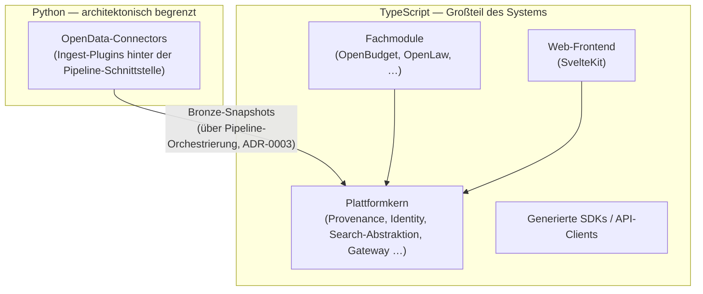
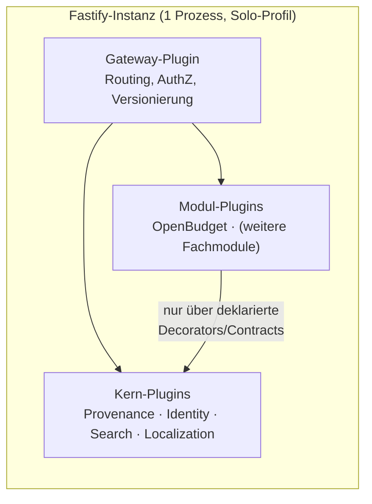
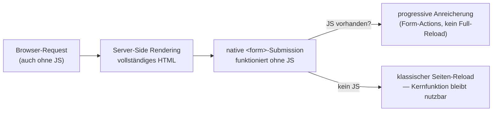

<!--
SPDX-FileCopyrightText: 2026 OpenCivic Contributors
SPDX-License-Identifier: Apache-2.0
-->

# 03 — Programmiersprachen, Backend, Frontend

Erste konkrete Technologiewahl, aufsetzend auf dem [modularen Monolithen](01-macro-architecture.md)
und dem [Provenance-Modell](02-provenance-model.md). Jede Wahl wird gegen die
[priorisierten Qualitätsattribute](../foundation/06-qualitaetsattribute.md) (QA1–QA10) und die
[Entscheidungsprinzipien](../foundation/08-entscheidungsprinzipien.md) (P1–P11) begründet — inkl.
ehrlicher Nennung, wo eine Alternative in einzelnen Punkten tatsächlich stärker ist.

> Der persönliche Technologie-Stack des Nutzers ist hier bewusst irrelevant — es zählt die
> Herleitung aus den Projektzielen.

---

## 1. Sprachlandkarte

**Zwei Sprachen, klar begründet (P5):** TypeScript trägt Plattformkern, Fachmodule, Frontend und
SDKs — den weit überwiegenden Teil des Systems. Python ist bewusst auf die OpenData-Connectors
begrenzt und dort über eine bestehende Architekturgrenze (die Pipeline-Orchestrierungs-
Schnittstelle aus [ADR-0003](../adr/0003-plattformkern-und-modulschnitt.md)) sauber isoliert —
keine Sprachgrenze quer durch ein Modul, sondern entlang einer ohnehin vorhandenen Naht.

---

## 2. Entscheidung gegen die Qualitätsattribute

| QA (priorisiert) | Wirkung der Wahl |
|---|---|
| QA1 Nachvollziehbarkeit | Geteilte TS-Typen zwischen Backend und Frontend machen den Provenance-/Citation-Contract ([ADR-0006](../adr/0006-provenance-modell-w3c-prov.md)) compilergeprüft end-to-end — ein Feldname-Tippfehler in der Statement-Struktur bricht den Build, nicht die Anzeige. |
| QA2 Barrierefreiheit | SvelteKit-SSR + native Form-Actions liefern funktionierendes HTML ohne JS-Abhängigkeit (siehe §4) — direkte Grundlage für Architekturziel 7. |
| QA3 Wartbarkeit (10+ J.) | Node.js (seit 2009) und TypeScript (seit 2012) sind ausreichend „boring", neutral governt (OpenJS Foundation, TC39) und nicht von einem Einzelanbieter abhängig. |
| QA4 Sicherheit/Datenschutz | Risiko wird anerkannt (npm-Abhängigkeitsbäume, R11) und **prozessual** mitigiert (Lockfiles, Audits, SBOM — Security-Topic), nicht durch Sprachwahl verdrängt. |
| QA5 Self-Hosting | Alle Profile ([ADR-0002](../adr/0002-architekturstil-modular-monolith.md)) laufen containerisiert — der Betreiber installiert nie manuell eine Laufzeitumgebung, unabhängig von der Sprachwahl. |
| QA6 Testbarkeit | Eine gemeinsame TS-Toolchain für Backend/Frontend-Tests senkt die Einstiegshürde für Contributor. |
| QA7 Interoperabilität | Fastifys native JSON-Schema-Integration erzwingt maschinenlesbare, versionierbare Contracts (Architekturziel 2). |
| QA8 Performance | Anerkannter Schwachpunkt ggü. kompilierten Sprachen bei CPU-lastiger Transformation — dafür ist genau dieser Teil (Silver/Gold-Transformation) modular austauschbar, falls ein Modul später Performance-kritisch wird ([ADR-0002](../adr/0002-architekturstil-modular-monolith.md) Extraktions-Nähte). |
| QA9 Observability | OpenTelemetry-SDKs für Node.js sind ausgereift und standardkonform. |
| QA10 i18n | Sprachneutral; keine Auswirkung. |

Die Sprach-/Framework-Wahl gewinnt am stärksten bei QA1, QA2, QA3 — den drei höchstpriorisierten
Attributen nach QA1 selbst — und ist ein bewusster, benannter Kompromiss bei QA8 (Performance),
wo die Alternative Go tatsächlich stärker wäre.

---

## 3. Backend: Node.js + Fastify

Fastifys **Plugin-Kapselung** ist der technische Mechanismus, der die harten Modulgrenzen aus
[ADR-0002](../adr/0002-architekturstil-modular-monolith.md) durchsetzt: Ein Plugin sieht die
internen Zustände eines anderen Plugins nicht, sondern nur explizit über `fastify.decorate(...)`
freigegebene Schnittstellen — die Architektur „Modulgrenze = Contract" ist damit kein reines
Versprechen, sondern strukturell erzwungen. Details & Alternativen (NestJS, Express):
[ADR-0010](../adr/0010-backend-framework-nodejs-fastify.md).

---

## 4. Frontend: SvelteKit

Architekturziel 7 verlangt: *„Kernfunktion ohne JavaScript nutzbar."* SvelteKit erfüllt das im
**Standardfall**, nicht als Sonderaufwand:

Weil der einfache, standardmäßige Pfad in SvelteKit bereits der barrierefreie Pfad ist, bleibt
diese Eigenschaft auch bei vielen wechselnden Freiwilligen über 10+ Jahre eher erhalten, als wenn
sie gegen die Grundphilosophie eines SPA-zentrierten Frameworks verteidigt werden müsste. Details
& Alternativen (Next.js/React, Remix, Astro, htmx):
[ADR-0011](../adr/0011-frontend-framework-sveltekit.md).

---

## 5. Bewusst offen (Folge-Topics)

- **Datenbank/Suche/Vektor-Technologie** — eigener Topic, aufbauend auf den
  [Speicheranforderungen](02-provenance-model.md#10-anforderungen-an-die-speicherung-input-für-den-db-topic)
  des Provenance-Modells.
- **Paketmanager & Monorepo-Build-Tooling** — vertieft den provisorischen
  [ADR-0005](../adr/0005-repo-strategie-monorepo.md).
- **OpenAPI-Codegen-Kette** für die SDK-Generierung — API-Design-Topic.
- **Test-Framework-Detailwahl** (z. B. Vitest) — leichtgewichtige Ergänzung, keine eigene ADR nötig,
  wird bei Bedarf im Repo-/Build-Topic mitentschieden.
