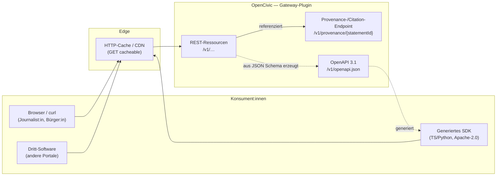
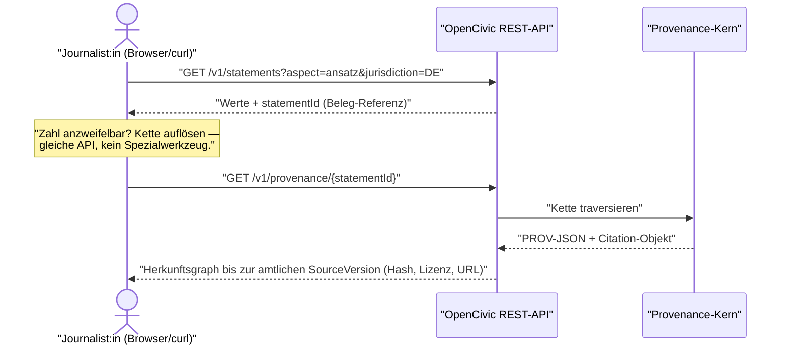
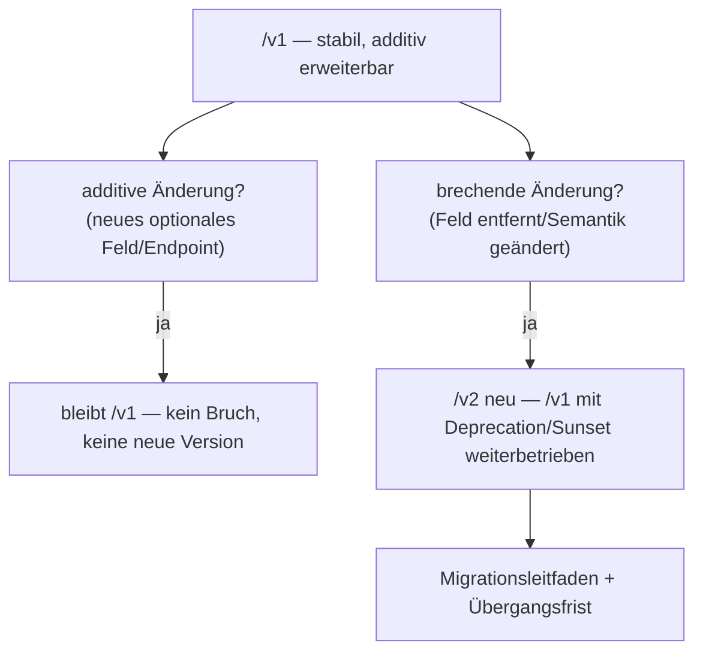
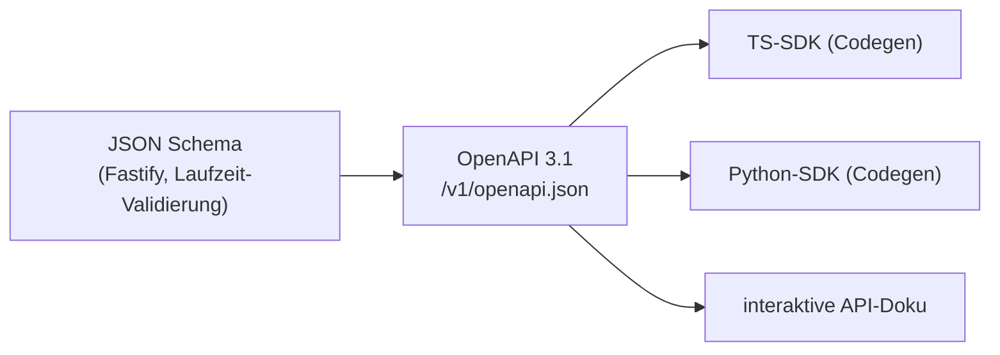

<!--
SPDX-FileCopyrightText: 2026 OpenCivic Contributors
SPDX-License-Identifier: Apache-2.0
-->

# 04 — API-Design & -Versionierung

Aufsetzend auf dem [modularen Monolithen](01-macro-architecture.md), dem
[Provenance-Modell](02-provenance-model.md) und der [Backend-/Frontend-Wahl](03-languages-backend-frontend.md)
legt dieses Dokument die **öffentliche Schnittstelle** von OpenCivic fest — den Vertrag, über den
Bürger:innen, Journalist:innen, andere Behörden und Drittsoftware auf die Plattform zugreifen. Jede
Wahl wird gegen die [priorisierten Qualitätsattribute](../foundation/06-qualitaetsattribute.md)
(QA1–QA10) und die [Entscheidungsprinzipien](../foundation/08-entscheidungsprinzipien.md) (P1–P11)
begründet — inkl. ehrlicher Nennung, wo eine Alternative in einzelnen Punkten tatsächlich stärker ist.

Zwei Entscheidungen tragen dieses Dokument, jede in einer eigenen ADR vertieft:

- **Stil & Contract-Format:** REST mit **OpenAPI 3.1** — [ADR-0012](../adr/0012-api-stil-rest-openapi.md).
- **Versionierung:** **URI-Pfad-Major** (`/v1/…`) + additive, rückwärtskompatible Evolution —
  [ADR-0013](../adr/0013-api-versionierung.md).

> **Leitgedanke:** Die API ist bei OpenCivic nicht bloß Integrationsschicht, sondern selbst ein
> Transparenz-Instrument. Wer eine Zahl anzweifelt, muss die Herkunft dieser Zahl **über dieselbe
> Schnittstelle** und ohne Spezialwerkzeug bis zur amtlichen Quelle auflösen können. Das prägt jede
> Designentscheidung stärker als reine Ingenieur-Eleganz.

---

## 1. Architekturziele der Schnittstelle

| Ziel | Rückbindung | Konsequenz für das API-Design |
|---|---|---|
| **Belege sind an der Schnittstelle sichtbar** | QA1, [Leitprinzip 2 (Quellenzwang)](../foundation/08-entscheidungsprinzipien.md) | Fakthaltige Antworten referenzieren `Statement`-IDs; ein Citation-/Provenance-Endpoint löst die volle Kette auf (§4). |
| **Für Laien erkundbar** | QA2, Zielgruppe Journalist:innen | Lesbar in Browser & `curl`, sichtbare Version in der URL, selbstbeschreibende OpenAPI-Doku. |
| **Offene, standardisierte Verträge** | QA7, P2, P6 | OpenAPI 3.1 + JSON Schema als Single Source of Truth; keine Eigenbau-Contract-Sprache. |
| **Langlebige, evolvierbare Verträge** | QA3, P7 | Additive Evolution ohne Bruch; Breaking Changes nur über neue Major + Deprecation-Policy (§5). |
| **Cache- & skalierbar** | QA8 | Ressourcenorientiertes REST erlaubt HTTP-Caching auf Standard-Infrastruktur (CDN, Reverse-Proxy). |
| **Modulgrenzen bleiben Verträge** | QA3, [ADR-0002](../adr/0002-architekturstil-modular-monolith.md), [ADR-0010](../adr/0010-backend-framework-nodejs-fastify.md) | Jedes Fachmodul exponiert seinen Teil der API schema-first über sein Fastify-Plugin. |

Die Reihenfolge der Qualitätsattribute steuert die Trade-offs: Wo Belegbarkeit (QA1) oder
Erkundbarkeit für Laien (QA2) mit der theoretischen Eleganz einer Alternative kollidieren, gewinnt
das höher priorisierte Attribut — genau dieser Konflikt entscheidet beide ADRs.

---

## 2. API-Stil im Überblick

OpenCivic exponiert eine **ressourcenorientierte REST-API**, deren Vertrag aus JSON Schema als
**OpenAPI-3.1-Dokument** generiert wird. Das nutzt Fastifys Schema-First-Ansatz
([ADR-0010](../adr/0010-backend-framework-nodejs-fastify.md)) direkt: Dieselben Schemas validieren
zur Laufzeit Ein- und Ausgaben und beschreiben zugleich den öffentlichen Contract — Doku und
Implementierung können nicht auseinanderlaufen.

**Warum REST und nicht GraphQL/gRPC?** Die vollständige Herleitung mit fairer Würdigung beider
Alternativen steht in [ADR-0012](../adr/0012-api-stil-rest-openapi.md). Kurzfassung: GraphQL ist bei
stark verlinkten Daten und flexiblen Client-Queries stärker, verliert aber bei Browsbarkeit (QA2),
HTTP-Caching (QA8) und Angriffsfläche (QA4); gRPC ist performanter und vertragsstärker, ist aber im
Browser nicht direkt nutzbar und damit als **öffentliche Bürger-API** ungeeignet. gRPC bleibt eine
mögliche **interne** Transportoption bei späterer Modul-Extraktion (§7).

---

## 3. Ressourcenmodell

Die API bildet die Kern-Entitäten des [Provenance-Modells](02-provenance-model.md) auf stabile,
zitierbare Ressourcen ab. Ressourcen tragen persistente Identifier (interne URN, später ggf.
auflösbare PIDs), sind über kollektionsbasierte Pfade auffindbar und über Filter auf den
First-Class-Achsen (Jurisdiktion, Zeit, Aspekt — [ADR-0008](../adr/0008-jurisdiktions-und-referenzdaten-achse.md))
abfragbar.

| Ressource (Beispiel-Pfad) | Entspricht | Zweck |
|---|---|---|
| `GET /v1/statements/{id}` | `Statement` | Einzelne, atomare Aussage inkl. Referenz auf ihre Provenance. |
| `GET /v1/statements?jurisdiction=DE&aspect=ansatz&validAt=2025-06-01` | Abfrage über `Statement` | Gefilterte, paginierte Kollektion entlang der codierten Achsen. |
| `GET /v1/sources/{id}` / `…/versions/{versionId}` | `Source` / `SourceVersion` | Herkunft und unveränderliche Bronze-Snapshots. |
| `GET /v1/datasets/{id}/versions/{versionId}` | `DatasetVersion` | Silver/Gold-Ableitung mit `code_version`, `content_hash`. |
| `GET /v1/provenance/{statementId}` | volle PROV-Kette | Beleg-Endpoint (§4). |
| `GET /v1/openapi.json` | — | Maschinenlesbarer Contract; Grundlage für SDK-Codegen. |

**Konventionen (in der ADR verbindlich, hier illustriert):** Substantive im Plural für Kollektionen;
`GET` ist die tragende, cachebare Operation der öffentlichen Lese-API; schreibende Operationen
(Kuratierung, Ingest-Steuerung) sind authentifiziert und liegen außerhalb der anonym erkundbaren
Lesefläche; Fehler folgen einem einheitlichen `Problem+JSON`-Schema (RFC 9457); Zeit- und
Währungsangaben nutzen ISO 8601 / ISO 4217 wie im Datenmodell.

---

## 4. Provenance an der Schnittstelle (der Kern)

Der Quellenzwang aus dem [Provenance-Modell](02-provenance-model.md#8-zitierbarkeit-beleg-an-der-schnittstelle)
wird hier **API-seitig sichtbar** gemacht (QA1, [ADR-0006](../adr/0006-provenance-modell-w3c-prov.md)):

1. **Jede fakthaltige Antwort referenziert `Statement`-IDs.** Eine Zahl ohne auflösbaren Beleg gibt
   es an der Schnittstelle nicht — so wie es sie im Datenmodell nicht gibt.
2. **Ein dedizierter Provenance-/Citation-Endpoint** (`GET /v1/provenance/{statementId}`) liefert die
   **volle Kette** in zwei Repräsentationen:
   - **maschinenlesbar** — der Herkunftsgraph als **PROV-JSON / JSON-LD** (`Statement → DatasetVersion → SourceVersion → Source`),
   - **menschenlesbar** — ein **Citation-Objekt**: Quelle, Publisher, `retrieved_at`, Upstream-URL,
     Lizenz (SPDX), `content_hash`, `DatasetVersion`.

Dass dieser Weg **ohne SDK, ohne Login und mit sichtbarer URL** funktioniert, ist kein Komfort,
sondern die technische Einlösung von QA1 gegenüber nicht-technischen Zielgruppen. Genau hier zahlt
sich die Browsbarkeit von REST (QA2) unmittelbar auf das höchstpriorisierte Qualitätsattribut ein —
ein Argument, das GraphQL/gRPC an dieser Stelle schwächer bedienen.

---

## 5. Versionierung

Die vollständige Herleitung steht in [ADR-0013](../adr/0013-api-versionierung.md); hier die
tragenden Regeln:

- **Sichtbare Major in der URL:** `/v1/…`, `/v2/…`. Eine Version ist ohne Header-Wissen erkennbar,
  verlinkbar, in Lesezeichen und Zitaten stabil — entscheidend für Laien und für die Zitierbarkeit
  über Jahre (P7).
- **Additive Evolution innerhalb einer Major:** Neue optionale Felder, neue Endpunkte, neue optionale
  Query-Parameter sind **nicht** brechend und erscheinen ohne Versionswechsel. Konsument:innen dürfen
  unbekannte Felder ignorieren (Robustheitsprinzip).
- **Breaking Changes nur mit neuer Major** und begleitet von einer **Deprecation-Policy**: `Deprecation`-/
  `Sunset`-Header, dokumentierter Mindest-Support-Zeitraum, Migrationsleitfaden, paralleler Betrieb
  von `/v1` und `/v2` während der Übergangsfrist.

**Warum nicht Header-/Media-Type-Versionierung?** Sie erzeugt sauberere URLs und ist HATEOAS-näher —
ein echter Vorteil, der in der ADR fair gewürdigt wird. Für OpenCivic wiegt jedoch die Sichtbarkeit
und Testbarkeit der Version für Nicht-Spezialist:innen (QA2) schwerer als die URL-Ästhetik. Auch
„gar kein Versionsschema, nur additiv" wird verworfen: Es lässt keinen sauberen Pfad für die
unvermeidbaren echten Breaking Changes über einen 10-Jahres-Horizont.

---

## 6. SDKs & Contract-getriebene Konsumierung

Das OpenAPI-3.1-Dokument ist die **Single Source of Truth**. Client-SDKs werden daraus **generiert**
(Codegen), nicht handgeschrieben — konsistent mit „Automatisierung vor Konvention" (P10) und der
geteilten TS-Typenlinie aus [ADR-0009](../adr/0009-programmiersprachen-typescript-python.md).

Die generierten SDKs stehen — wie Libs und Datenmodelle — unter **Apache-2.0** (Split-Lizenz,
[ADR-0001](../adr/0001-lizenzmodell-split.md)), damit Dritte sie ohne Copyleft-Sorgen einbinden
können. Die konkrete Codegen-Kette ist als Folge-Arbeit im Build-/Repo-Topic verortet (vgl.
[03 §5](03-languages-backend-frontend.md#5-bewusst-offen-folge-topics)).

---

## 7. Interner Transport bei Modul-Extraktion (Ausblick)

OpenCivic startet als modularer Monolith mit **Extraktions-Nähten**
([ADR-0002](../adr/0002-architekturstil-modular-monolith.md)). Wird ein Fachmodul später als
eigener Service herausgelöst, ist der **interne** Transport zwischen den Diensten eine separate,
reversible Entscheidung (P8). Dort kann **gRPC** eine sinnvolle Option sein — starke Contracts,
gute Performance, ideal für dienstinterne Kommunikation. Das berührt die **öffentliche** API nicht:
Diese bleibt REST + OpenAPI. Die Trennung „öffentlich REST / intern ggf. gRPC" ist bewusst und in
[ADR-0012](../adr/0012-api-stil-rest-openapi.md) festgehalten.

---

## 8. Zusammenspiel mit den Qualitätsattributen

| QA (priorisiert) | Wirkung der API-Wahl |
|---|---|
| QA1 Nachvollziehbarkeit | `Statement`-Referenzen + Citation-Endpoint machen den Beleg an der Schnittstelle sichtbar und auflösbar (§4). |
| QA2 Barrierefreiheit/Zugänglichkeit | In Browser & `curl` erkundbar; sichtbare Version in der URL; selbstbeschreibende OpenAPI-Doku senkt die Einstiegshürde für Journalist:innen. |
| QA3 Wartbarkeit/Evolvierbarkeit | Additive Evolution + saubere Major-Grenze halten Verträge über 10+ Jahre stabil (P7). |
| QA4 Sicherheit/Datenschutz | Ressourcenorientiertes REST hat eine kleinere DoS-Angriffsfläche als frei formulierbare Queries; schreibende Endpunkte sind authentifiziert und von der anonymen Lesefläche getrennt. |
| QA5 Self-Hosting | Standard-HTTP läuft hinter jedem Reverse-Proxy/CDN, in allen Deployment-Profilen. |
| QA6 Testbarkeit | Der OpenAPI-Contract ist automatisiert testbar (Contract-Tests, Schema-Diffs für Breaking-Change-Erkennung). |
| QA7 Interoperabilität | OpenAPI 3.1 + JSON Schema sind offene Standardschnittstellen (P2, P6); Provenance als PROV-JSON/JSON-LD. |
| QA8 Performance/Skalierung | Cachebare `GET`-Ressourcen erlauben Edge-Caching auf Standard-Infrastruktur. |
| QA9 Observability | Standard-HTTP-Semantik (Statuscodes, Methoden, Pfade) ist mit vorhandenen OpenTelemetry-/Tracing-Werkzeugen ohne Sonderbehandlung beobachtbar. |
| QA10 i18n | Localization-Kern liefert Labels getrennt von Fakten; menschenlesbare Citation-Felder sind lokalisierbar (QA10). |

---

## 9. Bewusst offen (Folge-Topics)

- **Authentifizierung/Autorisierung** für schreibende Endpunkte (OAuth2/OIDC-Details) → Security-/
  Identity-Topic.
- **Konkrete Codegen-Kette** (Toolwahl, CI-Integration) → Build-/Repo-Topic.
- **Rate-Limiting & Quotas** der öffentlichen API → Betriebs-/Security-Topic.
- **Pagination-/Filter-Detailkonventionen** je Fachmodul → beim jeweiligen Modul (OpenBudget zuerst).
- **Interner Transport** bei tatsächlicher Modul-Extraktion (gRPC ja/nein) → eigener Topic zum
  Extraktionszeitpunkt (§7).
