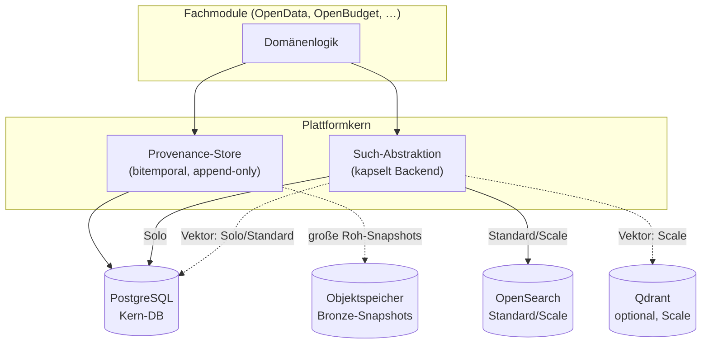
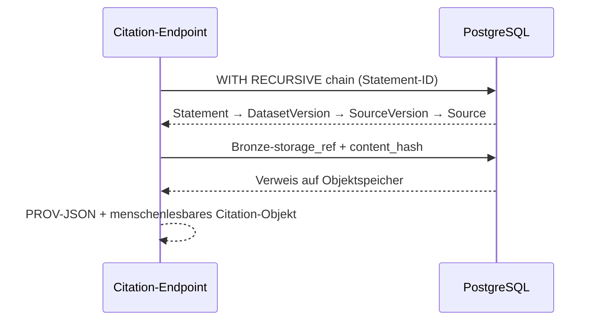
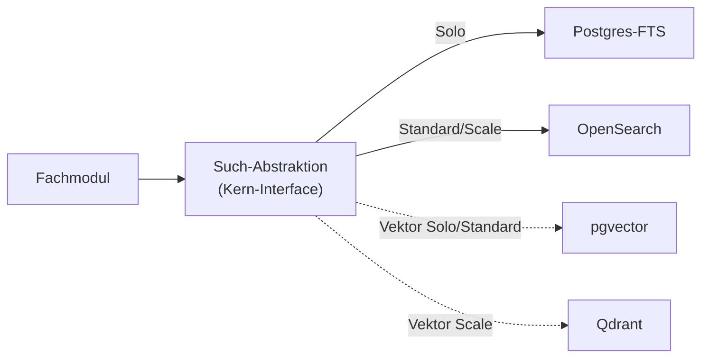

<!--
SPDX-FileCopyrightText: 2026 OpenCivic Contributors
SPDX-License-Identifier: Apache-2.0
-->

# 05 — Datenbanken, Suche & Vektorsuche

Dieses Dokument legt die **Speicher- und Suchschicht** von OpenCivic fest. Es ist die technische
Antwort auf die produktneutralen Speicheranforderungen aus
[§10 des Provenance-Datenmodells](02-provenance-model.md#10-anforderungen-an-die-speicherung-input-für-den-db-topic)
und ordnet sich in den [Plattformkern](../adr/0003-plattformkern-und-modulschnitt.md) ein.
Es bindet unmittelbar an die [Qualitätsattribute](../foundation/06-qualitaetsattribute.md) QA1
(Nachvollziehbarkeit — höchste Priorität), QA3 (Wartbarkeit), QA5 (Portabilität/Self-Hostbarkeit),
QA7 (Interoperabilität) und QA8 (Performance/Skalierbarkeit) sowie an die
[Entscheidungsprinzipien](../foundation/08-entscheidungsprinzipien.md) P1 (boring & bewährt),
P2 (offene Standards), P3 (keine harten Anbieter-Abhängigkeiten), P4 (lizenzkompatibel),
P7 (Daten sind langlebiger als Code), P8 (Reversibilität) und P11 (TCO über 10 Jahre).

Zwei ADRs konkretisieren die hier dargestellte Landkarte:
[ADR-0014 — Primäre Datenbank (PostgreSQL)](../adr/0014-primaere-datenbank-postgresql.md) und
[ADR-0015 — Suche & Vektorsuche](../adr/0015-suche-und-vektorsuche.md).

> **Leitsatz:** Ein System, so lange es reicht. OpenCivic beginnt mit **PostgreSQL als einziger
> Kern-Datenbank** und führt zusätzliche Speicher- oder Suchsysteme erst ein, wenn ein
> Deployment-Profil sie nachweislich braucht — nie prophylaktisch.

---

## 1. Überblick: eine Kern-DB, gestaffelte Suche

Die Speicherschicht folgt zwei Grundsätzen, die direkt aus den Prinzipien folgen:

- **Ein System statt vieler** (P1, P11, R9): Betriebs-, Backup- und Konsistenz-Komplexität wächst
  überproportional mit der Zahl der Datenbanken. PostgreSQL deckt relationale Daten, JSONB-Dokumente,
  Volltextsuche und — via `pgvector` — Vektorsuche in **einem** transaktionalen System ab.
- **Gestaffelt entlang der Deployment-Profile** (siehe
  [ADR-0002](../adr/0002-architekturstil-modular-monolith.md)): Die Solo-Installation kommt ohne jede
  Zusatzinfrastruktur aus; Standard/Scale schalten dedizierte Such- und Vektor-Engines hinzu, ohne
  dass Fachmodul-Code sich ändert — gekapselt hinter der Such-Abstraktion des Kerns
  ([ADR-0003](../adr/0003-plattformkern-und-modulschnitt.md)).



Der Objektspeicher (S3-kompatibel) hält die unveränderlichen **Bronze-Snapshots** (`storage_ref` in
`SourceVersion`), wie im [Medallion-Datenfluss](../adr/0004-kanonischer-datenfluss-medallion-provenance.md)
und im Provenance-Modell vorgesehen. PostgreSQL speichert die strukturierten Provenance-, Silver-
und Gold-Daten sowie die Metadaten zu den Bronze-Objekten. Große Binärrohdaten gehören **nicht** in
die relationale DB — Postgres hält den Hash und den `storage_ref`, nicht die 200-MB-PDF.

---

## 2. Warum PostgreSQL die Provenance-Anforderungen erfüllt

Die fünf Speicheranforderungen aus
[§10 des Provenance-Modells](02-provenance-model.md#10-anforderungen-an-die-speicherung-input-für-den-db-topic)
werden direkt auf Postgres-Bordmittel abgebildet. Jede Zeile ist eine Anforderung, kein
Erweiterungswunsch:

| Anforderung (§10) | Postgres-Mechanismus | Rückbindung |
|---|---|---|
| **Append-only / Unveränderlichkeit** | MVCC + Insert-only-Zugriffsmuster, `INSERT`-Trigger-Guards, `REVOKE UPDATE/DELETE` auf Historientabellen | QA1, [ADR-0007](../adr/0007-bitemporal-append-only-lifecycle.md) |
| **Bitemporale Abfragen** (`valid_time` × `system_time`) | `tstzrange`/`daterange` Range Types + GiST-Indizes, Exclusion Constraints gegen Überlappung | QA1, P7 |
| **Graph-Traversierung** der Herkunftskette | rekursive CTEs (`WITH RECURSIVE`) in beide Richtungen | QA1 |
| **Hash-Integrität + Objektspeicher-Verweis** | `bytea`/`text`-Hashfelder, `storage_ref` auf S3-kompatiblen Speicher | QA1, R11 |
| **Skalierbare Filter** (Jurisdiktion, Aspekt, Zeit) | B-Tree/GiST/GIN-Indizes, Partitionierung, `tsvector`-Volltext | QA8 |
| **Flexible/typisierte Statement-Values** | `JSONB` mit `jsonb_path_ops`-GIN-Index | QA3, [ADR-0006](../adr/0006-provenance-modell-w3c-prov.md) |

### 2.1 Bitemporalität mit Range Types

`valid_time` (Realwelt-Gültigkeit) und `system_time` (Erfassungszeit) sind zwei unabhängige Achsen.
Postgres-Range-Types drücken beide nativ aus und lassen sich mit **Exclusion Constraints**
absichern, sodass sich für ein und dieselbe Aussage keine überlappenden Gültigkeitsintervalle bilden
können — eine Integritätsgarantie auf DB-Ebene, nicht bloß in Anwendungscode.

```sql
-- system_time offen = aktuell; superseded/retracted setzen system_time_to
CREATE TABLE statement (
  id              text PRIMARY KEY,
  subject_ref     text NOT NULL,
  aspect          text NOT NULL,
  value           jsonb NOT NULL,
  unit            text,                       -- ISO 4217 bei Beträgen
  valid_time      daterange NOT NULL,         -- Realwelt-Gültigkeit
  system_time     tstzrange NOT NULL          -- [erfasst, offen)
                    DEFAULT tstzrange(now(), NULL, '[)'),
  jurisdiction_id text NOT NULL,
  lifecycle       text NOT NULL DEFAULT 'active',
  dataset_version_id text NOT NULL,
  revision_of     text
);

-- "Was zeigte OpenCivic am 12.03.2026 für Haushaltsjahr 2025 an?"
SELECT * FROM statement
WHERE subject_ref = 'titel:685-01'
  AND valid_time  @> DATE '2025-06-01'
  AND system_time @> TIMESTAMPTZ '2026-03-12T00:00:00Z';
```

### 2.2 Graph-Traversierung ohne Graph-DB

Die Herkunftskette `Statement → DatasetVersion → SourceVersion → Source` ist ein **gerichteter,
azyklischer Pfad geringer Tiefe** (typisch 3–5 Kanten, gelegentlich zusätzliche
`derived`-Statement-Eingänge). Für diese Kettentiefe genügt eine rekursive CTE vollständig; es
braucht keine spezialisierte Graph-Engine.

```sql
-- volle Provenance-Kette eines Statements auflösen
WITH RECURSIVE chain AS (
  SELECT id, dataset_version_id, 0 AS depth
  FROM statement WHERE id = $1
  UNION ALL
  SELECT dv.id, dv.derived_from_source_version_id, c.depth + 1
  FROM chain c
  JOIN dataset_version dv ON dv.id = c.dataset_version_id
)
SELECT * FROM chain ORDER BY depth;
```



### 2.3 JSONB für typisierte, flexible Werte

Statement-`value` ist mal ein Betrag (`EUR`), mal Text, mal eine strukturierte Größe. `JSONB`
speichert diese Varianz typerhaltend und bleibt dennoch indizier- und abfragbar
(`jsonb_path_ops`-GIN). So bleibt das Kernschema stabil (P7), während Fachmodule ihre
Wertstrukturen weiterentwickeln (QA3) — ohne dass jede neue Aspekt-Art eine Schema-Migration
erzwingt.

### 2.4 Volltextsuche eingebaut

Postgres bringt mit `tsvector`/`tsquery`, GIN-Index, Ranking (`ts_rank`) und Wörterbüchern
(inkl. deutscher Stemming-Konfiguration) eine vollwertige Volltextsuche mit — genug, um das
**Solo-Profil ohne jede Zusatzinfrastruktur** suchfähig zu machen (QA5). Erst wenn große Korpora
und tiefe Facettierung ins Spiel kommen, lohnt eine dedizierte Engine (siehe §3).

---

## 3. Suche: gestaffelt entlang der Deployment-Profile

Suche ist im Kern hinter einer **Such-Abstraktion** gekapselt
([ADR-0003](../adr/0003-plattformkern-und-modulschnitt.md)). Fachmodule sprechen gegen ein
stabiles Interface (`index()`, `query()`, `facet()`); welches Backend antwortet, entscheidet das
Deployment-Profil — nicht der Modul-Code. Das erhält QA3 (Wartbarkeit) und P8 (Reversibilität):
ein Backend-Wechsel ist eine Konfigurations-, keine Code-Frage.

| Profil | Volltext-/Facettensuche | Vektorsuche (ab Phase 4) | Zusatzinfrastruktur |
|---|---|---|---|
| **Solo** | Postgres-FTS (`tsvector`) | `pgvector` in derselben Postgres | keine |
| **Standard** | OpenSearch (Apache-2.0) | `pgvector` | 1× Such-Engine |
| **Scale** | OpenSearch (Apache-2.0) | Qdrant (Apache-2.0) optional | Such- + Vektor-Engine |



### 3.1 OpenSearch statt Elasticsearch — eine Lizenz-Governance-Entscheidung

Für Standard/Scale fällt die Wahl bewusst auf **OpenSearch (Apache-2.0)**, nicht auf Elasticsearch.
Elastic hat Elasticsearch auf die **SSPL** relizenziert — eine Single-Vendor-Copyleft-Lizenz, die
nicht als Open Source im Sinne der OSI anerkannt ist und Self-Hosting/Weiterverbreitung rechtlich
belastet. Genau diese Art von Governance-Risiko sollen die Prinzipien vermeiden:

- **P2 (offene Standards):** OpenSearch steht unter Apache-2.0 und wird herstellerneutral
  (heute u. a. unter Dach der Linux Foundation) entwickelt.
- **P3 (keine harten Anbieter-Abhängigkeiten):** SSPL koppelt die Zukunft an einen einzelnen
  kommerziellen Anbieter — das widerspricht der Cloud-/Vendor-Neutralität.
- **P4 (lizenzkompatible Abhängigkeiten):** SSPL ist mit dem Split-Lizenzmodell
  ([ADR-0001](../adr/0001-lizenzmodell-split.md)) und mit unbeschwertem Self-Hosting nicht
  verträglich.

OpenSearch ist API- und funktional weitgehend kompatibel zum früheren Elasticsearch-Stand und bringt
skalierbare Volltext-, Facetten- und Aggregations-Suche mit — passend für die Datenexploration in
OpenBudget (QA8).

### 3.2 Vektorsuche: pgvector zuerst, Qdrant nur bei Bedarf

Vektorsuche wird erst mit **CivicAI/RAG in Phase 4** relevant
([Roadmap](../foundation/10-roadmap.md)). Das Prinzip „ein System, so lange es reicht" gilt hier
besonders streng: Statt sofort eine vierte Datenbank einzuführen, nutzen Solo und Standard
`pgvector` in **derselben** PostgreSQL. Embeddings liegen damit transaktional konsistent neben den
Statements, die sie repräsentieren — kein separater Sync, kein Konsistenzfenster.

Erst wenn die Vektormenge (Millionen bis Hunderte Millionen Vektoren mit hohen QPS-Anforderungen)
`pgvector` überfordert, kommt im **Scale-Profil optional Qdrant (Apache-2.0)** als spezialisierte
ANN-Engine hinzu — wieder hinter derselben Such-Abstraktion. Die Entscheidung, ob und wann, bleibt
so bis zum tatsächlichen Bedarf offen (P8).

---

## 4. Objektspeicher für Bronze

Rohe Quell-Snapshots (Bronze) sind groß, binär und unveränderlich. Sie gehören in einen
**S3-kompatiblen Objektspeicher** (self-hostbar via MinIO/Ceph, QA5), nicht in die relationale DB.
PostgreSQL hält pro `SourceVersion` nur `content_hash`, `media_type`, `byte_size` und `storage_ref`.
So bleibt die Kern-DB schlank und schnell, während die Integrität über den Hash prüfbar bleibt (R11).

---

## 5. Betriebliche Konsequenzen und Rückbindung

- **Solo bleibt trivial betreibbar** (QA5, QA3): Eine einzige Postgres-Instanz plus Objektspeicher
  genügt für vollständige Funktion inkl. Suche und — später — Vektorsuche. Das senkt die
  Einstiegshürde für kleine Kommunen und Freiwillige drastisch.
- **Skalierung ist additiv, nicht disruptiv** (P8): Standard/Scale ergänzen OpenSearch bzw. Qdrant,
  ohne die Kern-DB oder Modul-Code zu ersetzen.
- **Langlebigkeit** (P1, P11, QA3): PostgreSQL ist eines der am längsten gepflegten Open-Source-
  Projekte überhaupt, mit breiter Anbietervielfalt und klarem Support-Horizont — „boring" im besten
  Sinne.
- **Interoperabilität** (P6, QA7): Der Zugriff erfolgt über SQL — eine Standardschnittstelle statt
  einer proprietären Query-Sprache.

Die Speicherschicht ist damit auf die höchstpriorisierte Qualität ausgerichtet: **Korrektheit und
Nachvollziehbarkeit (QA1) vor Geschwindigkeit** — und liefert die schnellen Pfade (Suche, Vektor)
dort nach, wo ein Profil sie wirklich braucht.
