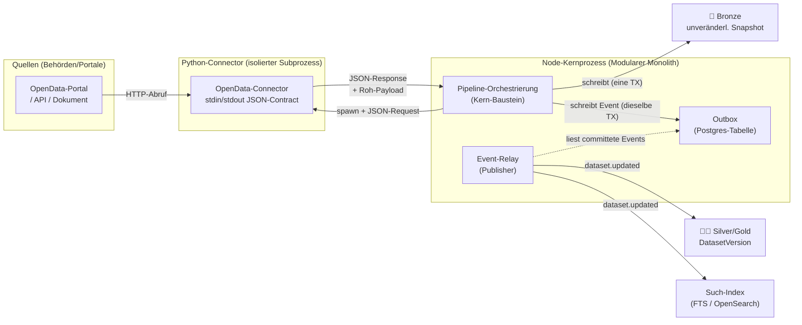
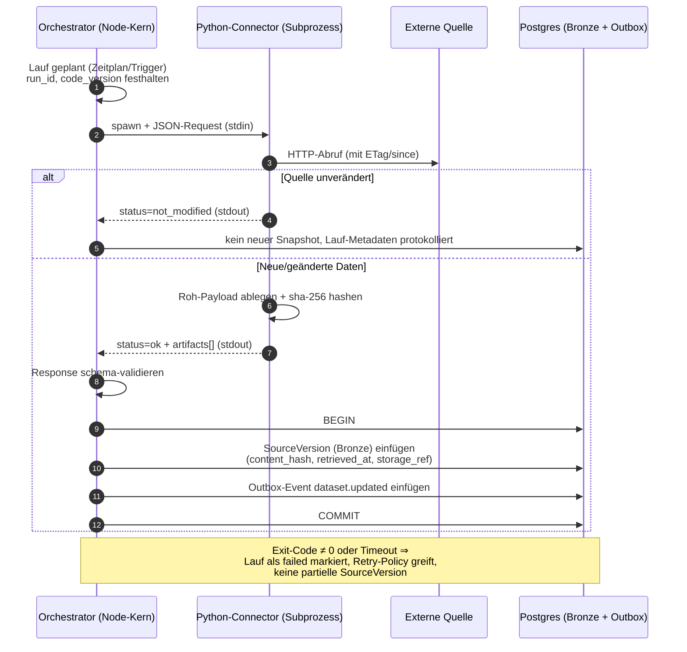
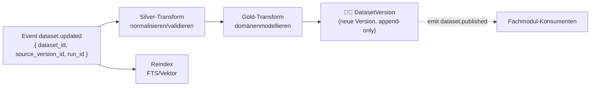
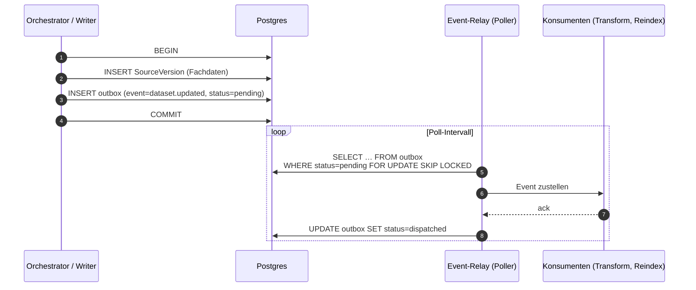

<!--
SPDX-FileCopyrightText: 2026 OpenCivic Contributors
SPDX-License-Identifier: Apache-2.0
-->

# 06 — ETL-Orchestrierung & Event-System

Dieses Dokument beschreibt, **wie Daten in OpenCivic entstehen und wie ihre Verarbeitung
angestoßen wird**: von der Ausführung der OpenData-Connectors über die Schichtung
Bronze → Silver → Gold bis zur entkoppelten Neuberechnung und Reindizierung per Events. Es
operationalisiert den [kanonischen Medallion-Datenfluss](../adr/0004-kanonischer-datenfluss-medallion-provenance.md)
und den [Quellenzwang](../foundation/03-leitprinzipien.md) (Leitprinzip 2): Daten werden nicht nur
transportiert, sondern **reproduzierbar und lückenlos belegt** erzeugt (Leitprinzip 4, QA1
Nachvollziehbarkeit).

Zwei Bausteine des [Plattformkerns](../adr/0003-plattformkern-und-modulschnitt.md) werden hier konkret:
die **Pipeline-Orchestrierung** ([ADR-0016](../adr/0016-pipeline-orchestrierung.md)) und der
**Event-Bus** ([ADR-0017](../adr/0017-event-bus.md)). Beide sind so entworfen, dass das
Solo-Deployment-Profil ([ADR-0002](../adr/0002-architekturstil-modular-monolith.md)) **ohne jede
Zusatzinfrastruktur** lauffähig bleibt (QA5 Self-Hostbarkeit, Risiko R9) und erst bei Bedarf zu
Standard/Scale hin skaliert — ohne die Anwendungslogik zu verändern.

Leitende Qualitätsattribute: **QA1** (Nachvollziehbarkeit/Auditability), **QA3** (Wartbarkeit),
**QA5** (Self-Hostbarkeit), **QA8** (Performance/Skalierbarkeit), **QA9** (Observability).
Leitende Prinzipien: **P1** (boring & bewährt), **P3** (keine harten Cloud-Abhängigkeiten),
**P5** (wenige Sprachen), **P8** (Reversibilität), **P11** (10-Jahre-TCO).

---

## 1. Überblick

Die Datenverarbeitung von OpenCivic hat zwei getrennte, bewusst entkoppelte Hälften:

1. **Ingest & Transform (ETL, „push"-gesteuert vom Orchestrator):** Der Orchestrator im
   Node-Kernprozess plant und startet Läufe, ruft die Python-Connectors auf, legt Bronze-Snapshots
   ab und stößt die Silver/Gold-Ableitung an. Er ist der einzige Ort, der *weiß*, wann etwas neu
   verarbeitet wird.
2. **Reaktion & Präsentation (Event-getrieben, „pull"-fähig von Konsumenten):** Sobald ein Datensatz
   fortgeschrieben ist, wird ein **Domänen-Event** (`dataset.updated` u. a.) veröffentlicht.
   Nachgelagerte Konsumenten — Silver/Gold-Neuberechnung, Suchreindizierung, künftige Fachmodule —
   reagieren darauf **asynchron und ohne Kenntnis voneinander**.



> **Architekturziel 4 (Entkopplung von Ingest und Präsentation):** Der Orchestrator kennt keine
> Suchmaschine, und die Suche kennt keinen Connector. Beide sprechen nur über Events. Das ist die
> Naht, an der Fachmodule (OpenBudget zuerst) und Infrastruktur unabhängig voneinander wachsen.

---

## 2. Pipeline-Orchestrierung im Node-Kern

### 2.1 Warum in-Prozess

Die Orchestrierung ist ein **Kern-Baustein**, kein separates Fremdsystem. Sie läuft im selben
Node.js/Fastify-Prozess wie der Rest des Kerns ([ADR-0010](../adr/0010-backend-framework-nodejs-fastify.md)),
teilt sich dessen Postgres-Verbindung ([ADR-0014](../adr/0014-primaere-datenbank-postgresql.md)) und
dessen Deployment-Artefakt. Das ist die entscheidende Voraussetzung dafür, dass ein
**Solo-Betreiber** OpenCivic mit einem einzigen Container plus einer Postgres-Instanz betreiben
kann — ohne Scheduler-Cluster, ohne Worker-Pool, ohne zweite Betriebswelt (QA5, R9, P11). Die
Begründung dieser Wahl und die fair abgewogenen Alternativen (Airflow, Dagster/Prefect, Cron)
stehen in [ADR-0016](../adr/0016-pipeline-orchestrierung.md).

### 2.2 Sprachgrenze: Python-Connectors als Subprozess

Fachlogik, Frontend und Kern sind TypeScript; **nur** die OpenData-Connectors sind Python
([ADR-0009](../adr/0009-programmiersprachen-typescript-python.md)), weil dort das reife Ökosystem für
Daten-Parsing (PDF, Tabellen, Geodaten) lebt. Die Sprachgrenze ist zugleich eine **Prozessgrenze**:
Der Orchestrator startet jeden Connector als **isolierten, kurzlebigen Subprozess** und kommuniziert
über einen **klaren JSON-Contract über `stdin`/`stdout`**.

Diese Prozessisolation ist Absicht:

- **Fehlerisolation:** Ein abstürzender oder hängender Connector reißt den Kernprozess nicht mit;
  der Orchestrator setzt Timeouts und wertet den Exit-Code aus (QA3, Robustheit).
- **Ressourcen-/Sicherheitsgrenze:** Der Subprozess kann mit reduzierten Rechten und Netz-/
  Dateisystem-Limits laufen (P9 secure by default) — er ist der einzige Teil, der ungeprüfte
  externe Inhalte anfasst.
- **Keine ABI-/Laufzeitkopplung:** Node und der Python-Interpreter teilen keinen Speicher; die
  Kopplung ist ausschließlich der versionierte JSON-Contract (P6 Standardschnittstellen).

### 2.3 Contract über stdin/stdout

Der Orchestrator schreibt einen **Request** (ein JSON-Objekt) auf `stdin` des Connectors und liest
eine **Response** von `stdout`; Roh-Payloads (das eigentliche Bronze-Material) werden nicht durch
`stdout` gequetscht, sondern vom Connector in einen übergebenen Ablagepfad/Objektspeicher geschrieben
und in der Response nur referenziert (Pfad + `content_hash`). `stderr` ist reserviert für
strukturierte Logs/Diagnose.

```jsonc
// Orchestrator → Connector (stdin)
{
  "contract_version": "1",
  "run_id": "urn:oc:run:2026-07-11T09:00:00Z#3f2a",
  "source_id": "urn:oc:source:de-bund-haushalt",
  "params": { "haushaltsjahr": 2025 },
  "output_dir": "/var/lib/opencivic/bronze/incoming/3f2a",
  "since": { "etag": "\"a1b2c3\"", "retrieved_at": "2026-02-01T09:00:00Z" }
}
```

```jsonc
// Connector → Orchestrator (stdout)
{
  "contract_version": "1",
  "status": "ok",                       // ok | not_modified | error
  "artifacts": [
    {
      "storage_ref": "bronze/incoming/3f2a/haushalt-2025.pdf",
      "media_type": "application/pdf",
      "byte_size": 4823019,
      "content_hash": "sha256:a1b2c3…",
      "upstream_uri": "https://…/haushalt2025.pdf",
      "upstream_version_label": "Haushaltsjahr 2025",
      "license": "DL-DE-BY-2.0",
      "fetch_metadata": { "etag": "\"a1b2c3\"", "http_status": 200 }
    }
  ],
  "connector": { "name": "de-bund-haushalt", "code_version": "git:9f8e…" }
}
```

Der Contract ist **schema-validiert** (JSON Schema, konsistent mit dem Contract-First-Ansatz aus
[ADR-0012/0013](04-api-design.md)) und **additiv versioniert** (`contract_version`): Neue Felder
brechen alte Connectors nicht (P7 Daten sind langlebiger als Code). `status: "not_modified"`
(abgeleitet aus ETag/`since`) erlaubt es, unveränderte Quellen ohne neuen Bronze-Snapshot zu
überspringen — das hält die Historie sauber und spart Arbeit.

### 2.4 Ablauf eines Laufs



Kernpunkt: Der **Bronze-Snapshot und das auslösende Event werden in **einer** Postgres-Transaktion**
geschrieben (siehe §4). Der Datenschreibvorgang und sein „ist passiert"-Signal können nicht
auseinanderfallen.

### 2.5 Determinismus & Reproduzierbarkeit

Reproduzierbarkeit ist kein Nachgedanke, sondern eine Kern-Invariante (Leitprinzip 4, QA1). Jeder
Lauf zeichnet auf und persistiert über das [Provenance-Modell](02-provenance-model.md)
([ADR-0006](../adr/0006-provenance-modell-w3c-prov.md)/[0007](../adr/0007-bitemporal-append-only-lifecycle.md)):

| Aufgezeichnet | Feld / Ort | Zweck |
|---|---|---|
| Wer hat verarbeitet | `Agent` (kind=software), `code_version` = git-sha/Container-Digest | „Mit welchem Code entstand das?" |
| Wann | `Activity.started_at/ended_at`, `retrieved_at` (ISO 8601) | Bitemporale Einordnung |
| Woraus | Input-Hashes: `SourceVersion.content_hash` (sha-256) | „Auf welchem Rohstoff basiert die Ableitung?" |
| Was entstand | `SourceVersion` / `DatasetVersion` mit eigenem `content_hash` | Integrität, Manipulationserkennung (R11) |
| Lauf-Klammer | `pipeline_run_id` (= `run_id`) auf allen Erzeugnissen | Ein Lauf ist als Ganzes rekonstruierbar |

Damit gilt: Gleicher `code_version` + gleiche Input-Hashes ⇒ gleiches Ergebnis, und jede
Abweichung ist auf einen konkreten Code- oder Quelldaten-Unterschied zurückführbar. Das ist die
Grundlage, um Zahlen in OpenBudget nicht nur zu zeigen, sondern **nachprüfbar** zu zeigen.

---

## 3. Silver/Gold-Transform als Event-Konsument

Die Transformation Bronze → Silver → Gold läuft **nicht** synchron im selben Aufruf, sondern als
Reaktion auf `dataset.updated`. Der Orchestrator ist damit schnell wieder frei; die (potenziell
teure) Modellierung geschieht entkoppelt und lässt sich unabhängig skalieren, wiederholen und
observieren (QA8, QA9).



Jede Transform erzeugt eine **neue** `DatasetVersion` (append-only, `wasDerivedFrom` die
SourceVersion) und emittiert bei Erfolg selbst wieder ein Event (`dataset.published`) — Ketten aus
kleinen, idempotenten Schritten statt eines Monolith-Jobs. Idempotenz ist Pflicht, weil die
Zustellung *mindestens einmal* erfolgt (§4.3): ein zweimal zugestelltes `dataset.updated` darf nicht
zu doppelten oder inkonsistenten DatasetVersions führen — Deduplizierung erfolgt über
`(dataset_id, source_version_id, code_version)`.

---

## 4. Event-System

### 4.1 Problem: verlorene Events

Der klassische Fehler ist, in *einer* Transaktion die Daten zu schreiben und *danach* (außerhalb der
Transaktion) ein Event zu publizieren. Stürzt der Prozess zwischen Commit und Publish ab, ist der
Datensatz fortgeschrieben, aber **niemand erfährt es** — Silver/Gold und Suche laufen still aus dem
Takt. Für eine audit-kritische Plattform (QA1) ist das inakzeptabel.

### 4.2 Solo-Profil: Transaktionales Outbox-Pattern in Postgres

Im Solo-Profil ist der Event-Bus **kein Zusatzsystem**, sondern eine Tabelle in derselben Postgres,
die schon die Fachdaten hält. Das Event wird in **derselben Transaktion** wie der Datenschreibvorgang
in eine `outbox`-Tabelle geschrieben. Entweder beides committet oder nichts — Events können nicht
mehr verloren gehen (P1 boring, P3 keine Zusatzabhängigkeit, QA5).



Der **Relay** pollt die Outbox in kurzem Intervall, stellt zu und markiert dispatched.
`FOR UPDATE SKIP LOCKED` erlaubt später auch mehrere Relay-Instanzen ohne Doppelzustellung im
Normalfall. Im Solo-Profil sind Konsumenten schlicht In-Process-Handler; das Poll-Intervall ist die
einzige (geringe) Latenz, die man dafür bezahlt, kein Broker-System zu betreiben.

### 4.3 Standard/Scale-Profil: NATS (JetStream)

Wächst das Deployment (mehrere Nodes, echte Nebenläufigkeit, mehr Fachmodule), wird der Relay zum
**Publisher auf NATS (JetStream)**. Die Outbox bleibt als **Ursprung der Wahrheit** bestehen — sie
garantiert weiterhin, dass jedes committete Fachdatum genau ein Event hervorbringt; der Relay
überträgt es nur zusätzlich in den Broker. Das ist ein *reiner Ausbau*, kein Umbau der
Anwendungslogik (P8 Reversibilität).

NATS wurde gewählt, weil es als **Single-Binary**, **Apache-2.0**-lizenziert und leichtgewichtig
self-hostbar ist (P2/P4 Lizenz & offene Standards, P3, QA5). JetStream liefert **Durability** und
**mindestens-einmal-Zustellung** — genau die Garantie, die audit-relevante Events brauchen. Die
Abwägung gegen Kafka, Redis Streams und RabbitMQ steht in
[ADR-0017](../adr/0017-event-bus.md).

### 4.4 Deployment-Profile im Überblick

| Aspekt | Solo | Standard | Scale |
|---|---|---|---|
| Orchestrierung | in-Prozess (Node-Kern) | in-Prozess | in-Prozess, ggf. dedizierte Worker-Nodes |
| Event-Transport | Postgres-Outbox + In-Process-Relay | Outbox → **NATS JetStream** | Outbox → NATS JetStream (geclustert) |
| Suche | Postgres-FTS | OpenSearch | OpenSearch + Qdrant (Vektor-Scale) |
| Zusatz-Ops-Komponenten | **0** | 1 (NATS) | wenige, alle Apache-2.0/OSS |
| Zustellgarantie | ≥ 1× (Outbox) | ≥ 1× (Outbox + JetStream) | ≥ 1× |

Die DB-/Such-Zeile spiegelt [ADR-0014/0015](05-data-storage.md); die Profile stammen aus
[ADR-0002](../adr/0002-architekturstil-modular-monolith.md).

### 4.5 Event-Katalog (initial)

Events sind **fachlich benannt**, versioniert und tragen ausreichend Kontext, um ohne Rückfrage
verarbeitet zu werden — aber keine vollständigen Payloads (die werden über IDs nachgeladen, damit
Events klein und die DB die Quelle der Wahrheit bleibt).

| Event | Ausgelöst durch | Kern-Payload | Typische Konsumenten |
|---|---|---|---|
| `source.ingested` | neuer Bronze-Snapshot | `source_id`, `source_version_id`, `content_hash`, `run_id` | Silver-Transform, Observability |
| `dataset.updated` | Silver/Gold-Eingang nötig | `dataset_id`, `source_version_id`, `run_id` | Silver/Gold-Transform, Reindex |
| `dataset.published` | neue Gold-DatasetVersion | `dataset_id`, `dataset_version_id`, `schema_version` | Reindex, Fachmodule, Cache-Invalidierung |
| `statement.retracted` | Zurückziehung (Lifecycle) | `statement_id`, `reason`, `agent_id` | Reindex, Audit-Log, Benachrichtigung |

`statement.retracted` verdeutlicht die Audit-Relevanz: Eine Zurückziehung ist ein
begründetes Provenance-Ereignis ([Lifecycle](02-provenance-model.md#5-lifecycle-einer-aussage)),
das **garantiert** durch die Suche und alle Caches propagieren muss — hier zahlt sich Durability
unmittelbar aus.

---

## 5. Beobachtbarkeit (Observability)

Jeder Lauf und jedes Event sind über OpenTelemetry (P6) instrumentiert; `run_id` und Event-IDs sind
Korrelations-Keys über Orchestrator, Connector-Subprozess und Konsumenten hinweg (QA9). Sichtbar
gemacht werden mindestens:

- **Lauf-Metriken:** Dauer, Exit-Code, `not_modified`-Quote, Retry-Zähler je Connector.
- **Outbox-Lag:** Anzahl `pending`-Events und Alter des ältesten — der wichtigste Health-Indikator
  des Event-Systems (steigt er, hängt der Relay oder ein Konsument).
- **Dead-Letter:** Events, die nach der Retry-Policy nicht zugestellt werden konnten, landen in einer
  `outbox_dead`-Tabelle mit Fehlerkontext statt still zu verschwinden — konsistent mit dem
  append-only/Nachvollziehbarkeits-Anspruch.

---

## 6. Rückbindung an Qualitätsattribute & Prinzipien

| Entscheidung | Qualitätsattribut / Prinzip |
|---|---|
| Orchestrierung im Node-Kern, keine Fremd-Runtime | QA5 Self-Hostbarkeit, P1 boring, P11 TCO, R9 |
| Python-Connectors als isolierte Subprozesse mit JSON-Contract | QA3 Wartbarkeit, P5 wenige Sprachen, P6 Standardschnittstellen, P9 secure by default |
| `code_version` + Input-Hashes je Lauf | QA1 Nachvollziehbarkeit, Leitprinzip 4 Reproduzierbarkeit, R11 |
| Transaktionale Outbox (Datum + Event in einer TX) | QA1 Auditability, P1 boring, P3 keine Zusatzabhängigkeit (Solo) |
| NATS JetStream ab Standard, Outbox bleibt Quelle | QA8 Skalierbarkeit, P2/P4 Lizenz, P8 Reversibilität |
| Event-getriebene Entkopplung Ingest ↔ Präsentation | Architekturziel 4, QA3, QA8 |
| ≥ 1×-Zustellung + idempotente, versionierte Konsumenten | QA1, P7 Daten langlebiger als Code |

---

## 7. Bewusst offen (Folge-Topics)

- **Scheduling-Semantik im Detail** (Cron-Ausdrücke, Backfills, Prioritäten) → Ausbau innerhalb des
  Orchestrator-Bausteins, kein neuer ADR nötig.
- **Konkrete Retry-/Backoff-Policies und Dead-Letter-Handling** → Betriebs-/Runbook-Ebene.
- **Signatur von DatasetVersions/Events** → Security-Topic (das Provenance-Modell hält den Platz
  bereits frei).
- **Broker-Cluster-Topologie und Multi-Region** → erst im Scale-Profil relevant.
