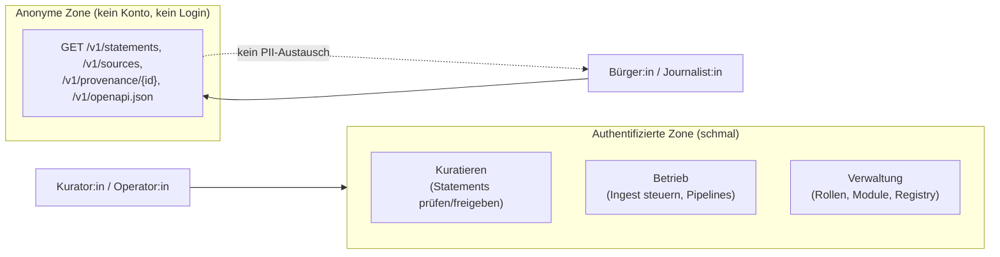
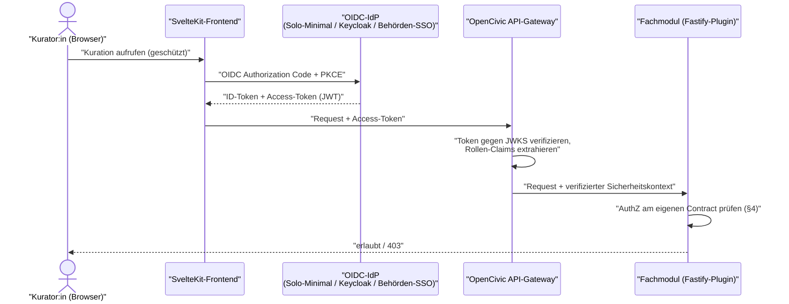
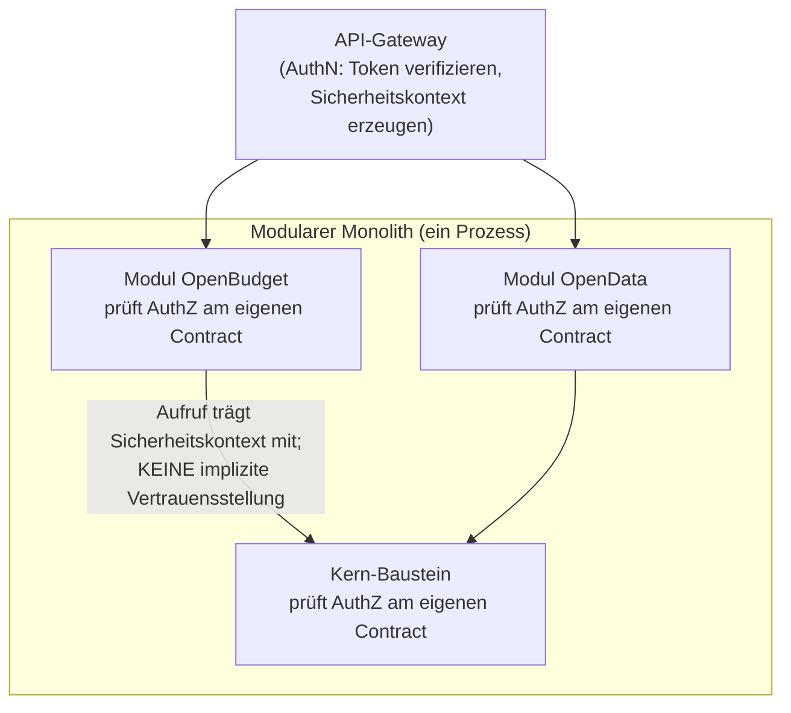

<!--
SPDX-FileCopyrightText: 2026 OpenCivic Contributors
SPDX-License-Identifier: Apache-2.0
-->

# 07 — Authentifizierung & Autorisierung

Aufsetzend auf dem [modularen Monolithen](01-macro-architecture.md), dem
[Plattformkern](../adr/0003-plattformkern-und-modulschnitt.md) (der einen dedizierten **Identity**-Baustein
vorsieht), dem [API-Design](04-api-design.md) und dem
[Provenance-Modell](02-provenance-model.md) beschreibt dieses Dokument, **wer** an OpenCivic
welche Handlung ausführen darf — und, mindestens ebenso wichtig, **wer sich dafür gar nicht
anmelden muss**. Jede Wahl wird gegen die
[priorisierten Qualitätsattribute](../foundation/06-qualitaetsattribute.md) (QA1–QA10) und die
[Entscheidungsprinzipien](../foundation/08-entscheidungsprinzipien.md) (P1–P11) begründet — inkl.
ehrlicher Nennung, wo eine Alternative in einzelnen Punkten tatsächlich stärker ist.

Zwei Entscheidungen tragen dieses Dokument, gebündelt in einer ADR:

- **AuthN:** OIDC/OAuth2 als Standard-Protokoll, **kein fest verdrahteter Identity-Provider** —
  eingebautes Minimal-Auth im Solo-Profil, jeder OIDC-konforme IdP (Referenz: **Keycloak**,
  Apache-2.0) in Standard/Scale — [ADR-0018](../adr/0018-authn-authz-oidc-rbac.md).
- **AuthZ:** **RBAC je Modul** (Rollen `reader`/`curator`/`operator`/`admin`) mit **Zero-Trust
  zwischen den Modulen** — [ADR-0018](../adr/0018-authn-authz-oidc-rbac.md).

> **Leitgedanke:** OpenCivic ist eine Transparenzplattform, kein soziales Netzwerk. Die eigentliche
> Leistung — amtliches Handeln lesen, filtern, bis zur Quelle auflösen — steht **anonym und ohne
> Konto** offen. Authentifizierung existiert nur für die schmale Fläche aus Kuration, Verwaltung und
> Betrieb. Das ist keine Bequemlichkeit, sondern Datensparsamkeit als Architekturprinzip: Wer keine
> Nutzerkonten für Leser:innen führt, kann sie auch nicht verlieren.

---

## 1. Ziele & Rückbindung

| Ziel | Rückbindung | Konsequenz für Auth |
|---|---|---|
| **Lesen ohne Konto** | Leitprinzip 6 (Datensparsamkeit), QA4 | Die öffentliche Lese-API ist anonym; kein Endnutzer-Login, keine PII-Horte. |
| **Standardschnittstelle statt Eigenbau** | P6 (OAuth2/OIDC ausdrücklich genannt), P2 | AuthN spricht OIDC/OAuth2; keine selbstgebaute Session-Krypto. |
| **Keine Anbieter-Bindung** | P3, QA5 | Jeder OIDC-konforme IdP ist anbindbar; Referenz-IdP ist self-hostbar (Keycloak). |
| **Verständlich & auditierbar** | P1 (boring), QA1, QA3 | RBAC statt Policy-Engine: Rollen sind lesbar, Zuweisungen sind nachvollziehbar. |
| **Modulgrenzen sind Sicherheitsgrenzen** | Architekturziel 8 (Zero-Trust), QA3, [ADR-0002](../adr/0002-architekturstil-modular-monolith.md) | Jedes Modul prüft Autorisierung an seinem eigenen Contract, nicht implizit. |
| **Behörden anschlussfähig** | QA7, P6 | Behörden-SSO (OIDC) ist ohne Sonderentwicklung anbindbar. |
| **Sichere Voreinstellung** | P9 (secure by default), QA4 | Schreibende Endpunkte sind per Default geschlossen; Zugriff ist explizit zu gewähren. |

Die Reihenfolge der Qualitätsattribute steuert die Trade-offs: Wo Datenschutz/Datensparsamkeit
(QA4) oder Verständlichkeit/Auditierbarkeit (QA1/QA3) mit der theoretischen Ausdrucksstärke einer
Policy-Engine kollidieren, gewinnt das höher priorisierte, einfachere Modell — genau dieser Konflikt
entscheidet die ADR.

---

## 2. Grundhaltung: die meisten Endpunkte brauchen gar keine Auth

Die Fläche von OpenCivic teilt sich sauber in zwei Zonen. Diese Trennung ist im
[API-Design](04-api-design.md#3-ressourcenmodell) bereits angelegt: `GET` ist die tragende,
cachebare, **anonyme** Operation der öffentlichen Lese-API; schreibende Operationen liegen außerhalb
der anonym erkundbaren Lesefläche.

Konkret bedeutet das:

- **Kein Endnutzer-Konto für reines Lesen.** Wer Zahlen liest, filtert oder ihre Herkunft bis zur
  amtlichen Quelle auflöst, authentifiziert sich **nicht** (QA1/QA2 aus dem
  [API-Design §4](04-api-design.md#4-provenance-an-der-schnittstelle-der-kern) bleiben ohne Login
  erfüllbar).
- **Keine PII-Horte.** Da es keine Leser-Accounts gibt, entsteht kein zentraler Bestand an
  personenbezogenen Daten von Bürger:innen — die attraktivste Datensparsamkeits-Maßnahme ist die,
  die Daten gar nicht erst zu erheben (QA4, Leitprinzip 6).
- **Provenance kennt keine Endnutzer-PII.** Das Agent-Modell der Provenance
  ([ADR-0006](../adr/0006-provenance-modell-w3c-prov.md),
  [02 §Agenten](02-provenance-model.md)) verzeichnet **verantwortliche Rollen/Systeme** als
  Verursacher einer Ableitung, nicht die Klarnamen einzelner Freiwilliger als personenbezogenes
  Audit-Log. Auth liefert die Identität für die Zugriffsentscheidung; sie wird nicht ungefiltert in
  den öffentlichen Herkunftsgraphen gespiegelt.

Diese Haltung verkleinert die sicherheitsrelevante Fläche drastisch: Authentifizierung und
Autorisierung müssen nur für eine **kleine Minderheit** der Endpunkte korrekt sein — was wiederum
rechtfertigt, dort das einfachste tragfähige Modell zu wählen (siehe §4).

---

## 3. Authentifizierung: OIDC/OAuth2, IdP pluggable

OpenCivic **implementiert keinen eigenen Identity-Provider und verdrahtet auch keinen fest**. Der
Identity-Baustein des [Plattformkerns](../adr/0003-plattformkern-und-modulschnitt.md) ist ein
**OIDC/OAuth2-Consumer**: Er validiert Tokens eines externen IdP (Signaturprüfung gegen JWKS,
Standard-Claims), leitet daraus eine Sitzungsidentität und Rollen ab und reicht diese an die Module
weiter. Welcher IdP dahintersteht, ist eine Deployment-Frage, keine Code-Frage (P3, QA5).

### 3.1 Ein Protokoll, drei Deployment-Profile

Die Deployment-Profile Solo/Standard/Scale aus
[ADR-0002](../adr/0002-architekturstil-modular-monolith.md) bestimmen, **woher** die Identität kommt —
nicht **wie** sie transportiert wird. Der Transport ist immer OIDC/OAuth2 (P6).

| Profil | IdP | Zweck | Betriebslast |
|---|---|---|---|
| **Solo** | eingebautes **Minimal-Auth** (ein Operator, lokaler Credential-Store, OIDC-kompatible Ausgabe) | Einzelperson betreibt eine Instanz, ohne separaten IdP aufsetzen zu müssen | minimal — kein zusätzlicher Dienst |
| **Standard** | externer OIDC-IdP, Referenz **Keycloak** (Apache-2.0, self-hostbar) | Team/Verein mit mehreren Kurator:innen, echte Rollen-/Nutzerverwaltung | ein zusätzlicher Dienst |
| **Scale** | externer OIDC-IdP, ggf. **Behörden-SSO** via OIDC-Federation | Mandantenbetrieb, Anbindung an bestehende Behörden-Identität | in bestehende Identity-Landschaft integriert |

Entscheidend: Der **Kern-Code ist über alle drei Profile identisch**. Das Solo-Minimal-Auth spricht
nach außen dieselbe OIDC-Kontur wie ein großer IdP, sodass ein Wechsel Solo → Standard → Behörden-SSO
eine **Konfigurations-**, keine Umbauentscheidung ist (P8 Reversibilität, QA5). Kein Code-Pfad
kennt einen konkreten Anbieter.

Das [SvelteKit-Frontend](../adr/0011-frontend-framework-sveltekit.md) nutzt den **Authorization-Code-Flow
mit PKCE**; serverseitiges Rendering hält Tokens in einer HTTP-only-Session, statt sie dem
Browser-JavaScript auszuliefern (P9 secure by default) — konsistent mit dem „ohne JS nutzbar"-Pfad
des Frontends.

### 3.2 Warum überhaupt ein Standardprotokoll?

Weil OpenCivic Identität **nicht selbst erfinden** soll. OAuth2/OIDC ist in P6 ausdrücklich als zu
bevorzugende Standardschnittstelle benannt; es ist breit implementiert, sicherheitsauditiert und der
einzige realistische Weg, **Behörden-SSO** ohne Sonderentwicklung anzubinden (QA7). Ein selbstgebautes
Session-Auth würde Behörden-Anschluss verbauen und Sicherheits-Eigenrisiko einführen — die
Herleitung dieser Verwerfung steht in [ADR-0018](../adr/0018-authn-authz-oidc-rbac.md).

---

## 4. Autorisierung: RBAC je Modul, Zero-Trust zwischen Modulen

### 4.1 RBAC als Baseline

Autorisierung erfolgt **rollenbasiert (RBAC)**. Der IdP liefert Rollen als Claims; jedes Modul
entscheidet anhand dieser Rollen, welche Operation an seinem Contract erlaubt ist. Vier
Baseline-Rollen decken den Bedarf des MVP ([OpenData → OpenBudget](../foundation/10-roadmap.md)):

| Rolle | Darf | Typischer Träger |
|---|---|---|
| `reader` | (implizit) anonyme Lesefläche — **braucht kein Konto** | jede:r |
| `curator` | Statements sichten, prüfen, freigeben/zurückziehen; Lifecycle `active/superseded/retracted` setzen | fachliche Freiwillige |
| `operator` | Ingest-/Pipeline-Steuerung, Connector-Läufe, Re-Ingest | technischer Betrieb |
| `admin` | Rollenzuweisung, Modul-/Plugin-Registry, Instanz-Konfiguration | Instanz-Verantwortliche |

Die Rollen sind **je Modul** interpretiert: `curator` in OpenBudget ist nicht automatisch `curator`
in einem späteren Modul. Das hält Zuständigkeiten lokal und auditierbar (QA1/QA3) und passt zur
modularen Struktur ([ADR-0002](../adr/0002-architekturstil-modular-monolith.md)).

**Warum RBAC und nicht ABAC/Policy-Engine?** Weil der Großteil der Daten ohnehin **öffentlich lesbar**
ist (§2) und die zu schützende Fläche schmal und rollenförmig ist. RBAC ist „boring", verständlich
(P1) und trivial auditierbar — man liest an einer Rollenzuweisung ab, wer was darf, ohne eine
Policy-Sprache interpretieren zu müssen (QA3). Feingranulare ABAC-Ausdruckskraft löst hier ein Problem,
das (noch) niemand hat. Die faire Würdigung von ABAC — inklusive der Szenarien, in denen es
tatsächlich überlegen ist — und der **explizite Ausbaupfad** stehen in
[ADR-0018](../adr/0018-authn-authz-oidc-rbac.md).

### 4.2 Zero-Trust zwischen Modulen

Architekturziel 8 verlangt **Zero-Trust zwischen den Modulen**: Ein Modul vertraut einem eingehenden
Request **nicht deshalb**, weil er aus einem anderen internen Modul stammt. Jedes Modul prüft
Autorisierung **an seinem eigenen Contract** gegen den verifizierten Sicherheitskontext — auch im
modularen Monolithen, in dem Module denselben Prozess teilen.

Das ist bewusst mehr Arbeit als eine einzige zentrale Torwächter-Prüfung — und genau der Punkt: Die
Fastify-Plugin-Kapselung ([ADR-0010](../adr/0010-backend-framework-nodejs-fastify.md)) **erzwingt**
ohnehin Modulgrenzen; die Autorisierungsprüfung am Modul-Contract macht diese Grenze auch zur
**Sicherheitsgrenze**. Wird ein Modul später als eigener Service extrahiert
([ADR-0002](../adr/0002-architekturstil-modular-monolith.md), Extraktions-Nähte), gilt die
Autorisierungsregel unverändert weiter — es kommt nur ein Netzwerk-Hop dazu, keine neue Vertrauens­annahme
(P8).

---

## 5. Was Auth *nicht* in die Daten schreibt

Die Zugriffsentscheidung nutzt Identität; die **Datenschicht** bleibt davon möglichst unberührt:

- **Provenance verzeichnet Rollen/Systeme, keine Endnutzer-PII.** Eine kuratorische Handlung wird im
  Herkunftsgraphen als Handlung einer **verantwortlichen Rolle/eines Systems** geführt
  ([ADR-0006](../adr/0006-provenance-modell-w3c-prov.md)), nicht als öffentlich einsehbarer Klarname.
- **Bitemporalität statt Personen-Log für „wer wann was".** Die
  [bitemporale, append-only Historie](05-data-storage.md) ([ADR-0007]) trägt bereits die
  Nachvollziehbarkeit *was* sich *wann* geändert hat; sie ist **kein** Ersatz für ein
  betriebliches Zugriffs-Audit, das getrennt und datensparsam geführt wird (QA4/QA9).
- **Keine Sekundärverwertung.** Betriebliche Identitätsdaten (Kurator:innen-Accounts im IdP) sind
  Betriebsdaten des IdP und werden nicht in die öffentliche Fakten-/Provenance-Fläche gespiegelt.

---

## 6. Alternativen (Kurzüberblick — Herleitung in der ADR)

| Alternative | In diesem Punkt tatsächlich stärker | Warum trotzdem nicht gewählt |
|---|---|---|
| **Auth-SaaS/SDK (Auth0, Clerk)** | schnell integriert, sehr wenig Ops | harte Anbieter-Abhängigkeit, nicht self-hostbar/cloud-neutral → Ausschluss über P3/QA5 |
| **ABAC via OPA/Cedar** | feingranular, ausdrucksstark, mandantenfähig | erhebliche Komplexität/Lernkurve, für die schmale, rollenförmige Fläche aktuell überzogen (P1) — als **späterer Ausbau** vorgesehen (P8) |
| **selbstgebautes Session-Auth (ohne OIDC)** | volle Kontrolle, keine Protokoll-Abhängigkeit | Sicherheits-Eigenrisiko, **kein Behörden-SSO**, Rad neu erfunden (gegen P6) |

Die vollständige, faire Gegenüberstellung mit 👍/👎 je Option steht in
[ADR-0018](../adr/0018-authn-authz-oidc-rbac.md).

---

## 7. Zusammenspiel mit den Qualitätsattributen

| QA (priorisiert) | Wirkung der Auth-Wahl |
|---|---|
| QA1 Nachvollziehbarkeit | Auth liefert die Rolle für Zugriffsentscheidungen, ohne Endnutzer-PII in den öffentlichen Herkunftsgraphen zu ziehen; RBAC-Zuweisungen sind selbst leicht auditierbar. |
| QA2 Barrierefreiheit/Zugänglichkeit | Die anonyme Lesefläche (inkl. Provenance-Auflösung) bleibt **komplett ohne Login** nutzbar. |
| QA3 Wartbarkeit/Evolvierbarkeit | RBAC ist lesbar und wartbar; identischer Kern-Code über alle Profile; Zero-Trust überlebt Modul-Extraktion unverändert. |
| QA4 Sicherheit/Datenschutz | Keine Leser-Konten, keine PII-Horte, geschlossen per Default (P9), Tokens serverseitig gehalten. |
| QA5 Self-Hosting/Cloud-Neutralität | Jeder OIDC-IdP anbindbar; Referenz-IdP (Keycloak) und Solo-Minimal-Auth sind self-hostbar; keine SaaS-Bindung (P3). |
| QA6 Testbarkeit | RBAC-Regeln sind pro Modul deterministisch und unit-testbar; OIDC-Verifikation ist gegen Standard-Testdoubles prüfbar. |
| QA7 Interoperabilität | OAuth2/OIDC ist offener Standard (P6); Behörden-SSO ohne Sonderentwicklung anschließbar. |
| QA8 Performance/Skalierung | Anonyme `GET`-Fläche bleibt voll cachebar (kein Auth-Overhead im Hot Path); JWT-Verifikation ist zustandslos. |
| QA9 Observability | Zugriffs-/Auth-Ereignisse folgen Standard-HTTP-Semantik und sind mit den vorhandenen OpenTelemetry-Werkzeugen beobachtbar. |
| QA10 i18n | Auth ist fachlich neutral; Rollen-/Fehlertexte im Frontend nutzen den Localization-Kern. |

---

## 8. Bewusst offen (Folge-Topics)

- **Rate-Limiting & Quotas** der öffentlichen (anonymen) API → Betriebs-/Security-Topic
  (bereits in [04 §9](04-api-design.md#9-bewusst-offen-folge-topics) benannt).
- **Konkrete Rollen-/Claim-Konvention** je Fachmodul (Scopes, Rollen-Namespacing) → beim jeweiligen
  Modul, OpenBudget zuerst.
- **ABAC-Ausbaustufe** (OPA/Cedar) bei komplexeren Mandanten-/Kommunen-Szenarien → eigener ADR zum
  Zeitpunkt des tatsächlichen Bedarfs (P8), siehe [ADR-0018](../adr/0018-authn-authz-oidc-rbac.md).
- **Betriebliches Zugriffs-Audit** (getrennt von der fachlichen Provenance) → Betriebs-/Security-Topic.
- **Solo-Minimal-Auth im Detail** (Credential-Härtung, Recovery) → Härtungs-/Betriebs-Topic.
