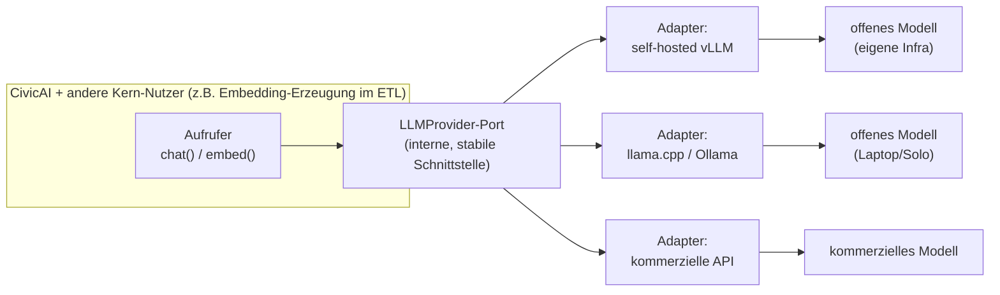
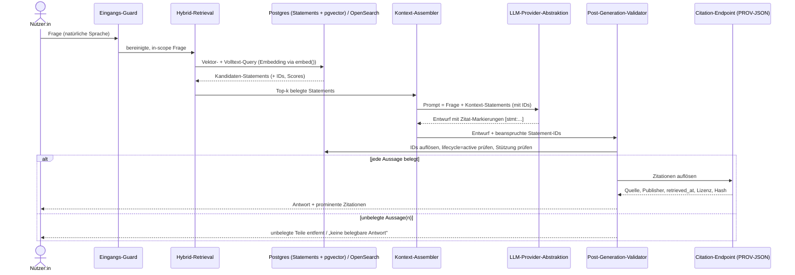

<!--
SPDX-FileCopyrightText: 2026 OpenCivic Contributors
SPDX-License-Identifier: Apache-2.0
-->

# 08 — KI-Integration & RAG (CivicAI)

CivicAI ist die natürlichsprachige Schnittstelle zu OpenCivic: Nutzende stellen eine Frage in
eigenen Worten und erhalten eine Antwort, **die ausschließlich auf dem provenance-belegten Bestand
beruht** und jede Aussage mit auflösbaren Quellen belegt. Dieses Dokument leitet die KI-Architektur
konsequent aus dem Fundament ab — insbesondere aus
[Leitprinzip 1 (Faktentreue statt Meinung)](../foundation/03-leitprinzipien.md),
[Leitprinzip 2 (Quellenzwang)](../foundation/03-leitprinzipien.md), dem
[Nicht-Ziel „keine Prognose- oder Meinungs-KI"](../foundation/05-nicht-ziele.md) sowie aus
[Risiko R2 (Halluzination/Desinformation)](../foundation/09-risiken.md) und
[Risiko R12 (KI-Abhängigkeit von einem Anbieter/Modell)](../foundation/09-risiken.md).
Es baut auf den bereits gefassten Entscheidungen zu
[Provenance](02-provenance-model.md), [API-Design](04-api-design.md) und
[Datenhaltung/Suche](05-data-storage.md) auf.

CivicAI ist **kein Chatbot mit Weltwissen**. Es ist eine Retrieval-augmentierte
Frage-Antwort-Schicht, deren Wissensraum per Konstruktion auf den zitierbaren
[`Statement`-Bestand](02-provenance-model.md) begrenzt ist. Die zentrale Design-Aussage lautet:
**das Sprachmodell formuliert, aber es weiß nichts, was nicht belegt ist.**

> **Grundinvariante (Belegzwang für generierte Aussagen):** Jede von CivicAI ausgegebene fakthaltige
> Aussage ist auf mindestens eine auflösbare `Statement`-ID gestützt. Kann eine Aussage nicht belegt
> werden, wird sie **strukturell** unterdrückt — CivicAI antwortet dann „keine belegbare Antwort",
> nicht mit einer erfundenen. Dies ist über Retrieval **und** einen Post-Generation-Validator
> erzwungen, nicht bloß per Prompt erbeten.

Die beiden tragenden Entscheidungen dieses Topics sind in
[ADR-0019](../adr/0019-llm-abstraktion-striktes-rag.md) festgehalten:
(1) eine **provider-abstrahierte LLM-Schicht** über einer OpenAI-kompatiblen Adapter-API und
(2) **striktes Zitier-RAG** mit erzwungener Belegprüfung.

---

## 1. Einordnung: Wann, wo, warum

- **Phase 4 der [Roadmap](../foundation/10-roadmap.md).** CivicAI ist bewusst *kein* MVP-Baustein.
  Das MVP ist [OpenData → OpenBudget](../foundation/01-vision.md); die natürlichsprachige Schicht
  setzt einen ausreichend gefüllten, kuratierten Bestand voraus. Ohne belegbare Fakten ist ein
  Zitier-RAG leer — CivicAI ist damit die *Ernte* des Provenance-Fundaments, nicht dessen Anfang.
- **Kein neues Datensilo.** CivicAI liest den bestehenden Gold-Bestand und den Vektor-Index
  (siehe [ADR-0015](../adr/0015-suche-und-vektorsuche.md)); es unterhält keinen eigenen,
  konkurrierenden „Wissensspeicher". Der Herkunftsgraph aus [ADR-0006](../adr/0006-provenance-modell-w3c-prov.md)
  bleibt die einzige Wahrheit (QA1, Leitprinzip 2).
- **Als eigenes Fachmodul geschnitten.** Nach [ADR-0003](../adr/0003-plattformkern-und-modulschnitt.md)
  ist CivicAI ein austauschbares Fachmodul über dem Plattformkern; die LLM-Abstraktion ist ein
  klar begrenzter Kern-Dienst (Modularität, Leitprinzip 7 / P7).

---

## 2. Gesamtbild

```mermaid
flowchart TB
    user["Nutzer:in<br/>natürlichsprachige Frage"]

    subgraph civicai["CivicAI-Modul"]
        guard["Eingangs-Guard<br/>Scope-/PII-Filter"]
        retr["Hybrid-Retrieval<br/>Vektor (pgvector) + Volltext (FTS/OpenSearch)"]
        ctx["Kontext-Assembler<br/>nur belegte Statements + Zitate"]
        gen["Generierung<br/>über LLM-Provider-Abstraktion"]
        val["Post-Generation-Validator<br/>Beleg-Attribution erzwungen"]
        ans["Antwort + Zitationen<br/>oder „keine belegbare Antwort""]
    end

    subgraph core["Plattformkern & Datenhaltung"]
        pg["PostgreSQL<br/>Statements (Gold) · pgvector"]
        fts["Volltext<br/>Postgres-FTS → OpenSearch"]
        prov["Provenance-/Citation-Endpoint<br/>PROV-JSON"]
    end

    subgraph llm["LLM-Provider-Abstraktion (Kern-Dienst)"]
        adapter["OpenAI-kompatible Adapter-API"]
        selfhost["Self-hosted<br/>llama.cpp / vLLM / Ollama"]
        commercial["kommerzielle API<br/>(austauschbar)"]
        adapter --> selfhost
        adapter --> commercial
    end

    user --> guard --> retr
    retr <--> pg
    retr <--> fts
    retr --> ctx
    ctx --> gen
    gen <--> adapter
    gen --> val
    val -->|"jede Aussage belegt"| ans
    val -->|"unbelegte Aussage"| ans
    ans --> prov
    ans --> user
```

Der Datenpfad ist **einbahnig in den Bestand hinein**: CivicAI kann nur wiedergeben und formulieren,
was das Retrieval aus dem belegten Bestand geliefert hat. Es gibt keinen Pfad, über den das
Sprachmodell freies Weltwissen in die Antwort einspeisen könnte, ohne am Validator zu scheitern.

---

## 3. Die zwei Säulen

### 3.1 Provider-abstrahierte LLM-Schicht

Alle Modellaufrufe laufen über eine **einzige interne Abstraktion** mit einer **OpenAI-kompatiblen
Adapter-API** (das faktische Lingua-franca-Protokoll für Chat-/Embedding-Endpunkte). Diese
Kompatibilität ist gezielt gewählt, weil sowohl kommerzielle Anbieter als auch die verbreiteten
Self-Hosting-Runtimes (**llama.cpp**, **vLLM**, **Ollama**) dieselbe Schnittstellenform anbieten
oder nachbilden. Der Wechsel des Backends ist damit eine **Konfigurations-**, keine
Code-Änderung (QA5 Portabilität/Self-Hostbarkeit; P3 keine harten Cloud-Abhängigkeiten; direkt
gegen R12).



Bewusst **kein Vendor-Framework** als Rückgrat (kein anbietereigenes „Agent-SDK" als
Architektur-Fundament). Ein solches Framework würde eine zweite, schwerer entfernbare Lock-in-Ebene
über der reinen Modell-API einziehen — gegen P7 (Ersetzbarkeit) und R12. Die Abstraktion bleibt
absichtlich schmal: `chat()` und `embed()`, plus Fähigkeits-Metadaten (Kontextfenster,
Embedding-Dimension, unterstützt Tool-Calls ja/nein). Anbieter-spezifische „Killerfeatures" werden
**nicht** in den Kern gezogen, sondern hinter der Abstraktion gekapselt oder verzichtet — der Preis
für Neutralität und Austauschbarkeit ist in [ADR-0019](../adr/0019-llm-abstraktion-striktes-rag.md)
ehrlich benannt.

| Deployment-Profil | Typisches LLM-Backend | Vektor-/Volltext-Backend |
|---|---|---|
| **Solo** (ein Befehl, ein Rechner) | Ollama / llama.cpp, kleines offenes Modell | Postgres-FTS + pgvector |
| **Standard** | self-hosted vLLM oder kommerzielle API (Wahl des Betreibers) | OpenSearch + pgvector |
| **Scale** | vLLM-Cluster oder kommerzielle API | OpenSearch + optional Qdrant |

Die Profil-Staffelung folgt [ADR-0002](../adr/0002-architekturstil-modular-monolith.md) und
[ADR-0015](../adr/0015-suche-und-vektorsuche.md): dasselbe Modul, austauschbare Backends. Auch der
Betrieb **ganz ohne kommerziellen Anbieter** ist ein voll unterstützter Standardpfad, nicht nur ein
theoretisches Fallback (Leitprinzip 9 Souveränität; QA5).

### 3.2 Striktes Zitier-RAG

RAG (Retrieval-Augmented Generation) heißt hier in der strengen Lesart: **Retrieval ist die einzige
Wissensquelle**, Generierung ist reine Formulierung. Das operationalisiert Leitprinzip 1 („zeige die
Quelle, nicht die Meinung") und das Nicht-Ziel „keine Meinungs-/Weltwissen-KI" (R2). Drei
Kontrollstellen setzen den Belegzwang **strukturell** durch — nicht als Bitte an das Modell:

1. **Retrieval-Beschränkung.** Es werden ausschließlich `Statement`-Objekte aus dem belegten
   Gold-Bestand abgerufen (Hybrid aus Vektorsuche über pgvector und Volltext, siehe unten). Was
   nicht im Bestand steht, kann nicht in den Kontext gelangen.
2. **Kontext-Assembler.** Jedes in den Prompt aufgenommene Fakt trägt seine `Statement`-ID mit. Das
   Modell wird angewiesen, jede Aussage mit den IDs zu markieren, aus denen sie stammt.
3. **Post-Generation-Validator.** Nach der Generierung wird jede fakthaltige Aussage gegen die
   zitierten `Statement`-IDs geprüft: Existiert die ID? Ist sie `active` (siehe
   [Lifecycle, ADR-0007](../adr/0007-bitemporal-append-only-lifecycle.md))? Stützt sie die Aussage
   inhaltlich? Aussagen ohne haltbaren Beleg werden **verworfen oder markiert**; bleibt nichts
   Belegtes übrig, lautet die Antwort „keine belegbare Antwort".



**Hybrid-Retrieval** kombiniert die beiden bereits in [ADR-0015](../adr/0015-suche-und-vektorsuche.md)
festgelegten Verfahren: **Vektorsuche** (pgvector in derselben PostgreSQL,
[ADR-0014](../adr/0014-primaere-datenbank-postgresql.md)) fängt semantische Nähe („Kita-Ausgaben"
findet „Kindertagesbetreuung"), **Volltextsuche** (Postgres-FTS im Solo-Profil, OpenSearch ab
Standard) fängt exakte Begriffe, Kennziffern und Haushaltstitel, die Embeddings unzuverlässig
treffen. Die Ergebnislisten werden zusammengeführt (z. B. Reciprocal Rank Fusion). Beide Verfahren
liefern **belegte** Statements — die Zitierbarkeit entsteht nicht erst am Ende, sondern ist
Eigenschaft jedes Retrieval-Treffers (QA1).

---

## 4. Antwortverhalten & Grenzfälle

| Situation | Verhalten von CivicAI | Rückbindung |
|---|---|---|
| Frage vollständig belegbar | Antwort formulieren, jede Aussage mit Quelle | LP1, LP2, QA1 |
| Teilweise belegbar | nur den belegten Teil beantworten, Lücke offen benennen | LP2, R2 |
| Nicht belegbar | „keine belegbare Antwort" + ggf. Hinweis auf klassische Suche | Nicht-Ziel, R2 |
| Wertung/Meinung/Prognose erfragt | verweigern; auf Faktentreue verweisen | LP1, Nicht-Ziel |
| Quelle inzwischen `retracted`/`superseded` | veraltete Aussage nicht als aktuell ausgeben; bitemporalen Stand kenntlich machen | ADR-0007 |
| Personenbezogener/heikler Prompt | minimal verarbeiten, nicht dauerhaft speichern | LP6, QA4 |

Das **kalibrierte Nein** ist ein Feature, kein Mangel: Eine ehrliche Nicht-Antwort ist im Sinne der
Mission besser als eine flüssige Halluzination (Leitregel der Qualitätsattribute:
*Korrektheit & Nachvollziehbarkeit schlagen Geschwindigkeit*). CivicAI verweist bei Nicht-Antworten
auf die **klassische, LLM-freie Suche** — diese bleibt der maximal transparente, komplementäre Weg
(siehe [ADR-0019](../adr/0019-llm-abstraktion-striktes-rag.md), Option D) und ist kein Ersatz,
sondern die Grundlage, auf der CivicAI aufsetzt.

---

## 5. Datenschutz & Sicherheit

- **Datensparsamkeit (Leitprinzip 6 / QA4).** Nutzer-Prompts sind personenbezogene Daten. Es werden
  **keine** Prompts über das für die Beantwortung Nötige hinaus gespeichert; kein Prompt-Log als
  Dauerspeicher, keine Nutzung von Prompts als Trainingsmaterial, keine Weitergabe von Nutzer-PII an
  ein LLM-Backend, wo vermeidbar. Beim Betrieb mit kommerziellen APIs ist die
  **Self-Hosting-Option** die datenschutzfreundlichste Voreinstellung — Prompts verlassen dann die
  eigene Infrastruktur nicht (QA5 stützt QA4).
- **Prompt-Injection als Bedrohung.** Retrieval-Inhalte stammen aus amtlichen Quellen, könnten aber
  perspektivisch manipulierte Passagen enthalten. Der Kontext wird als **Daten, nicht als
  Instruktion** behandelt; der Validator prüft gegen `Statement`-IDs, nicht gegen freien Modelltext,
  was Injection-Effekte zusätzlich eindämmt (R11).
- **Kein Handlungs-/Tool-Zugriff auf schreibende Operationen.** CivicAI ist read-only auf dem
  Bestand; es kann keine Statements erzeugen, ändern oder zurückziehen (Append-only/Kuration bleiben
  bei Pipeline und Human-in-the-loop, [ADR-0007](../adr/0007-bitemporal-append-only-lifecycle.md)).
- **Sichere Voreinstellungen (P9).** Standardmäßig striktes RAG, Belegpflicht aktiv,
  Self-Hosting-fähig, keine Prompt-Persistenz.

---

## 6. Qualitätsattribut-Rückbindung (Zusammenfassung)

| Entscheidung | Primär gestützte QA / Prinzipien | Adressiertes Risiko |
|---|---|---|
| Provider-Abstraktion (OpenAI-kompatibel) | QA5, P3, P7, Leitprinzip 9 | R12 |
| Betrieb mit offenen Modellen (Self-Hosting) | QA5, QA4, Leitprinzip 9 | R12 |
| Striktes Zitier-RAG (Retrieval-only) | QA1, Leitprinzip 1 & 2 | R2, R1 |
| Post-Generation-Validator | QA1, QA6 (Testbarkeit) | R2 |
| „Keine belegbare Antwort" als Default | QA1, Nicht-Ziel-Treue | R2 |
| Kein eigenes Datensilo, Provenance-Wiederverwendung | QA1, QA3 (Wartbarkeit) | R2 |
| Datensparsame Prompt-Behandlung | QA4, Leitprinzip 6 | — |
| Offene Standards (OpenAI-kompat. API, PROV-JSON, DCAT-Bestand) | P2, QA7 | R10 |

---

## 7. Bewusst offen (Folge-Entscheidungen)

- **Konkrete Modellauswahl** (welches offene Modell als Solo-Default, welche Embedding-Modelle) —
  bewusst *keine* Architekturentscheidung, sondern konfigurierbar; wird als Betriebsempfehlung
  gepflegt (Reversibilität, P8).
- **Fusions- und Ranking-Strategie** des Hybrid-Retrievals (RRF-Parameter, Re-Ranking) — Tuning-Frage
  je Bestand, kein Architektur-Commitment.
- **Genauigkeit des Validators** (heuristische ID-Attribution vs. zusätzliche
  Natural-Language-Inference-Prüfung der Stützung) — als Ausbaustufe vorgesehen; das Modell hält den
  Platz dafür frei.
- **Evaluations-Harness** (Kennzahlen für Halluzinationsrate, Beleg-Präzision, Nein-Kalibrierung) —
  gehört zum Testbarkeits-Ausbau (QA6) und wird mit CivicAI in Phase 4 aufgebaut.
- **Feedback-/Meldeweg** für falsch belegte Antworten — koppelt an den bestehenden
  Korrektur-/Kurationsprozess, nicht an einen CivicAI-Sonderweg.
