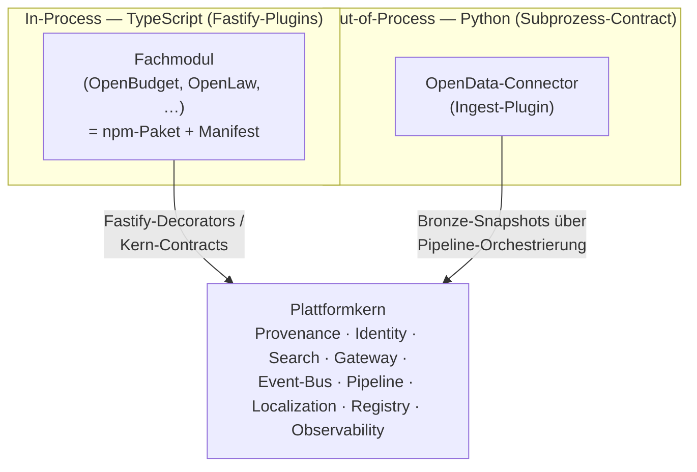
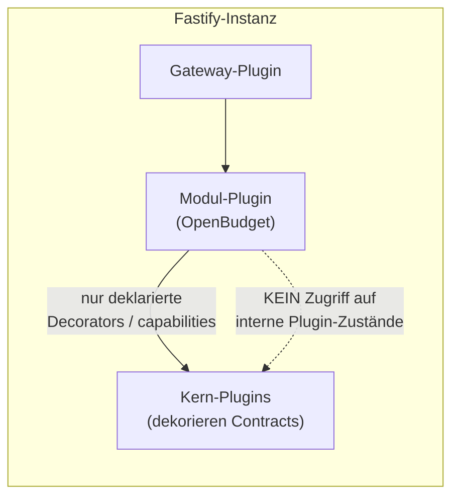
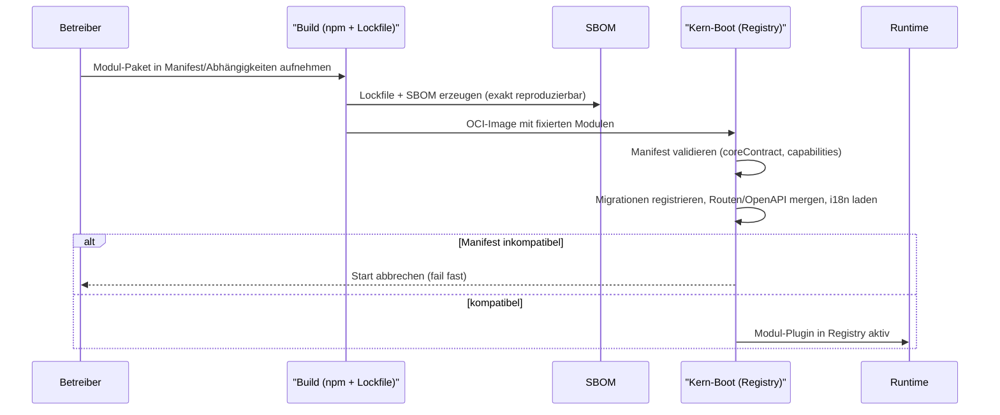
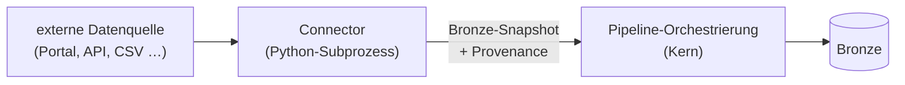

<!--
SPDX-FileCopyrightText: 2026 OpenCivic Contributors
SPDX-License-Identifier: Apache-2.0
-->

# 09 — Plugin- & Erweiterungssystem

Aufbauend auf dem [modularen Monolithen](01-macro-architecture.md), dem
[Plattformkern-/Modulschnitt](../adr/0003-plattformkern-und-modulschnitt.md) und der
[Backend-Wahl Node.js + Fastify](03-languages-backend-frontend.md#3-backend-nodejs--fastify)
beschreibt dieses Dokument, **wie** OpenCivic um Fachmodule und Datenquellen erweitert wird — ohne
Fork und ohne ein eigenes Plugin-Framework zu erfinden. Jede Aussage wird gegen die
[priorisierten Qualitätsattribute](../foundation/06-qualitaetsattribute.md) (QA1–QA10) und die
[Entscheidungsprinzipien](../foundation/08-entscheidungsprinzipien.md) (P1–P11) zurückgebunden. Die
Grundsatzentscheidung ist in [ADR-0020](../adr/0020-plugin-erweiterungsmechanismus.md) festgehalten;
dieses Dokument ist die ausführliche Herleitung und Referenz.

> **Kernthese:** Der Erweiterungspunkt von OpenCivic ist der **Fastify-Plugin-Mechanismus selbst**
> ([ADR-0010](../adr/0010-backend-framework-nodejs-fastify.md)), ergänzt um einen deklarativen
> **Manifest-Contract**. Es gibt bewusst **kein Runtime-Hot-Loading** fremden Codes. Ein
> „Marktplatz" bedeutet kuratierte, versionierte npm-Pakete — nicht dynamisch nachgeladenen Code.

---

## 1. Anforderung: Erweiterbarkeit ohne Fork

Architekturziel 10 verlangt **„Erweiterbarkeit ohne Fork"**: Eine Kommune, ein Rechercheteam oder
ein Landesverband soll ein neues Fachmodul (z. B. OpenLaw, OpenProcurement) oder einen neuen
OpenData-Connector hinzufügen können, **ohne** den Kern zu verändern und ohne einen eigenen Branch
dauerhaft pflegen zu müssen. Gleichzeitig darf diese Offenheit die höchstpriorisierten
Qualitätsattribute nicht untergraben — insbesondere QA1 (Nachvollziehbarkeit) und QA4
(Sicherheit/Datenschutz).

Daraus ergeben sich drei harte Randbedingungen:

- **Modulgrenzen bleiben Contracts.** Ein Modul greift nie in die inneren Zustände eines anderen
  oder des Kerns; es kommuniziert ausschließlich über deklarierte Schnittstellen
  ([ADR-0002](../adr/0002-architekturstil-modular-monolith.md),
  [ADR-0003](../adr/0003-plattformkern-und-modulschnitt.md)).
- **Reproduzierbarkeit ist nicht verhandelbar.** Was in einer Instanz läuft, muss aus einem
  Lockfile und einer SBOM exakt rekonstruierbar sein (QA1, QA4, P4).
- **Boring by default.** Kein exotisches Eigenbau-Framework, wo eine bewährte, neutral governte
  Grundlage bereits existiert (P1).

---

## 2. Zwei Erweiterungsklassen

OpenCivic kennt genau zwei Arten von Erweiterungen, entlang der bereits bestehenden Architekturnähte:

| Klasse | Sprache | Mechanismus | Belegende ADR |
|---|---|---|---|
| **Fachmodul** (fügt Domäne, Routen, Datenmodell hinzu) | TypeScript | Fastify-Plugin + Manifest, in-process | [ADR-0010](../adr/0010-backend-framework-nodejs-fastify.md), [ADR-0020](../adr/0020-plugin-erweiterungsmechanismus.md) |
| **OpenData-Connector** (bringt eine externe Datenquelle ein) | Python | Subprozess-Contract hinter der Pipeline-Schnittstelle | [ADR-0009](../adr/0009-programmiersprachen-typescript-python.md), [ADR-0016](../adr/0016-pipeline-orchestrierung.md) |

Beide Klassen laufen entlang **ohnehin vorhandener** Grenzen: das Fachmodul entlang der
Fastify-Plugin-Kapselung, der Connector entlang der Pipeline-Orchestrierung. Es wird keine neue
Erweiterungsdimension eingezogen (P5 — wenige, klar begründete Nähte).

---

## 3. Fachmodul = npm-Paket + Manifest-Contract

Ein Fachmodul ist ein **npm-Paket im Monorepo** ([ADR-0005](../adr/0005-repo-strategie-monorepo.md)),
das einen dokumentierten **Manifest-Contract** erfüllt und beim Start ein Fastify-Plugin
exportiert. Der Manifest ist die **einzige** deklarative Wahrheit darüber, was ein Modul mitbringt
und was es vom Kern erwartet.

### 3.1 Manifest-Felder

| Feld | Zweck | Rückbindung |
|---|---|---|
| `name`, `version` | Identität + SemVer des Moduls | P7, QA3 |
| `coreContract` | benötigte **Major-Version** des Kern-Contracts (SemVer-Range) | QA3, QA7 |
| `capabilities` | benötigte Kern-Fähigkeiten (z. B. `provenance`, `search`, `identity`, `eventBus`) | [ADR-0003](../adr/0003-plattformkern-und-modulschnitt.md) |
| `routes` | Routen-Präfix + OpenAPI-Beitrag (Contract-First, JSON-Schema) | [ADR-0012](../adr/0012-api-stil-rest-openapi.md), QA7 |
| `migrations` | versionierte, vorwärts-/rückwärtskompatible DB-Migrationen | [ADR-0014](../adr/0014-primaere-datenbank-postgresql.md), P7 |
| `i18n` | mitgelieferte Übersetzungskataloge je Locale | [ADR-0008](../adr/0008-jurisdiktions-und-referenzdaten-achse.md), QA10 |
| `provenanceKinds` | Entity-/Activity-Typen, die das Modul in den Provenance-Graph einträgt | [ADR-0006](../adr/0006-provenance-modell-w3c-prov.md), QA1 |

Der Manifest ist **maschinenlesbar und schema-validiert** (JSON Schema). Der Kern lehnt ein Modul
beim Boot ab, dessen `coreContract`-Range nicht zur laufenden Kern-Major passt oder dessen
`capabilities` nicht bereitgestellt werden — **fail fast beim Start**, nicht unbemerkt zur Laufzeit
(P9 sichere Voreinstellungen, QA6).

### 3.2 Kapselung erzwingt die Modulgrenze

Das Modul-Plugin sieht die internen Zustände anderer Plugins **nicht**. Es erhält Zugriff auf
Kern-Fähigkeiten ausschließlich über explizit per `fastify.decorate(...)` freigegebene Contracts —
genau der Mechanismus, der schon in [ADR-0002](../adr/0002-architekturstil-modular-monolith.md) die
harten Modulgrenzen strukturell (nicht nur disziplinarisch) durchsetzt:

**Warum das QA1 dient:** Weil ein Modul den Provenance-Kern nur über den dekorierten Contract
erreicht, kann es **keine** Daten anzeigen, die den Provenance-Pfad umgehen. Die
Nachvollziehbarkeit ist damit auch für Dritt-Module strukturell erzwungen, nicht nur höflich
erbeten.

---

## 4. Lebenszyklus: Build-/Deploy-Zeit, nicht Laufzeit

Module werden zur **Build-/Deploy-Zeit** eingebunden — als Abhängigkeit im Lockfile, mitgebaut in
das OCI-Image. Es gibt kein dynamisches Nachladen fremden Codes in einen laufenden Prozess.

**Registrierung** erfolgt beim Boot gegen die **Plugin-/Modul-Registry** des Kerns
([ADR-0003](../adr/0003-plattformkern-und-modulschnitt.md)): Der Kern liest die Manifeste aller
gebauten Module, validiert sie, spielt Migrationen ein, merged die Routen in das OpenAPI-Dokument
([ADR-0012](../adr/0012-api-stil-rest-openapi.md)) und lädt die i18n-Kataloge. Was läuft, steht
vollständig im Lockfile und in der SBOM — **Reproduzierbarkeit und Auditierbarkeit bleiben
erhalten** (QA1, QA4).

### 4.1 „Marktplatz" ≠ dynamisches Nachladen

Ein späterer „Modul-Marktplatz" ist ein **Verzeichnis kuratierter, versionierter Pakete** mit
geprüften Manifesten und veröffentlichter SBOM — die Installation bleibt ein bewusster
Build-/Deploy-Schritt des Betreibers. Der Marktplatz senkt die **Findbarkeit** von Modulen, nicht
die **Vertrauensschwelle** ihrer Ausführung (P1, P9).

---

## 5. OpenData-Connectors: Out-of-Process

OpenData-Connectors sind der einzige Python-Anteil des Systems
([ADR-0009](../adr/0009-programmiersprachen-typescript-python.md)) und laufen **nicht** in-process,
sondern als isolierte Subprozesse hinter der Pipeline-Orchestrierung
([ADR-0016](../adr/0016-pipeline-orchestrierung.md)). Sie liefern **Bronze-Snapshots** samt
Provenance-Belegen an den Kern ([ADR-0004](../adr/0004-kanonischer-datenfluss-medallion-provenance.md)).

Die Prozessgrenze ist hier zugleich die **Sprachgrenze** und eine **Isolationsgrenze**: Ein
fehlerhafter oder ressourcenhungriger Connector kann den Node-Kern nicht destabilisieren, und der
Subprozess-Contract ist der einzige Berührungspunkt (QA4, QA6). Für Connectors gilt derselbe
Grundsatz wie für Module: **eingebunden zur Deploy-Zeit, versioniert, reproduzierbar** — kein
Nachladen fremden Codes zur Laufzeit.

---

## 6. Stabilität der Extension-Points

Erweiterbarkeit über 10+ Jahre (QA3) steht und fällt mit der **Stabilität des Kern-Contracts**.
Deshalb wird der Kern-Contract **semantisch versioniert** und additiv evolviert — dieselbe Disziplin
wie beim öffentlichen API ([ADR-0013](../adr/0013-api-versionierung.md)):

| Änderung am Kern-Contract | SemVer-Wirkung | Folge für Module |
|---|---|---|
| neue optionale `capability`, neuer Decorator | **Minor** | bestehende Module laufen unverändert |
| neues optionales Manifest-Feld | **Minor** | rückwärtskompatibel |
| Entfernen/Umbenennen eines Decorators, Pflichtfeld-Änderung | **Major** | Module müssen `coreContract` anheben, migrieren |

Weil der Manifest die geforderte Kern-Major deklariert (`coreContract`), scheitert eine
inkompatible Kombination **deterministisch beim Boot** statt subtil zur Laufzeit (P9, QA6). Der
Contract selbst ist damit das langlebige Gut — konsistent mit P7 („Daten/Schemata sind langlebiger
als Code").

---

## 7. Rückbindung an die Qualitätsattribute

| QA | Wirkung des Erweiterungsmodells |
|---|---|
| QA1 Nachvollziehbarkeit | Module erreichen den Provenance-Kern nur über den dekorierten Contract; kein Umgehen des Provenance-Pfads. Build-Zeit-Einbindung hält Lockfile/SBOM vollständig. |
| QA2 Barrierefreiheit | Module liefern OpenAPI-Beiträge + i18n-Kataloge; das „ohne JS nutzbar"-Frontend ([ADR-0011](../adr/0011-frontend-framework-sveltekit.md)) bleibt vom Modul-Mechanismus unberührt. |
| QA3 Wartbarkeit | Bewährter Fastify-Mechanismus statt Eigenbau (P1); Extension-Points semantisch versioniert; „ohne Fork" strukturell möglich. |
| QA4 Sicherheit/Datenschutz | **Kein Runtime-Loading nicht vertrauenswürdigen Codes** (R11); Vertrauensschwelle liegt beim bewussten Deploy; Connectors zusätzlich prozess-isoliert. |
| QA5 Self-Hosting | Module/Connectors sind Teil des OCI-Images; der Betreiber installiert nie manuell eine Laufzeit. |
| QA6 Testbarkeit | Manifest schema-validiert, `coreContract` fail-fast beim Boot; Contracts als Testgrenzen. |
| QA7 Interoperabilität | Manifest + Routen sind Contract-First (OpenAPI/JSON-Schema, [ADR-0012](../adr/0012-api-stil-rest-openapi.md)). |
| QA8 Performance | In-Process-Module ohne IPC-Overhead; performancekritische Module über Extraktions-Nähte ([ADR-0002](../adr/0002-architekturstil-modular-monolith.md)) später separierbar. |
| QA9 Observability | Module erben das OpenTelemetry-Instrumentarium des Kerns über den Contract. |
| QA10 i18n | i18n-Kataloge sind Pflichtbestandteil des Manifests. |

---

## 8. Bewusst offen / Ausblick

- **Sandbox für nicht vertrauenswürdige Dritt-Plugins.** Für den Fall, dass eines Tages
  Erweiterungen **ohne** vorherige Kuratierung und **ohne** Redeploy zugelassen werden sollen, wäre
  ein isoliertes Ausführungsmodell (z. B. WASM-Isolate) der ehrliche Weg — mit erheblichem
  Sicherheits- und Komplexitätsaufwand. Das ist ein **möglicher späterer Ausbau**, kein Teil des
  jetzigen Modells; die Reversibilität dahin bleibt gewahrt (P8). Die Abwägung ist in
  [ADR-0020](../adr/0020-plugin-erweiterungsmechanismus.md) fair dargestellt.
- **Signierung/Verifikation von Marktplatz-Paketen** (Provenance der Lieferkette) — eigenständiges
  Security-Topic, aufsetzend auf SBOM und Lockfile.
