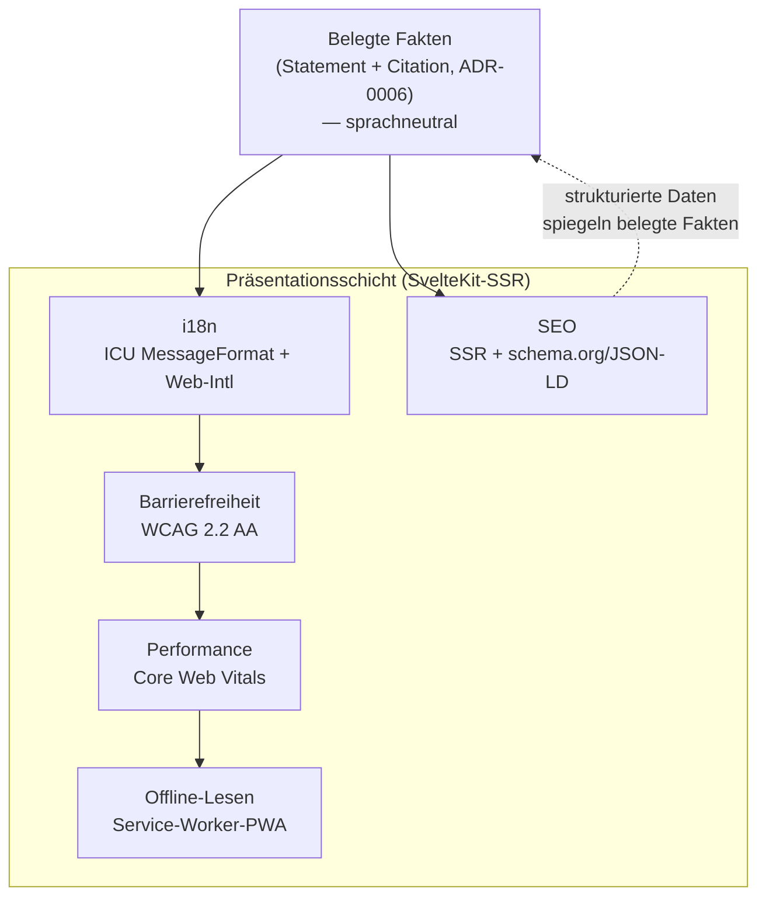
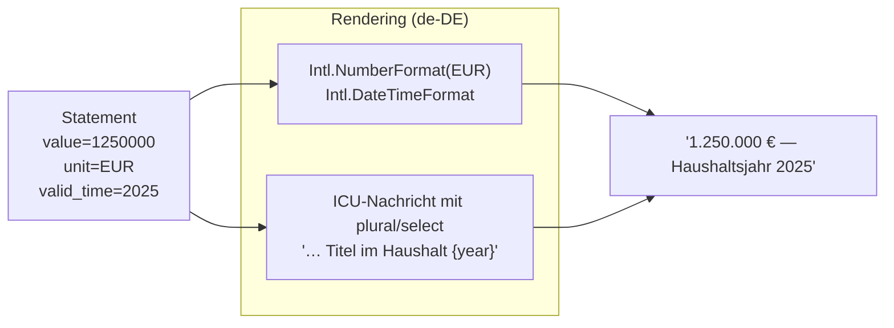
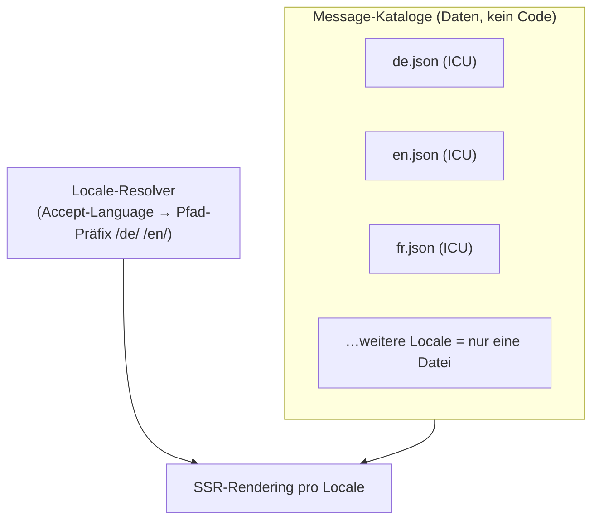
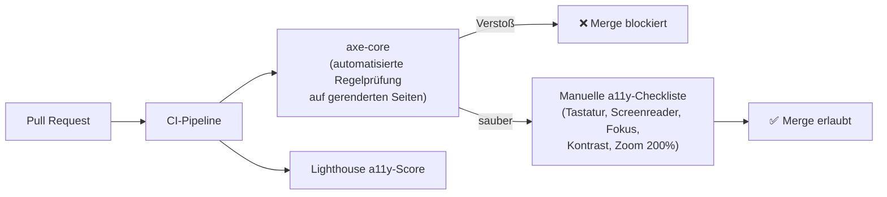
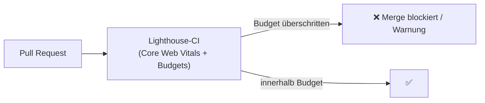
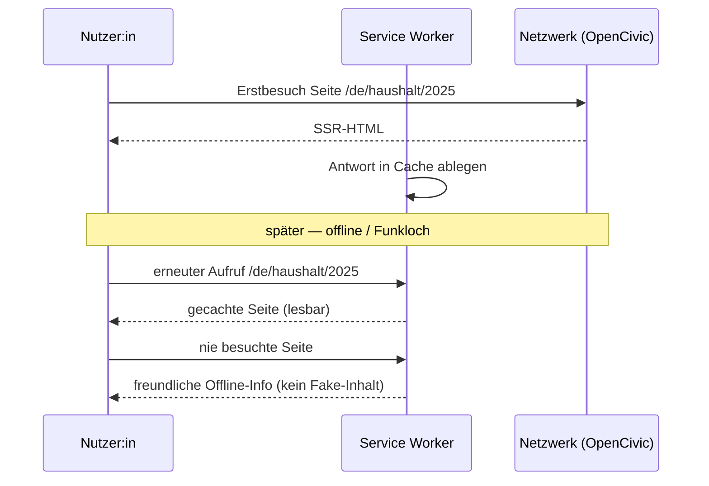
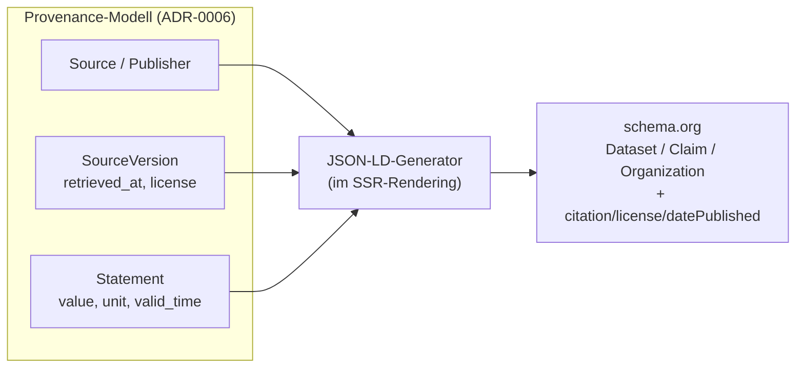
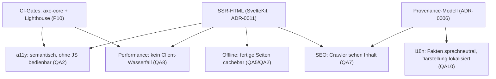

<!--
SPDX-FileCopyrightText: 2026 OpenCivic Contributors
SPDX-License-Identifier: Apache-2.0
-->

# 10 — i18n, Barrierefreiheit, Performance, Offline & SEO

Dieses Dokument bündelt die **präsentationsnahen Querschnittsqualitäten** von OpenCivic zu einem
kohärenten Regime: Internationalisierung, Barrierefreiheit, Performance, Offline-Lesen und
Suchmaschinen-Auffindbarkeit. Es setzt auf dem [Frontend](03-languages-backend-frontend.md#4-frontend-sveltekit)
([ADR-0011](../adr/0011-frontend-framework-sveltekit.md)), dem [Provenance-Modell](02-provenance-model.md)
([ADR-0006](../adr/0006-provenance-modell-w3c-prov.md)) und der [API](04-api-design.md) auf und begründet
jede Aussage gegen die [priorisierten Qualitätsattribute](../foundation/06-qualitaetsattribute.md)
(QA1–QA10) und die [Entscheidungsprinzipien](../foundation/08-entscheidungsprinzipien.md) (P1–P11) —
inklusive ehrlicher Nennung, wo eine Alternative in Einzelpunkten tatsächlich stärker ist.

Die Leitidee ist, dass diese fünf Themen **keine unabhängigen Features** sind, sondern eine einzige
Aussage über die Beziehung von OpenCivic zu seinen Nutzer:innen: *Belegte Fakten müssen für alle
Menschen, auf allen Geräten, in ihrer Sprache und auch bei schlechter Verbindung les- und auffindbar
sein.* Barrierefreiheit ist damit **Voraussetzung, kein Feature** (Leitprinzip 5, QA2) — und
Auffindbarkeit ist nur eine weitere Zielgruppe derselben belegten Wahrheit.

> **Kerninvariante (Darstellung vs. Fakt):** Fakten sind sprachneutral gespeichert (das
> [Statement](02-provenance-model.md#2-logisches-datenmodell-er) trägt Werte, Einheiten und Codes,
> keine übersetzte Prosa). Sprache, Format und Layout sind **Darstellung** und liegen strikt
> getrennt von den Daten. Kein Übersetzungsschritt darf einen Fakt verändern.

---

## 1. Überblick: ein Qualitätsregime, fünf Blickwinkel

Alle fünf Blickwinkel teilen dieselbe technische Grundlage: **serverseitig gerendertes,
vollständiges HTML** aus SvelteKit ([ADR-0011](../adr/0011-frontend-framework-sveltekit.md)). Dieses
eine Architekturmerkmal zahlt gleichzeitig auf Barrierefreiheit (funktioniert ohne JS), Performance
(kein Client-Render-Wasserfall), SEO (Crawler sehen fertige Inhalte) und Offline (fertige Seiten
sind cachebar) ein. Das erklärt, warum die fünf Themen **gemeinsam** entschieden werden.

| Blickwinkel | Primäres QA | Sekundär | Leitprinzip / Ziel | ADR |
|---|---|---|---|---|
| i18n | QA10 Internationalisierbarkeit | QA2, QA7 | P6, P2 | [ADR-0021](../adr/0021-i18n-icu-intl.md) |
| Barrierefreiheit | QA2 Zugänglichkeit | QA3, QA6 | Leitprinzip 5, P10 | [ADR-0022](../adr/0022-web-plattform-baseline.md) |
| Performance | QA8 Performance | QA2 (Low-End-Geräte) | Mobile-First, P10 | [ADR-0022](../adr/0022-web-plattform-baseline.md) |
| Offline-Lesen | QA2, QA5 | QA8 | Architekturziel 7, P8 | [ADR-0022](../adr/0022-web-plattform-baseline.md) |
| SEO | QA7 Interoperabilität | QA1 (belegte Fakten) | P2, P6 | [ADR-0022](../adr/0022-web-plattform-baseline.md) |

---

## 2. Internationalisierung (i18n)

### 2.1 Zwei getrennte Verantwortlichkeiten

OpenCivic trennt konsequent zwei Dinge, die naive i18n-Ansätze vermischen:

1. **Übersetzung** — die UI-Prosa („Ansatz", „Quelle abgerufen am …"). Zuständig: **ICU
   MessageFormat**.
2. **Formatierung** — Zahlen, Beträge, Daten, relative Zeiten, Listen, Pluralregeln nach
   Locale-Konventionen. Zuständig: die native **Web-`Intl`-API** der JavaScript-Standardbibliothek
   (ECMA-402).

Der Fakt (`1250000`, `EUR`, `2025`) bleibt unangetastet; nur seine **Projektion** in eine Locale
wechselt. Für `de-CH` würde derselbe Wert als `1'250'000 CHF`-Konvention formatiert, ohne dass eine
Zeile Faktencode sich ändert — das ist die technische Ausprägung der Kerninvariante aus der
Einleitung und der direkte Bezug zur [Referenzdaten-Achse](02-provenance-model.md#6-jurisdiktions--referenzdaten-achse)
([ADR-0008](../adr/0008-jurisdiktions-und-referenzdaten-achse.md): ISO 4217, ISO 8601).

### 2.2 Warum offene Standards statt Eigenformat (P6, P2)

- **ICU MessageFormat** ist ein etablierter, sprachübergreifender Standard für Nachrichten mit
  Platzhaltern, **Plural-**, **Selekt-** (Genus) und verschachtelter Logik. Er löst korrekt, was
  Key/Value-JSON nicht kann: dass Slawisch/Arabisch/… mehr als zwei Pluralformen kennen und dass
  Genus die Wortwahl steuert.
- **`Intl`** ist Teil der Web-Plattform (ECMA-402) und trägt die
  [CLDR](https://cldr.unicode.org/)-Locale-Daten der Runtime — wir pflegen **keine** eigenen
  Format-Tabellen für Tausendertrennzeichen, Datumsreihenfolgen oder Währungssymbole. Neue Locales
  erben diese Regeln kostenlos.

Damit ist Localization ein **Kernanliegen der Plattform** (Localization-Komponente aus
[ADR-0003](../adr/0003-plattformkern-und-modulschnitt.md)), das auf Standards statt Eigenbau ruht.

### 2.3 DACH-first, aber jede Locale ohne Codeänderung (QA10)

Der MVP liefert `de` vollständig; `en` und `fr` sind vorbereitet. Eine neue Sprache ist ein
**Datenbeitrag** (ein Katalog + Locale-Eintrag), kein Code-Change — genau die Bedingung, die QA10
(„jede Locale ohne Schema-/Codeänderung ergänzbar") an die Architektur stellt. Fehlende Schlüssel
fallen deterministisch auf die Quell-Locale (`de`) zurück, statt einen leeren String zu zeigen.

**Locale in der URL, nicht nur im Header.** Jede lokalisierte Seite hat einen eigenen, stabilen
Pfad (`/de/…`, `/en/…`) mit `hreflang`-Verknüpfung. Das ist zugleich SEO-relevant (§6) und
robust ohne JavaScript — die Sprachwahl ist ein Link, kein Client-State.

### 2.4 Bezug zur API und zu Fakten

Die [API](04-api-design.md) liefert Fakten sprachneutral (Codes, Werte, ISO-Formate); die
Lokalisierung ist ausschließlich Sache der Präsentationsschicht bzw. optional per `Accept-Language`
für abgeleitete Labels. Ein Provenance-Beleg
([Citation](02-provenance-model.md#8-zitierbarkeit-beleg-an-der-schnittstelle)) ist damit in jeder
Sprache derselbe Beleg — die Übersetzung ändert nie, *worauf* sich eine Aussage stützt (QA1).

---

## 3. Barrierefreiheit (Accessibility)

### 3.1 WCAG 2.2 AA als CI-Gate, nicht als Vorsatz

Leitprinzip 5 und QA2 erklären Barrierefreiheit zur **Voraussetzung**. Eine Voraussetzung, die nur
in Reviews „mitgeprüft" wird, erodiert über 10+ Jahre und viele wechselnde Contributor. Deshalb ist
**WCAG 2.2 AA ein automatisiertes CI-Gate**:

- **Automatisiert (axe-core):** deckt die maschinell entscheidbaren Kriterien ab (fehlende
  Alt-Texte, Kontrastwerte, ARIA-Missbrauch, fehlende Labels, Landmark-Struktur). Verstöße
  blockieren den Merge — das macht Barrierefreiheit zur strukturellen Eigenschaft (P10:
  Automatisierung vor Konvention vor Dokumentation).
- **Manuelle Checkliste:** axe-core erkennt erwiesenermaßen nur einen Teil der WCAG-Kriterien.
  Tastaturbedienbarkeit, sinnvolle Fokusreihenfolge, Screenreader-Verständlichkeit und „Reflow bei
  200% Zoom" bleiben menschlich geprüft — ehrlich benannt, nicht wegautomatisiert.

### 3.2 Von SvelteKit begünstigt, nicht erkämpft

Der barrierefreie Pfad ist in OpenCivic der **Standardpfad**: SSR liefert semantisches HTML,
Formulare nutzen native `<form>`-Submission und funktionieren ohne JavaScript
([ADR-0011](../adr/0011-frontend-framework-sveltekit.md), Architekturziel 7). Damit sind zentrale
WCAG-Erfolgskriterien (Bedienbarkeit ohne Skript, robuste Struktur) bereits durch die
Framework-Grundtendenz erfüllt, statt gegen ein SPA-Paradigma verteidigt werden zu müssen.

| WCAG-2.2-Prinzip | Beitrag der Architektur |
|---|---|
| Wahrnehmbar | Semantisches SSR-HTML, erzwungene Kontrast-/Alt-Text-Prüfung in CI |
| Bedienbar | Native Formulare & Links funktionieren ohne JS; Tastatur-Checkliste |
| Verständlich | Einfache Sprache (QA2), konsistente i18n-Kataloge, klare Fehlermeldungen |
| Robust | Valides HTML aus SSR; progressive Anreicherung statt JS-Zwang |

### 3.3 Zugänglichkeit ist mehr als Screenreader

Kleine Bundles und schnelles SSR (§4) erreichen auch Nutzer:innen mit **schwachen Geräten und
langsamen Verbindungen** — ein praktischer, oft übersehener Teil von Zugänglichkeit (QA2), der
nahtlos in das Performance-Regime übergeht.

---

## 4. Performance

### 4.1 Core-Web-Vitals-Budgets, in CI geprüft

Performance ist wichtig, aber laut QA8 **nachrangig gegenüber Korrektheit und Zugänglichkeit** —
nie ein Grund, SSR oder Belegpflicht aufzuweichen. Innerhalb dieser Grenze gilt **Mobile-First**
mit expliziten, in CI durchgesetzten Budgets auf Basis der Core Web Vitals:

| Metrik | Budget (Mobile, Ziel) | Was sie schützt |
|---|---|---|
| LCP (Largest Contentful Paint) | ≤ 2,5 s | Zeit bis der Hauptinhalt sichtbar ist |
| INP (Interaction to Next Paint) | ≤ 200 ms | Reaktivität auf Eingaben |
| CLS (Cumulative Layout Shift) | ≤ 0,1 | visuelle Stabilität (kein Springen) |
| JS-Transfer pro Route | Budget je Route | Datenlast auf schwachen Verbindungen |

- **Lighthouse-CI** misst die Vitals gegen die Budgets bei jedem PR. Regression ist damit sichtbar
  und blockierbar, nicht erst in Produktion spürbar (P10).
- **SvelteKit** trägt strukturell bei: kompiliertes, VDOM-freies Minimal-JS und SSR vermeiden den
  Client-Render-Wasserfall, der SPAs auf Low-End-Geräten ausbremst
  ([ADR-0011](../adr/0011-frontend-framework-sveltekit.md)).

### 4.2 Verbindung zu Barrierefreiheit

Performance-Budgets und a11y sind hier **kein Zielkonflikt, sondern dieselbe Zielgruppe**: Wer ein
altes Smartphone im ländlichen Mobilfunkloch benutzt, profitiert von jedem eingesparten Kilobyte
genauso wie von semantischem HTML. Das ist der Grund, warum beide im selben ADR
([ADR-0022](../adr/0022-web-plattform-baseline.md)) leben.

---

## 5. Offline-Lesen

### 5.1 Ehrlicher, begrenzter Scope

Architekturziel 7 nennt Offline-Fähigkeit. OpenCivic setzt sie **bewusst eng**: eine
Service-Worker-**PWA nur für das erneute Lesen bereits besuchter Inhalte**. Kein Offline-Editing,
kein Hintergrund-Sync, keine Konfliktauflösung.

### 5.2 Warum kein Offline-First mit vollem Sync

Ein voller Offline-First-Ansatz mit bidirektionalem Sync ist mächtig — aber für eine **Lese-
und Transparenzplattform überzogen**. Die dominierende Komplexität (Konfliktauflösung, lokale
Schreibmodelle, divergierende Zustände) brächte ein reales Risiko für die höchste Qualität QA1:
Ein Nutzer, der eine **veraltete oder lokal veränderte** Zahl als amtlichen Fakt liest, wäre ein
Provenance-Schaden. Der begrenzte Cache-Scope hält das Versprechen „was du siehst, ist belegt"
auch offline — gecachte Seiten tragen ihren Beleg und ihren `retrieved_at`-Stand mit sich.

Die Entscheidung ist **reversibel** (P8): Wächst später ein echter Offline-Bedarf (z. B.
Feldarbeit), lässt sich der Scope in einem neuen ADR erweitern, ohne die jetzige Architektur zu
verwerfen.

---

## 6. SEO / Auffindbarkeit

### 6.1 Strukturierte Daten aus dem Provenance-Modell

Auffindbarkeit ist bei OpenCivic **keine Marketing-Disziplin**, sondern eine weitere Projektion
derselben belegten Fakten für eine weitere „Zielgruppe": Suchmaschinen und ihre Nutzer:innen.
Deshalb wird `schema.org`/JSON-LD **direkt aus dem
[Provenance-Modell](02-provenance-model.md)** generiert — es gibt **keine separate
SEO-Datenhaltung**.

Die strukturierten Daten **spiegeln die belegten Fakten**: `citation` und `license` im JSON-LD
stammen aus derselben Citation-Kette, die die UI anzeigt und die API ausliefert. Damit ist
ausgeschlossen, dass Suchmaschinen etwas anderes „sehen" als Nutzer:innen — kein Cloaking, keine
divergierende Zweitwahrheit (P2, QA1).

### 6.2 SSR als Fundament

Weil SvelteKit vollständiges HTML serverseitig rendert, sehen Crawler den **fertigen Inhalt** ohne
JavaScript-Ausführung. SEO ist damit ein **Nebenprodukt** derselben SSR-Architektur, die a11y und
Performance trägt — nicht ein zusätzlicher Renderpfad. Lokalisierte URLs mit `hreflang` (§2.3)
machen jede Sprachfassung eigenständig auffindbar.

### 6.3 Warum kein separates SEO-/Meta-System

Ein eigenes SEO-Metadatensystem würde eine **zweite Quelle der Wahrheit** neben dem
Provenance-Modell schaffen — mit dem Risiko, dass beide divergieren (die Meta-Beschreibung nennt
eine Zahl, die der belegte Fakt längst korrigiert hat, [Lifecycle
`superseded`](02-provenance-model.md#5-lifecycle-einer-aussage)). Das widerspricht QA1 und dem
Grundsatz „Daten sind langlebiger als Code" (P7). Redundanzfreiheit ist hier zugleich
Korrektheitsschutz.

---

## 7. Zusammenspiel & QA-Rückbindung

| Aussage | QA / Prinzip |
|---|---|
| Fakten sprachneutral, Darstellung lokalisiert | QA1, QA10 |
| ICU + Intl statt Eigenformat | P6, P2 |
| WCAG 2.2 AA als blockierendes CI-Gate | QA2, Leitprinzip 5, P10 |
| Core-Web-Vitals-Budgets, Mobile-First | QA8 |
| Offline nur Lesen, kein Sync | QA1-Schutz, Architekturziel 7, P8 |
| SEO aus Provenance, keine Zweitdaten | QA1, QA7, P7 |

---

## 8. Bewusst offen (Folge-Topics)

- **Konkrete i18n-Bibliothek/Runtime** (welche ICU-Implementierung, Build-Integration der Kataloge)
  — Umsetzungsdetail, keine eigene ADR nötig; folgt aus [ADR-0021](../adr/0021-i18n-icu-intl.md).
- **Exakte Budget-Schwellen und Lighthouse-CI-Konfiguration** — im CI-/Build-Topic zu kalibrieren.
- **Übersetzungs-Workflow** (Beitragsprozess für Kataloge, Review durch Muttersprachler:innen) —
  Governance-/Community-Topic.
- **Detaillierte schema.org-Typabbildung** je Fachmodul (OpenBudget zuerst) — je Modul, aufsetzend
  auf §6.1.
