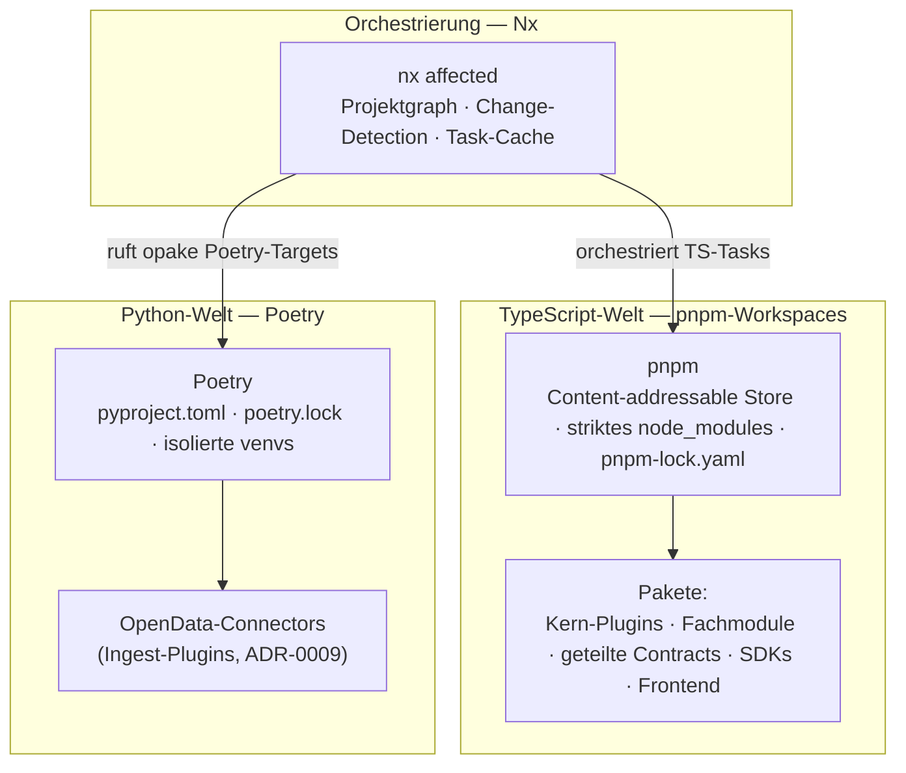
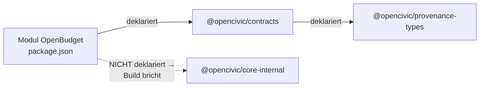

<!--
SPDX-FileCopyrightText: 2026 OpenCivic Contributors
SPDX-License-Identifier: Apache-2.0
-->

# 11 — Repo- & Build-System

Vertieft und konkretisiert die in [ADR-0005](../adr/0005-repo-strategie-monorepo.md) provisorisch
gesetzte **Monorepo**-Richtung: Wie wird das eine Repository real verwaltet, verlinkt und gebaut,
ohne dass Builds monolithisch langsam werden oder Modulgrenzen aufweichen? Jede Wahl wird gegen die
[priorisierten Qualitätsattribute](../foundation/06-qualitaetsattribute.md) (QA1–QA10) und die
[Entscheidungsprinzipien](../foundation/08-entscheidungsprinzipien.md) (P1–P11) begründet — inkl.
ehrlicher Nennung, wo eine Alternative in einzelnen Punkten tatsächlich stärker ist. Die konkreten
Werkzeugentscheidungen mit Alternativen stehen in
[ADR-0023](../adr/0023-build-task-tooling.md).

> Das Repo- & Build-System ist Infrastruktur, keine Fachlichkeit. Sein Erfolgskriterium ist
> unsichtbar: ein `clone`, ein Bootstrap, produktiv — und eine CI, die mit dem Diff wächst, nicht
> mit dem Repo.

---

## 1. Ausgangslage: zwei offene Kosten aus ADR-0005

[ADR-0005](../adr/0005-repo-strategie-monorepo.md) hat das Monorepo gewählt und dabei zwei Kosten
ausdrücklich in dieses Topic verschoben:

1. **CI-Skalierung.** Ein naives Monorepo baut/testet bei jeder Änderung *alles* — das wird mit
   wachsendem Repo zum Engpass.
2. **Grenzdisziplin.** Wenn aller Code physisch zusammenliegt, braucht es einen Mechanismus, der
   verhindert, dass geteilte Contracts durch versehentliche Querabhängigkeiten aufweichen.

Beide Kosten sind hier zu schließen. Hinzu kommt die **zweite Sprache**: Nach
[ADR-0009](../adr/0009-programmiersprachen-typescript-python.md) sind die OpenData-Connectors in
Python geschrieben und dürfen den TypeScript-Teil nicht kontaminieren.

---

## 2. Das gewählte Schichtmodell

Das Build-System besteht aus drei klar getrennten Schichten — jede mit genau einer Verantwortung:



- **Nx** weiß *welche* Tasks *wann* laufen (Orchestrierung), kennt aber nicht die Interna der Pakete.
- **pnpm** weiß, *wie* die TS-Pakete verlinkt und ihre Abhängigkeiten aufgelöst werden.
- **Poetry** kapselt die Python-Welt vollständig; Nx sieht die Connectors nur als „opake" Ziele —
  die Sprachgrenze aus [ADR-0009](../adr/0009-programmiersprachen-typescript-python.md) bleibt auch
  im Build-System eine saubere Naht.

---

## 3. pnpm: der strikte Dependency-Graph als erzwungene Grenze

pnpm legt Abhängigkeiten in einem Content-addressable-Store ab und verlinkt sie per Hardlink in ein
**nicht-flaches** `node_modules`. Der architektonisch entscheidende Effekt: Ein Paket sieht **nur**
die Abhängigkeiten, die es in seiner eigenen `package.json` deklariert hat.



Undeklarierte transitive „phantom dependencies" — bei npm/yarn ein häufiger stiller Fehler —
brechen bei pnpm den Build, statt zufällig zu funktionieren. Damit wird der Dependency-Graph zu
einer **erzwungenen Wahrheit**: Die harten Modulgrenzen aus
[ADR-0002](../adr/0002-architekturstil-modular-monolith.md) — auf Laufzeitebene bereits durch die
Fastify-Plugin-Kapselung ([ADR-0010](../adr/0010-backend-framework-nodejs-fastify.md)) durchgesetzt
— erhalten hier eine zweite, unabhängige Absicherung auf der Ebene der **Paketauflösung**. Grenze =
Contract ist damit doppelt strukturell verankert.

Das `pnpm-lock.yaml` liefert deterministische, reproduzierbare Installs (P4) — dieselbe
Abhängigkeitsauflösung auf jedem Rechner und in jeder CI-Ausführung.

---

## 4. Nx: CI skaliert mit dem Diff, nicht mit dem Repo

Nx liest die Paket-Abhängigkeiten aus und baut daraus einen **Projektgraphen**. Bei einer Änderung
ermittelt `nx affected`, welche Projekte tatsächlich betroffen sind, und führt Tasks (build, test,
lint, typecheck) nur für diese aus — mit lokalem und CI-weitem Berechnungs-Cache.

```mermaid
flowchart TB
    change["Commit ändert<br/>@opencivic/contracts"]
    change --> graph["Nx-Projektgraph"]
    graph --> aff["affected:<br/>contracts, OpenBudget, SDK, Frontend"]
    graph -.->|"nicht betroffen →<br/>Cache-Hit, kein Rebuild"| skip["OpenLaw, Identity, Search"]
    aff --> ci["CI baut/testet<br/>nur die 4 betroffenen Projekte"]
```

Ein Diff, der nur ein Fachmodul berührt, löst keinen Rebuild des gesamten Repos aus; ein Diff an
einem geteilten Contract baut gezielt alle Abnehmer neu. So wächst die CI-Laufzeit mit der Größe
des Diffs statt mit der Größe des Repos — genau die in
[ADR-0005](../adr/0005-repo-strategie-monorepo.md) benannte Monorepo-Kosten wird direkt geschlossen.

**Nx statt Turborepo — dieselbe Neutralitätslogik wie an anderer Stelle.** Beide Werkzeuge lösen
das Kernproblem (affected + Cache) technisch ebenbürtig. Ausschlaggebend ist die Governance: Turborepo
ist eng an das Vercel-Ökosystem gekoppelt — dieselbe Single-Vendor-Plattform-Nähe, die OpenCivic
schon bei SvelteKit statt Next.js ([ADR-0011](../adr/0011-frontend-framework-sveltekit.md)) und bei
OpenSearch statt Elasticsearch ([ADR-0015](../adr/0015-suche-und-vektorsuche.md)) bewusst gemieden
hat. Der Unterschied ist ehrlich gering und eine Prinzipien-, keine Fähigkeitsfrage
([ADR-0023](../adr/0023-build-task-tooling.md)).

---

## 5. Poetry: die Python-Connectors sauber isoliert

Die OpenData-Connectors bringen teils schwergewichtige Scraping-/Parsing-Abhängigkeiten mit. Poetry
kapselt jede dieser Welten in einem eigenen `pyproject.toml` + `poetry.lock` mit isolierter venv —
reproduzierbar (P4) und ohne jede Berührung mit dem TS-Abhängigkeitsbaum.

Nx orchestriert die Python-Tasks nur als **opake Targets**: Es ruft `poetry run …` auf, muss den
Python-Graphen aber nicht verstehen. Die Zwei-Sprachen-Trennung aus
[ADR-0009](../adr/0009-programmiersprachen-typescript-python.md) bleibt damit auch im Build-System
eine architektonische Naht, kein Sprachgrenze quer durch ein Werkzeug.

---

## 6. Split-Lizenz bleibt pro Paket erhalten

Weder Workspace-Verlinkung noch Task-Orchestrierung ändern etwas an der pfad-/paketweisen
Lizenzzuordnung: Die Split-Lizenz aus [ADR-0001](../adr/0001-lizenzmodell-split.md) wird weiterhin
pro Paket über SPDX-Header und REUSE gezogen. Apps (AGPL-3.0) und Bibliotheken/Datenmodelle
(Apache-2.0) liegen physisch im selben Repo, tragen aber je Paket den korrekten SPDX-Identifier —
ein Monorepo steht dem, wie schon in [ADR-0005](../adr/0005-repo-strategie-monorepo.md) festgehalten,
nicht entgegen.

---

## 7. Bindung an die Qualitätsattribute

| QA (priorisiert) | Wirkung der Wahl |
|---|---|
| QA1 Nachvollziehbarkeit | Reproduzierbare Lockfiles (pnpm + Poetry) machen jeden Build deterministisch nachvollziehbar — Voraussetzung für eine glaubwürdige, auditierbare Herkunft auch der ausgelieferten Artefakte (P4/P7). |
| QA2 Barrierefreiheit | Kein direkter Einfluss; das Build-System liefert das SSR-Frontend ([ADR-0011](../adr/0011-frontend-framework-sveltekit.md)) unverändert aus. |
| QA3 Wartbarkeit (10+ J.) | pnpm, Nx und Poetry sind etablierte, neutral governte Werkzeuge (P1); der strikte Graph hält Modulgrenzen über Jahre sauber, statt sie schleichend erodieren zu lassen. |
| QA4 Sicherheit/Datenschutz | Deterministische Lockfiles + getrennte Audit-Pfade je Sprache erlauben gezielte Dependency-Audits und SBOM-Erstellung (R11-Mitigierung, Security-Topic). |
| QA5 Self-Hosting | Keine Bindung an eine Hosting-Plattform; alle Werkzeuge laufen lokal und in beliebiger CI (P3). |
| QA6 Testbarkeit | `nx affected` führt genau die relevanten Tests aus — schnelle Feedback-Schleifen senken die Hürde, Tests überhaupt lokal laufen zu lassen. |
| QA7 Interoperabilität | Standardkonforme `package.json`/`pyproject.toml`; Nx sitzt nur obenauf — keine proprietären Paketformate (P2). |
| QA8 Performance/Skalierbarkeit | **Hier am stärksten:** affected-Builds + Cache lassen die CI mit dem Diff statt mit dem Repo skalieren — die zentrale offene Kosten aus [ADR-0005](../adr/0005-repo-strategie-monorepo.md). |
| QA9 Observability | Nx liefert Build-/Cache-Metriken; kein Ersatz für die Laufzeit-Observability (OpenTelemetry), aber Transparenz über die CI selbst. |
| QA10 i18n | Kein Einfluss. |

Die Wahl gewinnt am deutlichsten bei **QA8 (CI-Skalierung)** und **QA3 (Wartbarkeit durch
erzwungene Grenzen)**; sie ist ein bewusster, benannter Kompromiss bei **R9/P1**, weil Nx als
Zusatzwerkzeug eine moderate Lernkurve mitbringt (siehe
[ADR-0023](../adr/0023-build-task-tooling.md), Option B ist dort ehrlich der einfachste Einstieg).

---

## 8. Reversibilität (P8)

Nx ist ein **Build-Werkzeug, kein Runtime-Lock-in.** Die Pakete bleiben standardkonforme
pnpm-Workspaces mit gewöhnlichen `package.json`-Skripten; Nx orchestriert nur deren Ausführung. Ein
späterer Wechsel des Orchestrators — zu Turborepo, zu reinen Skripten oder (bei ganz anderer
Skalierung) zu Bazel — beträfe die CI-Verdrahtung, nicht den ausgelieferten Code oder die Laufzeit.
Und weil die Paketgrenzen bereits Contracts sind, bleibt auch die in
[ADR-0005](../adr/0005-repo-strategie-monorepo.md) offen gehaltene Ausbaustufe (einzelne Pakete in
eigene Repos auslagern) jederzeit erreichbar. Die Entscheidung ist nicht sackgassig.

---

## 9. Bewusst offen / Folge-Topics

- **CI-Pipeline-Konkretisierung** (Runner, Caching-Backend für Nx, SBOM-Erzeugung) — Security-/
  Betriebs-Topic.
- **Release-/Versionierungs-Werkzeug** (z. B. Changesets) für die koordinierte Modul-Kadenz aus
  [ADR-0005](../adr/0005-repo-strategie-monorepo.md) — leichtgewichtige Ergänzung, bei Bedarf hier
  mitentschieden.
- **OpenAPI-Codegen-Kette** für die SDK-Generierung — beim API-Design-Topic
  ([04-api-design.md](04-api-design.md)) verortet, im Monorepo als eigenes Paket mit Nx-Target.
