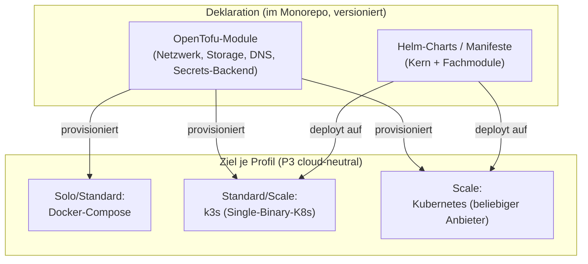
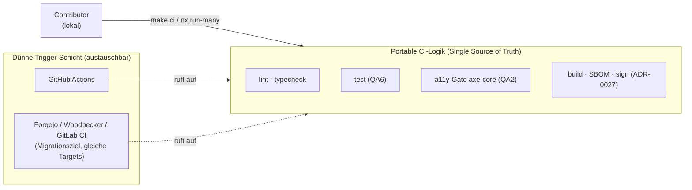
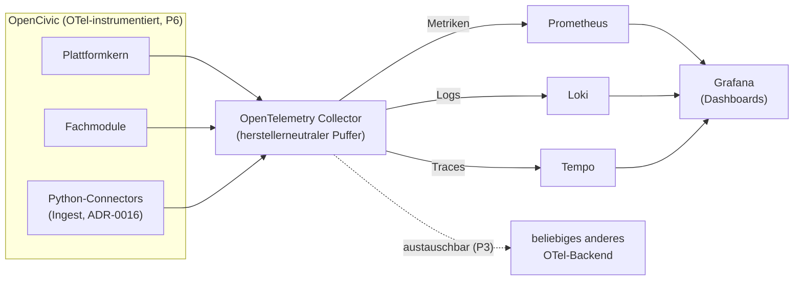
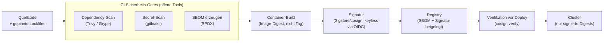

<!--
SPDX-FileCopyrightText: 2026 OpenCivic Contributors
SPDX-License-Identifier: Apache-2.0
-->

# 12 — Infrastruktur, IaC, CI/CD, Observability & Security

Wie OpenCivic betrieben, gebaut, beobachtet und abgesichert wird — aufsetzend auf dem
[modularen Monolithen](01-macro-architecture.md) mit seinen Deployment-Profilen
([ADR-0002](../adr/0002-architekturstil-modular-monolith.md)) und dem
[Provenance-Modell](02-provenance-model.md). Jede Wahl ist gegen die
[priorisierten Qualitätsattribute](../foundation/06-qualitaetsattribute.md) (QA1–QA10), die
[Entscheidungsprinzipien](../foundation/08-entscheidungsprinzipien.md) (P1–P11), die
[Leitprinzipien](../foundation/03-leitprinzipien.md) und die
[Architekturziele](../foundation/07-architekturziele.md) begründet — inklusive ehrlicher Nennung,
wo eine Alternative in einzelnen Punkten tatsächlich stärker ist.

> Dieses Dokument fasst die Betriebs- und Sicherheitsschicht zusammen; die einzelnen
> Entscheidungen sind in den ADRs [0024](../adr/0024-iac-kubernetes.md) (IaC & Orchestrierung),
> [0025](../adr/0025-ci-cd.md) (CI/CD), [0026](../adr/0026-observability-opentelemetry.md)
> (Observability) und [0027](../adr/0027-security-baseline.md) (Security-Baseline) vertieft.

---

## 1. Der rote Faden: Governance-Neutralität schlägt Bequemlichkeit

Vor den Einzelthemen steht ein Muster, das sich durch die gesamte Betriebsschicht zieht und das
diese Architekturphase bereits an mehreren Stellen getroffen hat: **Bei sonst gleichwertigen
Werkzeugen entscheidet die Lizenz- und Governance-Neutralität.** OpenCivic ist eine
Vertrauensplattform für staatliches Handeln; sie darf sich nicht in eine Abhängigkeit begeben, die
ein Einzelanbieter später einseitig verwerten kann (P2, P3, P4;
[Leitprinzip 9 Souveränität](../foundation/03-leitprinzipien.md),
[Leitprinzip 11 Neutralität](../foundation/03-leitprinzipien.md)).

| Fachthema | Naheliegend / verbreitet | Gewählt (neutral) | Ausschlussgrund |
|---|---|---|---|
| Volltextsuche ([ADR-0015](../adr/0015-suche-und-vektorsuche.md)) | Elasticsearch | **OpenSearch** (Apache-2.0) | SSPL — kein OSI-Open-Source |
| Monorepo-Build ([ADR-0023](../adr/0023-build-task-tooling.md)) | Turborepo (Vercel) | **Nx** | Single-Vendor-Plattform-Gravitation |
| IaC ([ADR-0024](../adr/0024-iac-kubernetes.md)) | Terraform (HashiCorp) | **OpenTofu** (Linux Foundation) | BSL — Lizenzwechsel durch Einzelanbieter |

Der OpenTofu-Fall ist die konsequente Fortsetzung derselben Logik: Terraform ist technisch
exzellent, aber HashiCorps Wechsel zur Business Source License (BSL) ist **genau** das
Single-Vendor-Governance-Lizenzrisiko, das P2/P3/P4 vermeiden sollen. OpenTofu ist der
lizenzkompatible, herstellerneutrale Fork unter dem Dach der Linux Foundation — dieselbe
Entscheidungsmechanik wie OpenSearch-statt-Elasticsearch und Nx-statt-Turborepo.

---

## 2. Betriebsmodell: Profile bestimmen die Betriebslast

Die gestaffelten Deployment-Profile aus [ADR-0002](../adr/0002-architekturstil-modular-monolith.md)
sind die tragende Struktur auch dieses Kapitels: **Betriebskomplexität ist optional und wächst mit
dem Bedarf** ([Architekturziel 6](../foundation/07-architekturziele.md) „Self-Hosting als Grad,
nicht als Alles-oder-nichts"; direkte Gegenmaßnahme zu
[R9](../foundation/09-risiken.md) „Komplexität schreckt Contributor & Self-Hoster ab").

| Profil | Zielbetreiber | Orchestrierung | Event-Bus | Suche | Observability | Sicherheits-Gate |
|---|---|---|---|---|---|---|
| **Solo** | Einzelperson, kleine Kommune | Docker-Compose | Postgres-Outbox | Postgres-FTS | minimal / aus | Signatur-Verifikation optional |
| **Standard** | Verein, mittlere Behörde | Docker-Compose *oder* k3s | NATS/JetStream | OpenSearch | Grafana-Stack (schlank) | Verifikation empfohlen |
| **Scale** | großer Betreiber, Verbund | Kubernetes / k3s | NATS/JetStream | OpenSearch (+ Qdrant opt.) | Grafana-Stack (voll) | Verifikation erzwungen |

Kernaussage: **Kubernetes ist kein Zwang.** Ein Solo-Betreiber startet mit einem einzigen
`docker compose up` (R9). Erst wenn echte Orchestrierung — Selbstheilung, horizontale Skalierung,
HA — gefordert ist, greift das Scale-Profil. Diese Staffelung hält die
Total-Cost-of-Ownership-Kurve (P11) für kleine Betreiber flach.

---

## 3. IaC & Orchestrierung ([ADR-0024](../adr/0024-iac-kubernetes.md))

Infrastruktur wird deklarativ als Code beschrieben — reproduzierbar, versioniert, review-fähig
([Leitprinzip 4 Reproduzierbarkeit](../foundation/03-leitprinzipien.md);
[Architekturziel 5](../foundation/07-architekturziele.md)). Werkzeug ist **OpenTofu**; das
Scale-Ziel ist **Kubernetes** als CNCF-Standard mit breiter Multi-Vendor-Basis, **k3s** als
leichtgewichtiger Einstieg für Self-Hoster und Kommunen.

**Warum Kubernetes für Scale?** Es ist der herstellerneutrale De-facto-Standard mit einer breiten,
unabhängigen Anbieterbasis — dieselbe Deklaration läuft auf jedem konformen Cluster, von der
selbstgehosteten Bare-Metal-Maschine bis zum Managed-Angebot beliebiger Anbieter
(P3 „keine harten Cloud-Anbieter-Abhängigkeiten";
[Leitprinzip 9](../foundation/03-leitprinzipien.md)). k3s liefert dieselbe Kubernetes-API als
ressourcensparsame Single-Binary-Distribution — der schonende Einstieg für Betreiber, die die volle
K8s-Betriebslast nicht tragen wollen (R9), aber später ohne Bruch dorthin wachsen können (P8).

---

## 4. CI/CD ([ADR-0025](../adr/0025-ci-cd.md))

Das Repository liegt auf GitHub ([ADR-0023](../adr/0023-build-task-tooling.md)), daher sind
**GitHub Actions** der pragmatische Default. Entscheidend ist aber die Schichtung: Die eigentliche
CI-Logik lebt in **portablen Skripten und Task-Targets** (Nx-Targets, Makefile), die lokal und in
jeder CI identisch laufen. Actions sind nur eine **dünne Trigger-Schicht** — kein Lock-in in
proprietäre Marketplace-Actions ([Leitprinzip 9](../foundation/03-leitprinzipien.md); P8
Reversibilität).

**Reproduzierbarkeit als Regel:** Actions werden auf **gepinnte Commit-SHAs** festgelegt (nicht auf
bewegliche Tags), Tool-Versionen und Lockfiles sind gepinnt (P1, P11;
[Leitprinzip 4](../foundation/03-leitprinzipien.md)). So ist eine Pipeline von heute in fünf Jahren
noch nachvollziehbar — und ein Wechsel des CI-Anbieters bedeutet, die Trigger-Schicht neu zu
schreiben, nicht die gesamte Build-Logik.

Diese CI trägt die verbindlichen Gates der bereits getroffenen Entscheidungen: das
WCAG-2.2-AA-Gate via axe-core und die Core-Web-Vitals-Budgets aus
[ADR-0022](../adr/0022-web-plattform-baseline.md) (QA2, QA8) sowie die Contract-First-Validierung
der OpenAPI-Schemata aus [ADR-0012](../adr/0012-api-stil-rest-openapi.md) (QA7).

---

## 5. Observability ([ADR-0026](../adr/0026-observability-opentelemetry.md))

Beobachtbarkeit ist eingebaut, nicht nachgerüstet
([Architekturziel 9](../foundation/07-architekturziele.md); QA9). Instrumentiert wird durchgängig
mit **OpenTelemetry** (Traces, Metriken, Logs) — ein offener, herstellerneutraler Standard, exakt
die von P6 geforderte Standardschnittstelle. Referenz-Backend ist der selbst-hostbare
**Grafana-Stack**: Prometheus (Metriken), Loki (Logs), Tempo (Traces).

**Warum OTel entscheidend ist:** Weil die Instrumentierung herstellerneutral ist, kann jeder
Betreiber ein anderes Backend anschließen, ohne Anwendungscode zu ändern (P3;
[Leitprinzip 9](../foundation/03-leitprinzipien.md)). Der Grafana-Stack ist nur die *empfohlene*
Referenz, kein Zwang — und je Profil skalierbar: Solo kann Observability minimal fahren oder ganz
abschalten, Scale betreibt den vollen Stack.

**Provenance-nahe Observability:** Strukturierte Logs und die Korrelation über Trace-IDs machen
insbesondere **Ingest- und Provenance-Ereignisse observierbar**. Ein fehlschlagender oder still
driftender Connector ist damit sichtbar, bevor er die Datenqualität beschädigt — die konkrete
Gegenmaßnahme zu [R3](../foundation/09-risiken.md) „Quellen ändern sich oder verschwinden". Damit
dient Observability hier nicht nur dem Betrieb, sondern direkt der obersten Qualität QA1
(Nachvollziehbarkeit).

---

## 6. Security-Baseline ([ADR-0027](../adr/0027-security-baseline.md))

Die Sicherheitsschicht schützt die Kette, die das Vertrauen trägt: Wenn Nutzende einer Aussage nur
glauben, weil sie deren Herkunft prüfen können, dann muss auch die **Software- und Artefaktkette**
prüfbar sein (QA1, QA4; [R11](../foundation/09-risiken.md) Angriffe auf die Datenintegrität).
Secure-by-default (P9), Least Privilege zwischen Modulen
([Architekturziel 8](../foundation/07-architekturziele.md) Zero-Trust).

Bausteine und ihre Rückbindung:

| Baustein | Werkzeug (offen) | Rückbindung |
|---|---|---|
| **SBOM je Build** | SPDX-Format | Konsistenz mit [ADR-0001](../adr/0001-lizenzmodell-split.md) / LICENSING.md; Lieferketten-Transparenz (R11) |
| **Dependency-Scan** | Trivy / Grype | QA4; frühe Warnung vor verwundbaren Abhängigkeiten (R11) |
| **Secret-Scan** | gitleaks | P9 secure-by-default; verhindert Leaks im Repo |
| **Image-Signatur** | Sigstore / cosign (keyless, OIDC) | nutzt die OIDC-Investition aus [ADR-0018](../adr/0018-authn-authz-oidc-rbac.md) mit — keine Schlüsselverwaltung |
| **Reproduzierbare Builds** | gepinnte Lockfiles + Image-Digests | [Leitprinzip 4](../foundation/03-leitprinzipien.md); deterministische, verifizierbare Artefakte |

**Verankerung an Provenance:** Datenintegrität knüpft an die Provenance-Hashes und die
Append-Only-/Lifecycle-Semantik aus [ADR-0006](../adr/0006-provenance-modell-w3c-prov.md) und
[ADR-0007](../adr/0007-bitemporal-append-only-lifecycle.md) an. Die Signatur der Artefakte und die
Hashes der Datensätze bilden zusammen eine durchgehend prüfbare Kette von der Rohquelle bis zum
ausgelieferten Container.

**Ehrlicher Preis:** SBOM-Erzeugung, Scanning und Signatur/Verifikation erhöhen die
CI-Komplexität und die Build-Zeit spürbar. Das ist ein bewusst akzeptierter Preis — für eine
Plattform, deren gesamter Wert auf Verifizierbarkeit beruht, ist eine unverifizierbare Lieferkette
keine Option.

---

## 7. Rückbindung an die Qualitätsattribute

| QA (priorisiert) | Wirkung dieser Betriebsschicht |
|---|---|
| QA1 Nachvollziehbarkeit | Signierte Artefakte + Provenance-Hashes bilden eine durchgehende Vertrauenskette; Ingest-Ereignisse sind observierbar (R3). |
| QA2 Barrierefreiheit | Das WCAG-2.2-AA-Gate (axe-core) läuft als portables CI-Target ([ADR-0022](../adr/0022-web-plattform-baseline.md)) und blockiert Regressionen. |
| QA3 Wartbarkeit (10+ J.) | Gepinnte, reproduzierbare Pipelines und deklarative IaC halten den Betrieb über Jahre nachvollziehbar (R10). |
| QA4 Sicherheit/Datenschutz | Dependency-/Secret-Scanning, Signaturprüfung vor Deploy, Least Privilege (Architekturziel 8). |
| QA5 Portabilität/Self-Hosting | OpenTofu + Kubernetes/k3s + Grafana-Stack sind vollständig self-hostbar und cloud-neutral (P3). |
| QA6 Testbarkeit | Ein `make ci`/`nx`-Lauf ist lokal und in CI identisch — dieselben Gates überall. |
| QA7 Interoperabilität | OpenAPI-Contract-Validierung und OTel als offene Standards (P6) in der Pipeline verankert. |
| QA8 Performance | Core-Web-Vitals-Budgets (Lighthouse) als CI-Gate; Metriken/Traces machen Regressionen im Betrieb sichtbar. |
| QA9 Observability | OpenTelemetry durchgängig; strukturierte Logs, Trace-Korrelation, Grafana-Referenz-Backend. |
| QA10 i18n | Betriebs-/sprachneutral; keine unmittelbare Auswirkung. |

---

## 8. Verwandte Entscheidungen

- [ADR-0024 — IaC & Orchestrierung (OpenTofu + Kubernetes/k3s)](../adr/0024-iac-kubernetes.md)
- [ADR-0025 — CI/CD (GitHub Actions mit portabler CI-Logik)](../adr/0025-ci-cd.md)
- [ADR-0026 — Observability (OpenTelemetry + Grafana-Stack)](../adr/0026-observability-opentelemetry.md)
- [ADR-0027 — Security-Baseline (SBOM, Scanning, Sigstore, reproduzierbare Builds)](../adr/0027-security-baseline.md)
- Fundament: [Deployment-Profile (ADR-0002)](../adr/0002-architekturstil-modular-monolith.md) ·
  [Event-Bus (ADR-0017)](../adr/0017-event-bus.md) ·
  [OIDC (ADR-0018)](../adr/0018-authn-authz-oidc-rbac.md) ·
  [Build-Tooling (ADR-0023)](../adr/0023-build-task-tooling.md)
