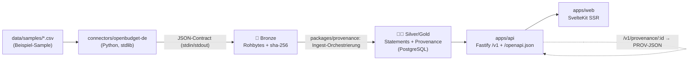

<!--
SPDX-FileCopyrightText: 2026 OpenCivic Contributors
SPDX-License-Identifier: Apache-2.0
-->

# 13 — MVP: OpenBudget-Durchstich (Walking Skeleton)

Der erste **lauffähige** vertikale Durchstich (Roadmap Phase 2): `OpenData → OpenBudget`
end-to-end. Er materialisiert die Architekturentscheidungen erstmals in Code und beweist die
Grundinvariante **Quellenzwang** — jede angezeigte Zahl ist bis zur Quelle inkl. Integritäts-Hash
rückführbar (Leitprinzip 2, QA1).

## Datenfluss (materialisiert ADR-0004)



## Wie der Durchstich die ADRs umsetzt

| Baustein | Umsetzung | ADR |
|---|---|---|
| Architekturstil | Solo-Profil: 1 lokaler PostgreSQL, In-Prozess-Orchestrierung, keine externen Broker | ADR-0002 |
| Modulschnitt | Kern `@opencivic/provenance` (Apache-2.0) vs. App-Schicht `apps/*` (AGPL-3.0) | ADR-0003, ADR-0001 |
| Datenfluss | Bronze (Rohbytes+Hash) → Silver/Gold (Statements) → API → Web | ADR-0004 |
| Provenance-Modell | Tabellen agent/jurisdiction/source/source_version/dataset_version/statement; PROV-JSON-Export | ADR-0006 |
| Bitemporal + Lifecycle | `valid_time` (daterange) + `sys_from/sys_to`; `lifecycle` active/superseded/retracted | ADR-0007 |
| Jurisdiktion | codiert & hierarchisch (`DE`), ISO 4217 (`EUR`), SPDX-Lizenz je Quelle | ADR-0008 |
| Sprachen | TypeScript (Kern/API/Web) + Python (nur Connector) | ADR-0009 |
| Backend | Node.js + Fastify, Schema-First | ADR-0010 |
| Frontend | SvelteKit SSR, funktioniert **ohne JavaScript**, barrierefrei | ADR-0011, ADR-0022 |
| API | REST + OpenAPI 3.1, `/v1`-Pfad-Versionierung, Provenance-Verweis je Antwort | ADR-0012, ADR-0013 |
| Speicher/Suche | PostgreSQL + Volltext (`tsvector`/GIN) | ADR-0014, ADR-0015 |
| ETL | Node-Orchestrierung ruft Python-Connector als Subprozess | ADR-0016 |
| i18n | `Intl.NumberFormat('de-DE', …)` für Beträge | ADR-0021 |
| Reproduzierbarkeit | deterministische IDs aus Inhalts-Hash; idempotenter Ingest; `code_version` je DatasetVersion | Leitprinzip 4 |

## Quellenzwang — technisch erzwungen

- `statement.dataset_version_id` ist **NOT NULL** mit Fremdschlüssel.
- Ein **DEFERRED Constraint-Trigger** verweigert beim Commit jedes Statement, dessen DatasetVersion
  keinen `source_version`-Input hat. Ein Integrationstest weist beides nach: gültige Aussagen lösen
  bis zum Quell-Hash auf, ein Statement ohne Quelle wird abgelehnt.

## Ausprobieren

```bash
make db-up        # lokaler PostgreSQL (ohne Docker)
make migrate      # Schema
make ingest       # Sample → Bronze → Statements (mit Provenance)
make test         # vitest (Quellenzwang, Citation, FTS, API) + pytest (Connector)
make api          # http://127.0.0.1:3001  (/v1/budget/statements, /v1/provenance/:id, /openapi.json)
make web-build && (cd apps/web && OPENCIVIC_API_URL=http://127.0.0.1:3001 node build)  # http://127.0.0.1:3000
```

## Grenzen (bewusst, siehe spätere Phasen)

Beispiel-Sample statt Live-Portal; kein OpenSearch/NATS/OIDC/CivicAI/Kubernetes (Solo-Profil).
Diese sind in den ADRs 0015–0027 entworfen und folgen in Phase 3+.
